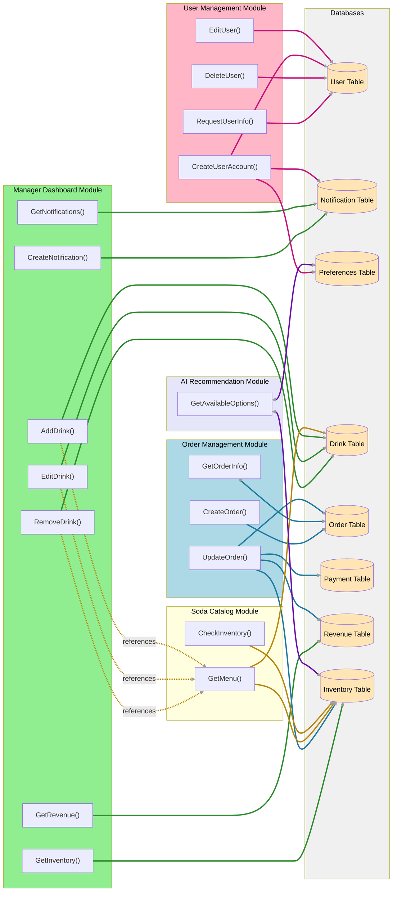

## Manager Dashboard & User Management Modules - Combined Flowchart

```mermaid
%% {init: {'flowchart': {'htmlLabels': true}, 'themeVariables': { 'fontSize': '16px', 'fontFamily': 'arial'}}}%%
flowchart LR
    %% Manager Dashboard Functions
    subgraph MDM["Manager Dashboard Module"]
        direction LR
        MDM1["CreateNotification()"]
        MDM2["RemoveDrink()"]
        MDM3["EditDrink()"]
        MDM4["AddDrink()"]
        MDM5["GetRevenue()"]
        MDM6["GetInventory()"]
        MDM7["GetNotifications()"]
    end

    %% User Management Functions
    subgraph UMM["User Management Module"]
        direction TB
        UMM1["RequestUserInfo()"]
        UMM2["DeleteUser()"]
        UMM3["CreateUserAccount()"]
        UMM4["EditUser()"]
    end

    %% Order Management Functions
    subgraph OMM["Order Management Module"]
        direction TB
        OMM1["CreateOrder()"]
        OMM2["GetOrderInfo()"]
        OMM3["UpdateOrder()"]
    end

    %% Soda Catalog Database Reference
    subgraph SCM["Soda Catalog Module"]
        direction TB
        SCM1["GetMenu()"]
        SCM2["CheckInventory()"]
    end

    %% AI Recommendation Module
    subgraph ARM["AI Recommendation Module"]
        direction TB
        ARM1["GetAvailableOptions()"]
    end

    %% Database Tables
    subgraph DB["Databases"]
        direction TB
        UserTable[(User Table)]
        NotifTable[(Notification Table)]
        PrefTable[(Preferences Table)]
        DrinkTable[(Drink Table)]
        OrderTable[(Order Table)]
        PaymentTable[(Payment Table)]
        RevenueTable[(Revenue Table)]
        InventoryTable[(Inventory Table)]
    end

    %% Manager Dashboard Connections
    MDM1 --> NotifTable
    MDM2 --> DrinkTable
    MDM3 --> DrinkTable
    MDM4 --> DrinkTable
    MDM5 --> RevenueTable
    MDM6 --> InventoryTable
    MDM7 --> NotifTable

    %% User Management Connections
    UMM1 --> UserTable
    UMM2 --> UserTable
    UMM3 --> UserTable
    UMM3 --> NotifTable
    UMM3 --> PrefTable
    UMM4 --> UserTable

    %% Order Management Connections
    OMM1 --> OrderTable
    OMM2 <--> OrderTable
    %% OrderTable --> OMM2
    OMM3 --> OrderTable
    OMM3 --> PaymentTable
    OMM3 --> RevenueTable
    OMM3 --> InventoryTable

    %% Soda Catalog connections
    SCM1 --> DrinkTable
    SCM1 --> InventoryTable
    SCM2 --> InventoryTable
    MDM2 -.->|references| SCM1
    MDM3 -.->|references| SCM1
    MDM4 -.->|references| SCM1

    %% AI Recommendation connections
    ARM1 <--> PrefTable
    ARM1 <--> InventoryTable

    %% Line styling by module
    linkStyle 0,1,2,3,4,5,6 stroke:#2d8b2d,stroke-width:3px
    linkStyle 7,8,9,10,11,12 stroke:#c2147d,stroke-width:3px
    linkStyle 13,14,15,16,17,18 stroke:#1e7a9e,stroke-width:3px
    linkStyle 19,20,21,22,23,24 stroke:#b8860b,stroke-width:3px
    linkStyle 25,26 stroke:#6a0dad,stroke-width:3px

    %% Styling
    style MDM fill:#90EE90,color:#000000
    style UMM fill:#FFB6C6,color:#000000
    style OMM fill:#ADD8E6,color:#000000
    style SCM fill:#FFFFE0,color:#000000
    style ARM fill:#E6E6FA,color:#000000
    style DB fill:#F0F0F0,color:#000000
    style UserTable fill:#FFE4B5,color:#000000
    style NotifTable fill:#FFE4B5,color:#000000
    style PrefTable fill:#FFE4B5,color:#000000
    style DrinkTable fill:#FFE4B5,color:#000000
    style OrderTable fill:#FFE4B5,color:#000000
    style PaymentTable fill:#FFE4B5,color:#000000
    style RevenueTable fill:#FFE4B5,color:#000000
    style InventoryTable fill:#FFE4B5,color:#000000
    
    %% Connection styling
    linkStyle default stroke:#9e9e95,stroke-width:2px
```
