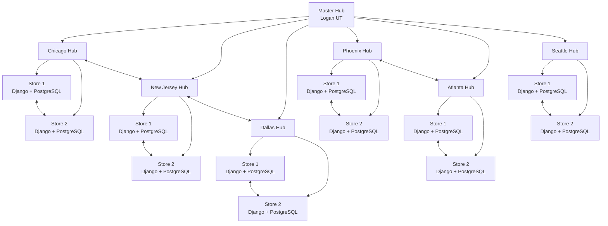
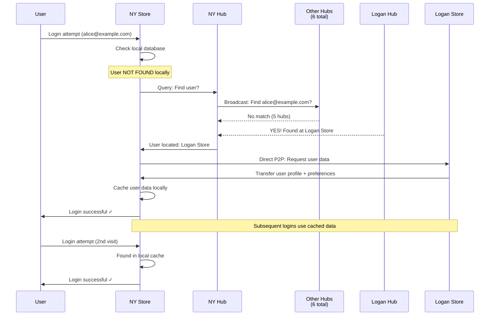
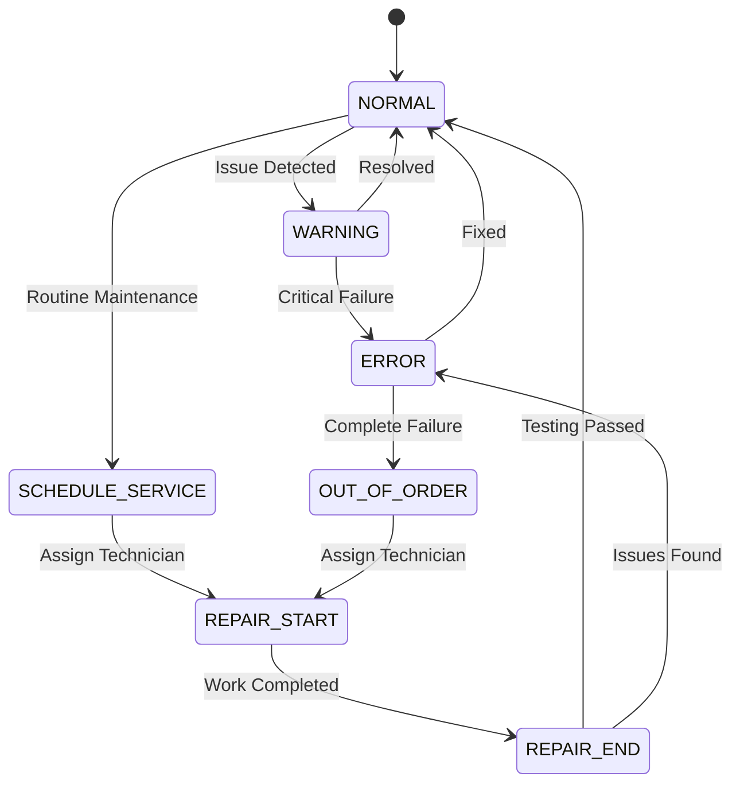
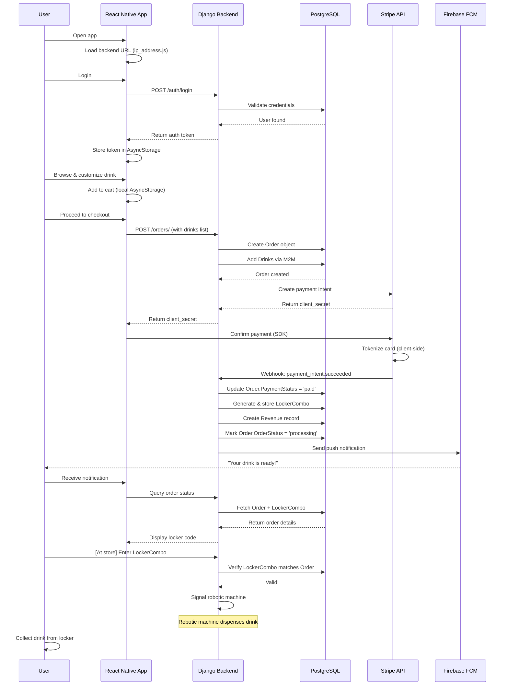
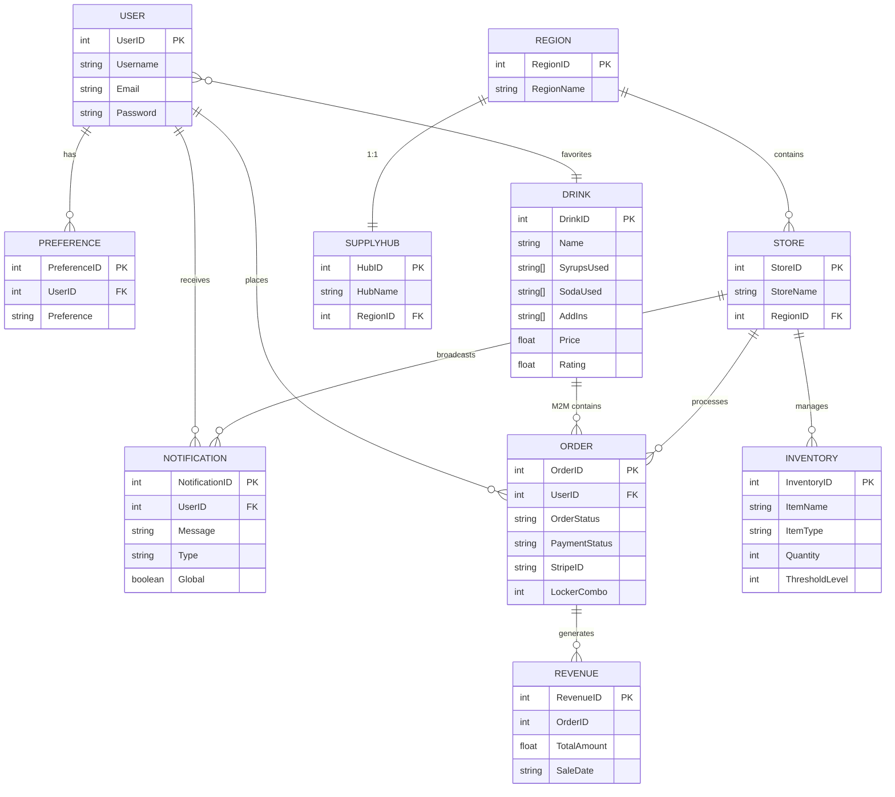

# Codepop Low Level Design Document

### Introduction
The purpose of this document is to provide a working description of the product’s system architecture, subsystems, classes, database tables, user interface prototypes, programming languages, libraries, and frameworks that will be used. This document also addresses system performance concerns and potential security risks as well as have a deployment plan for the release of the application. This document borrows heavily from the lasts teams low level design document as many technologies and data structures will remain unchanged. Developers, company management and customers should reference this document to ensure they are on the same page.

### Development plan

#### Sprint Breakdown

* Sprint 1 - 2 Weeks
    * Must have basic functionality 
    * Function over form
* Sprint 2 - 2 Weeks
    * Start implementing should haves and polishing existing features 
    * Implement must haves that weren't completed from previous sprint  
* Sprint 3 - 1 Week
    * Create user manual
    * Ensure the application is release ready 

### Sprint Outline

**Sprint 1**

Front-end:

Backend: 

**Sprint 2**

Front-end:

Backend: 

**Sprint 3**

Front-end:

Backend: 

### All Tasks Outline

## System Architecture

### Federated Distributed System

The High Level Design specifies a future transformation to a **federated distributed architecture** where multiple stores operate independently with regional coordination. This section describes the target architecture.

### Network Topology

CodePop will evolve into a **hub-and-spoke model with 7 regional supply hubs**:



### Store Discovery & Registration

**Store Registration on Startup:**
1. **Node Identification**: Store reads local configuration (store_id, region, location coordinates)
2. **Hub Contact**: Store connects to regional hub via HTTPS
3. **Registration Request**: POST to `/api/hub/register/` with payload:
```json
{
  "store_id": 42,
  "store_name": "CodePop Chicago #1",
  "region": "Chicago",
  "latitude": 41.8781,
  "longitude": -87.6298,
  "public_key": "-----BEGIN PUBLIC KEY-----...",
  "api_endpoint": "https://store42.codepop.local"
}
```
4. **Hub Response**: Hub returns signed certificate valid for 90 days and list of other stores in region
5. **Cache Update**: Store stores registry in local cache for peer discovery during partition

**Hub Registry Management:**
- Hub maintains in-memory registry of all stores in region
- Registry persists to PostgreSQL for recovery after hub restart
- Heartbeat every 30 seconds from each store; timeout after 3 failures (90 seconds)
- Failed stores marked as unavailable; mobile clients redirected to healthy stores

**Peer Discovery Protocol:**
1. Store needs data from peer store
2. Queries regional hub: `GET /api/hub/store-location/?email=user@example.com`
3. Hub responds with peer store's API endpoint and public key
4. Store directly contacts peer (P2P) with TLS verification

---

### Store Startup Sequence

**Initialization Order (Critical):**
1. **Database Connection** (must succeed)
   - Connect to local PostgreSQL
   - Verify schema version matches expected
   - Fail fast if DB unavailable; store cannot operate
2. **Configuration Load**
   - Read `config.json`: store_id, region, hub_url, etc.
   - Load private key from secure storage (environment variable or key management service)
3. **Register with Hub**
   - POST to hub's `/api/hub/register/` endpoint
   - Retry with exponential backoff (1s, 2s, 4s, 8s)
   - Log warning if hub unreachable; continue with cached registry
4. **Bootstrap Local Data** (if new store or DB reset)
   - Seed catalog drinks from CSV/API
   - Initialize empty inventory (manager will replenish)
   - Create admin user account
5. **Start API Server**
   - Django server listens on configured port
   - Health check endpoint returns 200 OK
   - Accept client connections
6. **Start Background Services**
   - Celery worker for async tasks
   - Event queue processors
   - Heartbeat task to hub (every 30 seconds)
7. **Ready for Operations**
   - Log "Store startup complete"
   - Begin accepting orders

**Graceful Shutdown Sequence:**
1. Stop accepting new connections
2. Wait for in-flight requests (timeout: 10 seconds)
3. Deregister from hub
4. Shutdown Celery workers
5. Close database connection

**Data Bootstrap Sources:**
- **Drink Catalog**: Replicated from master hub on first startup
- **Inventory**: Start empty; manager creates items via UI
- **User Data**: Lazy-loaded on first login attempts
- **Machine Data**: Manager configures machines post-deployment

---

### Store Autonomy & Resilience

- **Each store runs its own complete backend stack**: Django API + PostgreSQL database
- **Operational independence**: Stores continue functioning during hub/peer outages
- **Local data ownership**: Orders, inventory, revenue, machine status never leave the local database
- **Fault isolation**: Problems at one store do not cascade to others

---

### Hub-Store Communication

**Store Registration (on startup):**
- Store registers with its regional hub
- Hub maintains a directory of operational stores

**Peer Discovery:**
- When Store A needs data from Store B, it queries the hub for Store B's address
- Hub provides Store B's IP/endpoint

**Direct P2P Communication:**
- Once Store B's address is known, Store A communicates directly with Store B
- Bypasses hub for data transfer (reduces latency and hub load)

**Logistics Coordination:**
- Supply requests, machine status updates flow through hub
- Hub aggregates regional inventory and maintenance schedules

---

### Data Replication Strategy

**Replicated Data (Lazily synchronized):**
- User accounts and authentication
- User preferences (for personalization)
- User roles (for access control)
- Drink catalog (standard catalog drinks)
- Store registry and hub information

**Local Data (Never replicated):**
- Orders (each store owns its order history)
- Inventory (each store tracks its own stock)
- Revenue (financial data stays local)
- Notifications (user-specific alerts)
- Machine status (local operational metrics)

**Lazy Replication Model:**
- User data does NOT automatically replicate to all stores
- User data syncs ON-DEMAND when user logs into a new store for the first time
- After first login, user data is cached locally for fast subsequent logins

**Rationale for Lazy Replication:**
- **Scalability**: Replicating millions of accounts to thousands of stores is prohibitively expensive
- **Data locality**: Users typically frequent the same store; local caching is efficient
- **Reduced network traffic**: Only active users generate sync traffic
- **Privacy**: User data only exists at stores they have visited

---

### Cross-Region User Discovery

When a user travels to a different region (e.g., Logan, UT user visiting New York, NY):



**Flow Details:**
1. **Discovery Phase**: NY Store checks local database → user not found → queries NY Hub
2. **Hub Broadcast**: NY Hub broadcasts to 6 other regional hubs asking for the user
3. **Peer Response**: Logan Hub responds with user location (Logan Store #001)
4. **Direct Transfer**: NY Store requests user data directly from Logan Store (P2P)
5. **Local Caching**: NY Store caches user data; user logs in successfully
6. **Subsequent Logins**: Subsequent NY Store logins use cached data (no hub/peer queries needed)

---

#### 2.1.8 Revenue Aggregation

**Local Level:**
- Each store maintains its own revenue records
- Managers can view store-level revenue via local dashboard

**Regional Level:**
- Logistics manager requests regional report
- Regional hub queries all stores in region for revenue data
- Hub aggregates results

**National Level (Master Hub Aggregation):**
- Super admin requests nationwide revenue report
- **Primary path**: Master hub (Logan Hub) queries all 7 regional hubs
- **Fallback path**: If master hub unavailable, dashboard queries all 7 hubs in parallel and aggregates client-side

---

### Machine Status Monitoring

Each robotic machine tracks operational status through a **state machine**:



**State Descriptions:**
- **NORMAL**: Machine operational, all systems nominal
- **WARNING**: Minor issue detected, monitoring increased
- **ERROR**: Critical system failure, order intake paused
- **OUT_OF_ORDER**: Machine non-functional, repair staff assigned
- **SCHEDULE_SERVICE**: Routine maintenance scheduled
- **REPAIR_START**: Technician on-site, service in progress
- **REPAIR_END**: Repair completed, testing underway

**Real-time Updates:**
- Stores push machine status changes to regional hub
- Hub dashboard provides live health monitoring for repair staff
- Repair staff can filter/prioritize machines by region and status
- Alert escalation when machines enter WARNING or ERROR states

---

### Technology Stack

#### Frontend
- **Framework**: React Native
- **Key Libraries**:
  - React Navigation: Screen routing and navigation
  - Axios: HTTP requests to backend API
  - AsyncStorage: Local persistent data (userToken, userId, userRole, checkoutList)
  - Stripe React Native SDK: Payment processing

#### Backend
- **Framework**: Django with Django REST Framework
- **Authentication**: Token-based authentication (djangorestframework.authtoken)
- **Database**: PostgreSQL 15
- **Asynchronous Processing**: Celery + Redis (planned for distributed architecture)
- **Key Libraries**:
  - psycopg2: PostgreSQL database adapter
  - stripe: Stripe payment API client
  - scikit-learn: ML-based drink recommendations
  - pandas: Data manipulation for ML models
  - transformers + torch: HuggingFace NLP chatbot

#### Infrastructure
- **Containerization**: Docker + Docker Compose (current single-store setup)
- **Database-per-Store**: Each location will have independent PostgreSQL instance
- **Cloud Deployment (Planned)**: Google Cloud Platform (GCP) chosen for:
  - Cost-effectiveness (25% cheaper than Azure)
  - Superior student credits ($300 free trial)
  - Excellent Django support

#### External Services
- **Stripe**: Payment processing (PCI-DSS compliant; no raw card data stored)
- **Mapbox**: Geolocation and proximity tracking
- **Firebase Cloud Messaging (FCM)**: Cross-platform push notifications
- **Dialogflow ES**: NLP-based customer service chatbot
- **Gemini API**: AI-generated decorative graphics for app loading screens

---

### Inter-Node Communication Protocol

**Protocol Details:**
- **Transport**: HTTPS/TLS 1.3 for all inter-node communication
- **Authentication**: Token-based (JWT or Django REST Framework tokens)
  - Each node has a shared secret or certificate
  - All requests include `Authorization: NodeToken {token}` header
  - Nodes validate token before processing requests
- **Content Type**: JSON with UTF-8 encoding
- **Timeouts**:
  - Connection timeout: 5 seconds
  - Read timeout: 10 seconds
  - Max request size: 10MB
- **Retry Logic**: Exponential backoff (1s, 2s, 4s, 8s) for transient failures

**Inter-Node REST Endpoints:**
```
POST /api/inter-node/user-lookup/          # Query peer store for user
POST /api/inter-node/user-sync/            # Transfer user data to peer
POST /api/inter-node/status-update/        # Machine/store status update to hub
GET /api/inter-node/store-registry/        # Retrieve list of stores from hub
POST /api/inter-node/supply-request/       # Submit supply request to hub
POST /api/inter-node/health-check/         # Peer availability check
```

**Request/Response Format:**
```json
// User Lookup Request
{
  "email": "user@example.com",
  "requesting_store_id": 42
}

// User Lookup Response (Success)
{
  "status": "found",
  "user": {
    "user_id": 5,
    "email": "user@example.com",
    "preferences": ["Coconut", "Fruity"],
    "favorite_drinks": [42, 87, 105]
  },
  "located_at_store_id": 101
}

// User Lookup Response (Not Found)
{
  "status": "not_found",
  "message": "User not found in any store"
}
```

---

### Data Synchronization & Conflict Resolution

**Lazy Replication Strategy:**
- User data syncs **only on-demand** when user logs into new store
- No background sync process; on-demand queries happen in real-time
- After first successful sync, data cached locally for 24 hours
- Cache invalidation: Manual refresh via API or automatic expiration

**Conflict Resolution Rules:**

| Scenario | Rule | Resolution |
| :---- | :---- | :---- |
| User updates preferences at Store A, then logs in at Store B | Preference change wins | Accept most recent timestamp; overwrite cached version |
| User's favorite drinks differ between stores | Union approach | Merge favorite lists; Store B gets all of Store A's favorites |
| User account modified at multiple stores simultaneously | Last-write-wins | Use server timestamp; later write takes precedence |
| Duplicate user records created | Merge | Consolidate into single record; redirect references |

**Consistency Model:**
- **Eventual Consistency** for replicated data (user preferences, roles)
- **Strong Consistency** for local data (orders, inventory, revenue)
- **Conflict-Free Replicated Data Type (CRDT)** consideration for future: use for favorite drinks list (append-only set)

---

### Fallback Scenarios & Error Handling

**Hub Unavailability:**
- **Impact**: Store continues operating; new users cannot be discovered from other regions
- **Fallback**: Stores maintain local user cache; queries timeout gracefully
- **Recovery**: Automatic retry after 30 seconds; manual hub reconnection after 5 minutes
- **User Experience**: Non-local users see error message with estimated wait time

**Peer Store Unreachable:**
- **Impact**: Cannot fetch user data from peer; user login fails
- **Fallback**: Suggest user use their home store; provide offline mode if available
- **Recovery**: Automatic retry with exponential backoff
- **HTTP Status**: Return 503 Service Unavailable with retry hint

**Network Partition (Store isolated):**
- **Impact**: Store operates independently; orders processed normally
- **Fallback**: All operations queued locally; sync when connectivity restored
- **Outbound**: Status updates queued in Celery; processed when hub available
- **Recovery**: Automatic reconciliation when partition heals; manual override for conflicts

**Database Failure (Local PostgreSQL down):**
- **Impact**: All API operations fail; machine maintenance halts
- **Recovery**: Failover to replica (if configured); manual intervention required
- **User Experience**: Immediate 503 error; recommend contact store management

---

### Inter-Node Authentication & Authorization

**Node Identity & Trust:**
1. **Node Registration**: Each store/hub registers with master hub on startup
   - Provides: Node ID, Region, Location, Public Key
   - Receives: Signed certificate valid for 90 days
2. **Token Issuance**: Tokens signed with node's private key
   - Token includes: Node ID, Issuing Time, Expiration (1 hour)
   - Format: JWT with RS256 signature
3. **Token Validation**: Receiving node validates signature using sender's public key
   - Check expiration time
   - Verify node ID matches certificate
   - Reject if certificate expired

**Authorization Rules:**
- **Store → Hub**: Can submit supply requests, status updates, revenue reports
- **Hub → Store**: Can query store data, trigger machine status changes
- **Store A ↔ Store B**: Can exchange user data and machine status (after hub confirmation)
- **Manager Access**: Token claims include `user_id` and `store_id`; can only access own store
- **Logistics Manager**: Token includes `region_id`; can access hub-level data

In the distributed architecture, stores and hubs communicate via:

- **REST APIs** for synchronous requests (user lookup, store discovery)
- **Event queues** (Celery + Redis) for asynchronous messaging (status updates, alerts)
- **HTTPS/TLS 1.3** for all communications (encryption in transit)
- **Token authentication** between nodes (servers must authenticate before data exchange)
- **Trusted peer registry**: Hardcoded list of valid CodePop servers prevents unauthorized access

---

### Data Flow Example: User Placing an Order



---

Subsystems and UML Class Diagrams

* App objects: 

```mermaid
classDiagram
        class User {
        -username: String
        -password: String
        -email: String
        -preferences: Preferences
        -isLoggedIn: Boolean
        +signIn(username:String, password:String): Boolean
        +createUser(username:String, password:String): Boolean
        +updatePreferences(preferences: List<String>): void
        +savePreferences(): void
        +logout(): void
    }

    class Cart {
        -drinks: List<Drink>
        -totalPrice: Float
        -userId: String
        +addDrink(drink: Drink): void
        +removeDrink(drinkId: String): void
        +getCartItems(): List<Drink>
        +calculateTotal(): Float
        +checkout(paymentDetails: PaymentDetails): Boolean
    }

    class Drink {
        -drinkId: String
        -name: String
        -size: String
        -ingredients: List<String>
        -price: Float
        +createDrink(ingredients: List<String>, size: String): Drink
        +updateDrink(drinkId: String, updatedDetails: Drink): void
        +getDrinkDetails(drinkId: String): Drink
        +calculatePrice(): Float
    }

    class Admin {
        -adminId: String
        -name: String
        -email: String
        -permissions: List<String>
        +createManager(managerDetails: Manager): void
        +createRepairStaff(repairStaffDetails: RepairStaff): void
        +updateUser(userId: String, updatedDetails: User): void
        +deleteUser(userId: String): void
    }

    class SuperAdmin {
        -superAdminId: String
        -name: String
        -email: String
        -permissions: List<String>
        +createManager(managerDetails: Manager): void
        +createAdmin(adminDetails: Admin): void
        +createRepairStaff(repairStaffDetails: RepairStaff): void
        +createLogisticsManager(logisticsManagerDetails: LogisticsManager): void
        +updateUser(userId: String, updatedDetails: User): void
        +deleteUser(userId: String): void
    }

    class RepairStaff {
        -repairStaffId: String
        -name: String
        -email: String
        +viewMachineStatus(regionId:String): List<MachineStatus>
        +trackPendingRepairs(): List<Machine>
        +logRepairAction(machineId:String, action:String, notes:String): void
        +updateMachineStatus(machineId:String, status:String): void
        +uploadSchedule(csvFile: CSV): void
        +viewSchedule(): list<Schedule>
    }

    class Manager {
        -managerId: String
        -name: String
        -email: String
        -permissions: List<String>
        +getData(): DashboardData
        +updateDrink(drinkId: String, updatedDetails: Drink): void
        +resolveComplaint(complaintId: String, resolution: String): void
        +viewComplaints(): List<Complaint>
    }

    class Complaints {
        -userId: String
        -message: String
        +submitComplaint(userId: String, Location: string, message: String): void
        +getComplaints(): List<Complaints>
    }

    class Preference {
        +int PreferenceID
        +int UserID
        +String Preference
        +updatePreferences(preferences: List<String>): void
    }

    %% relationships
    User --> Cart
    Cart --> Drink
    User <|-- Admin
    User <|-- SuperAdmin
    User <|-- Manager
    User <|-- RepairStaff
    User --> Complaints
    User --> Preference
    Manager --> Complaints
    Admin --> Complaints
    SuperAdmin --> Complaints
```




* Customer user flow:  


 

## User interfaces:

### Accessibility

The CodePop interface is carefully designed to support both usability and accessibility, adhering to the Web Content Accessibility Guidelines (WCAG). A color palette has been selected based on an analysis of common forms of color blindness, ensuring that problematic combinations like teal and purple are not placed next to each other for better readability. Each page is fully compatible with screen readers, offering audio feedback for users with visual impairments. Additionally, tab-controlled navigation is integrated, allowing keyboard users to easily move through the interface without relying on a mouse, ensuring a more inclusive user experience.

### Flow and design for page layout

**(M) Nav bar**

* Home page  
* Drink design page  
* Cart button
* Chat page
* Profile page

**(M) Home page**

* (S) Seasonal drinks menu carousel
* If signed in:
  * (M) Generate random button (from AI) - 2 options:
    * (S) Generate based off my preferences
    * (S) Try something new
  * (M) Saved drinks - with options to delete or add to cart (UI for size selection follows 'add to cart' button)
* (M) If not signed in:
  * (M) Generate random button (from AI) - no options
  * Create account button (for non-account users)
  
**(M) Sign-in page**

* Email/Username Input
* Password Input with Toggle (Show/hide password icon)
* "Forgot Password" Link
* Sign-Up Link
* Error Messages - red error message at top of the screen

  Additional Features (C): 
* Social Login (Google, Apple sign-in) 
* "Remember Me" Checkbox
* Biometric Login (Face ID / Fingerprint on mobile)
  * (React Native supports this)
* Two-Factor Authentication (2FA)- accounts with saved payment info
* Goes to a tutorial of how to use app after signed in - skip button optional

**(M) Sign-up/Create Account Page**

* Email Input
  * Real-time validation: check email format and if email already exists
  * Error message if email taken: "This email is already registered. Sign in instead?"
* Password Input with Toggle (Show/hide password icon)
  * Real-time password strength indicator (visual bar: Weak → Medium → Strong)
  * Display requirements: "8+ characters, uppercase, lowercase, number, special character"
  * Error message if password weak: "Password must include uppercase, lowercase, number, and special character"
* Confirm Password Input with Toggle
  * Error message if passwords don't match: "Passwords do not match"
* Terms & Conditions Checkbox (Required to proceed)
  * Error message if unchecked: "You must accept the Terms & Conditions to continue"
  * Link to Terms and Privacy Policy (policy found in codepop/misc)
* Error Messages
  * Red error message at top of the screen for all validation failures
* Create Account Button
* Sign-In Link ("Already have an account? Sign in")

  Additional Features (C):
* Social Login (Google, Apple sign-in)
* Store Selection during Signup
  * Allows user to set home store for preferences and lazy replication
* Preference Onboarding (skippable)
  * Ask simple preference questions (favorite flavors) to bootstrap AI recommendations
* Email Verification Flow
  * Send verification email post-signup
  * Show: "Check your email to verify your account"
  * "Resend verification email" button if not received
  * Link expires handling: "Verification link expired. Request new link?"
* Geolocation Permission Prompt
  * Ask post-signup, not during (reduces friction)
  * Explain: "We'll use this to find nearby CodePop locations"
* Tutorial/Onboarding (skip button optional)
  * Goes to a tutorial of how to use app after account verified and signed in
* Password Requirements Display
  * Show as user types: checkmarks next to each requirement as they're met

**(M) Drink design page**

* (C) generative/responsive graphic created when a user makes drinks
* (M) An add to cart button by the graphic - must have a soda selected (other options default to none) - size selection occurs after hitting 'add to cart'
* (S) A 'Save as favorite' button by the graphic (saves drink to the user's favorites)
* (M) Drink design options (little graphics or emojis included with option names):
  * Soda - can select/deselect multiple - search bar included at top of this section
  * Syrups - can select/deselect multiple - search bar included at top of this section
  * Juices - can select/deselect multiple - (lemon, lime, pineapple, coconut etc.) - no search bar needed
  * Ice - can select one - (light, regular, extra, no ice) - no search bar needed
  
**(M) Cart page - also links to a payment page and a confirmation page**

* Cart page:
  * (M) Contains a bar of a graphic of the drink, drink name, edit button, price, and quantity controls
  * (M) Quantity Controls
    * +/- buttons for each item (or quantity input field)
    * Price updates automatically
  * (M) Empty State
    * If cart is empty: "Your cart is empty" message
    * Button: "Browse Drinks" to return to home
  * (M) Order Summary Section
    * Subtotal
    * (C) Taxes
    * Total (bold, highlighted)
  * (M) Checkout button
  * (C) Promo Code / Discount
    * Input field for discount code
    * Apply button
    * Display savings
  * (C) Apply Rewards button
    * Included in the cart page could be a graphic that shows the user's total rewards points
    * By "Checkout" button is an option that says, "Pay using ___ points"
  * (C) Saved Drinks
    * "Quick add" section showing previously ordered drinks
    * One-tap add to cart

* (M) Payment page
  * User is taken here from the “checkout” button in the cart
  * (M) Order Review Summary (Before Payment)
    * Show items being purchased
    * Show store location
    * Show estimated pickup time
    * Show total amount to be charged
  * (M) Payment Method Selection
    * Stripe API used to take user payment information
    * Radio buttons or tabs:
      - Credit/Debit Card
      - Apple Pay / Google Pay
      - Saved cards (if (C) "Save this card" implemented)
  * (C) Save Card Checkbox
    * Link to privacy policy
    * Show saved card last 4 digits for future orders
  * (M) Security Indicators
    * SSL lock icon
    * "Secure payment powered by Stripe"
    * Disclaimer: "Your card info is secure"
  * (M) Error Handling & Retry
    * If payment fails: "Payment declined. Please try again or use different card"
    * Retry button with attempt counter
    * Link to contact support for persistent issues
  * (M) Loading State During Payment
    * Disable button during processing
    * Show spinner: "Processing payment..."
    * Prevent accidental double-clicks
  ---
  Geolocation/Timing
  * (M) Visual Store Location
    * Show selected store name prominently
    * (C) Small map preview showing store location
    * Store hours display
  * (M) ETA/Timing Summary
    * If geolocation selected:
      * "Estimated pickup: 8 minutes from now"
      * Real-time ETA updates as user location changes
    * If scheduled time:
      * "Pickup at: 3:45 PM today"
      * (S) The system should estimate how long each order will take based on how many orders are in the queue
      * (S) If the user sets a time that is sooner than the system's estimated time, the user will be notified of the estimated finish time
  * (M) Change Options Button
    * Users can switch between geolocation/scheduled time
    * Doesn't require restarting payment flow
  ---
  Recurring Orders
  * (M) Recurring Order Confirmation Screen
    * If this option is selected the user will receive a text box that says, 
      "By selecting this option, your order will be automatically placed and your saved payment method will be charged $___ 30 minutes before your scheduled time. You can modify or cancel recurring orders at any time in your account settings."
    * Show full recurrence details:
      - "Every [frequency]"
      - "On [days]"
      - "Until [end date]"
      - "Charge amount: $X.XX"
      - "Payment date: 30 minutes before order time"
      ```
      ----------------------------------------
      CUSTOM RECURRENCE
      ----------------------------------------

      Repeat every:   [ 1 ] (week)

      Repeat on:      S  M  T  W  T  F  S
                                  [S]

      Ends:
        (*) Never
        ( ) On:      [ Feb 14, 2026 ]
        ( ) After:   [ 13 ] occurrences

      ----------------------------------------
      [ Cancel ]                      [ Done ]
      ----------------------------------------
      ```
      
* (M) Confirmation page
  * (C) After a user pays for their drink, they are taken to a page with a link to the complaints page (Didn’t get their drink?” button) as well as a rate your drink section where a user can rate their drink out of 5.
    * (C) Included will also be an input box that says, "Leave a review"
  * (M) In addition, there will be an order code displayed (which is what they type in a locked cooler to get their drink).
  * (S) The order code will also be visible on the home screen should the user leave the app and return. 
    * The order code goes away 5 minutes after the order number is typed into the cooler.
  * (C) There will also be a link to Instagram, X, or Facebook that says, "Share my drink"
    * Once clicked, the app goes to the selected platform and a pre-populated post template that includes the hashtag #socialdrinker appears
    ---
* Post-Payment
  * (M) Order Confirmation Screen
    * ✓ Order number/code
    * Order total & itemized receipt
    * Pickup location & ETA
    * Store address & hours
    * (C) Option to print/email receipt
  * (M) Order code - what they type in a locked cooler to get their drink
  * (C) Order Tracking
    * Status updates: "Preparing" → "Ready for Pickup"
    * Push notification when ready
    * Live location of order in queue
  * (C) Feedback/Rating Prompt
    * "Rate your drink" (5 stars)
    * "Leave a review" (text)
    * "Share on social media"
      * Link to Instagram, X, or Facebook
      * App transitions to the selected platform and a pre-populated post template that includes the hashtag #socialdrinker
  
**(M) Chat page**

* Simple page with a text entry box with a complaint prompt \- users will receive AI generated response messages after entering complaints
* (M) Chat Container
  * Full screen or modal overlay
  * Close/back button at top
  * "Chat with CodePop" header
  * Keyboard-aware (adjust for mobile keyboard)
* (M) Input Area
  * Text input with placeholder: "Describe your issue..."
  * Disable send if empty
* (C) Typing Indicator
  * Show "CodePop Bot is typing..." while waiting for response
  * Animated dots
* (M) Loading State
  * Show spinner while waiting for AI response
  * Prevent user from sending multiple messages while processing
  * Timeout handling (if AI doesn't respond in 5-10 seconds)
* (M) Error Handling
  * If AI response fails: "I'm having trouble right now. Please try again or contact support."
  * Retry button
  * Link to support if issue persists
* (C) Response Confidence Indicator
  * If AI is unsure: Show disclaimer or "This might help, but..."
  * Allow user to rate response: "Was this helpful?" with Yes/No buttons
* (C) Suggested Responses / Quick Replies
  * Show 2-3 suggested follow-up questions based on topic
  * One-tap buttons to ask common follow-ups
  * Examples:
    * "Report an issue with my order"
    * "Track my delivery"
    * "Request a refund"
* (M) Human Escalation Option
  * "Talk to a human?" button or link
  * Shows estimated wait time
  * Transitions to live support (if available)
  * Fall back to email: "support@codepop.com"
* (C) Context Preservation
  * Include order number in chat (if user has active order)
  * Pass conversation to human agent if escalated
  * Show previous issues/complaints in agent view
* (C) Complaint Categorization
  * Detect complaint type:
    - "Order not received"
    - "Drink quality issue"
    - "Payment problem"
    - "App bug"
    - "Other"
  * Route to appropriate resolution path
* (C) Auto-Suggest Solutions
  * Based on complaint type, suggest actions:
    - If "Not received": "Track your order" + link
    - If "Quality issue": "Request refund" button
    - If "Payment failed": "Update payment method"
* (C) Satisfaction Rating
  * After conversation ends: "Rate this support experience" (1-5 stars)
  * Optional text feedback
  * Used to improve AI training
  
**(M) Profile page**

* (M) Update preferences
  * Soda, syrups, ice quantity.
* (M) Settings
  * (M) Set location for geolocation.
  * (S) account settings
    * (S) change email/password.
    * (C) dark mode/light mode. 
  * (C) Manage Recurring Orders
    * View all active recurring orders
    * Skip next occurrence button
    * Edit recurrence details
    * Pause temporarily
    * Cancel recurrence
---
Profile Header
* (M) User Profile Info
  * User avatar (initials or image placeholder)
  * Username / Email display
  * Member since date
  * Loyalty points balance (if using rewards program)
  * Edit Profile button (for avatar/name)
* (C) Account Quick Actions
  * Notification settings (toggle)
  * Help/FAQ link
  * Logout button (prominent at bottom)
---
Update Preferences
* (M) Preference Categories with Toggles
  * Sodas: Checkboxes for favorites (Sprite, Coke, Fanta, etc.)
    - With search bar to filter products
  * Syrups: Checkboxes for favorites (Vanilla, Caramel, Hazelnut, etc.)
  * Ice Quantity: Radio buttons or slider
    - Options: No Ice, Light, Regular, Extra
    - Visual preview (cup with ice level)
* (M) Save Changes Button
  * Only enabled if changes made
  * Show "Saved!" confirmation message
  * Auto-save option (toggle)
* (C) Reset Preferences
  * "Reset to Defaults" button with confirmation dialog
  * Clears all selections
---
Settings
* (M) Settings organized in sections (tabs or accordion):
* TAB 1: LOCATION & DELIVERY
  * (M) Primary Store Location
    - Map picker or address search
    - Shows store name, hours, address
    - "Change Location" button
* TAB 2: ACCOUNT SETTINGS
  * (M) Email
    - Current email display
    - "Change Email" button → verification flow
  * (M) Password
    - "Change Password" button
    - Requires current password verification
    - New password with strength indicator
    - Confirm new password
  * (C) Two-Factor Authentication (2FA)
    - Enable/disable SMS or authenticator app
    - Phone number verification
  * (C) Session Management
    - View active sessions (devices, last login)
    - Sign out from other devices
    - View login history
* TAB 3: PREFERENCES & PRIVACY
  * (C) Dark Mode / Light Mode
    - Radio buttons: System Default, Light, Dark
  * (C) Notifications
    - Order status notifications (toggle)
    - Promotional emails (toggle)
    - New menu items alerts (toggle)
    - Push notifications (toggle)
  * (C) Privacy Settings
    - Share preferences with store (toggle)
    - Allow personalized recommendations (toggle)
    - Opt-out analytics (toggle)
* TAB 4: RECURRING ORDERS
  * (M) List of all active recurring orders
    - Order name/items (e.g., "Weekly Vanilla Latte")
    - Next charge date
    - Recurrence pattern (e.g., "Every Monday")
    - Payment method used
    - Status badge (Active, Paused, Pending)
  * (M) Per-Order Actions
    - "View Details" → shows full recurrence config
    - "Skip Next" button (skip 1 occurrence)
    - "Edit" → modify items/time/frequency
    - "Pause" → temporarily pause (with pause duration selector)
    - "Cancel" → delete recurring order (with confirmation)
  * (C) Recurrence Summary
    - Total monthly cost of all recurring orders
    - Next charge date across all orders
---
Tab Navigation / Layout
* (M) Navigation Structure
  * Accordion/Collapsible Sections
    ▼ Update Preferences
    ▼ Location & Delivery
    ▼ Account Settings
    ▼ Manage Recurring Orders
    ▼ Privacy & Notifications
---
Confirmation Dialogs
* (M) Destructive Actions Need Confirmation
  * Delete recurring order: "Are you sure? This can't be undone."
  * Change email: "Verification link will be sent to new email"
  * Change password: "You'll be logged out after change"
  * Reset preferences: "This will clear all favorites"
  * Cancel pause: "Resume order next scheduled time?"
---
Data Management & Privacy
* (C) Data Management Section
  * Delete Account
    - Permanent deletion warning
    - Option to keep order history or delete
    - Requires password confirmation
  * Data Privacy
    - Link to full privacy policy
    - GDPR/CCPA compliance info
---
Visual Design & UX
* (M) Loading & Success States
  * Skeleton loaders while fetching user data
  * "Saving..." indicator during updates
  * "Saved!" confirmation with checkmark
  * Error messages with retry button
  
**(C) Rewards page**

* Should this be included, there will be a section added to the nav bar called "Rewards":
  - "Home | Order | Cart | Rewards | Chat | Account"
* The Loyalty Program will include a dedicated “Rewards” section in the main navigation. Logged-in users can view their total point balance, earning history, and upcoming expirations. Points are awarded after order pickup and excluded for canceled orders. Expiration notifications will appear as dashboard alerts. Checkout will include a placeholder section for future point redemption functionality.
---
Points Dashboard / Hero Section
* (M) Main Points Card
  * Large, prominent display of total points
  * Visual: "2,450 Points"
  * Subtitle: "$24.50 value" (estimated redemption value)
  * Animated counter (counts up when points earned)
* (M) Tier/Level System
  * Current tier badge (e.g., "Epic Member")
  * Progress bar to next tier
  * "50 points until Legendary" indicator
  * Tier benefits display: "2x points on all orders"
  * Tiers: Common (0), Rare (500), Epic (1500), Legendary (3000)
* (C) Quick Stats Cards
  * This month earned: 250 points
  * Expiring soon: 100 points (30 days)
  * Lifetime total: 5,200 points
  * Streak: "5 orders in a row"
* (C) Earning Breakdown Tooltip
  * Hover/tap on points to see:
    - Base points: 100 (1 point per $1)
    - Bonus multiplier: 25 pts (Gold tier 1.25x)
    - Total: 135 pts
---
Checkout Integration-  this would be integrated into the checkout screen
* (M) Point Value Calculator
  * Interactive slider: "Redeem X points"
  * Shows dollar value: "= $5.00 off"
  * Minimum redemption: 100 points
  * Can't redeem more than balance
* (C) Partial Redemption
  * Use points + pay difference
  * Example: Order is $15
    - "Apply 100 points ($5 off)"
    - New total: $10 + pay with card
  * Visual: Show point reduction on total
* (M) Points Preview
  * Order Summary Before Payment:
    - Subtotal: $18.50
    - Tax: $1.34
    - Points applied: -$24.50
    - **New Total: FREE (+ $4.66 credit)**
  * Warning if points exceed total: "You'll get $4.66 as store credit"
* (C) Earn Points Display
  * "You'll earn: XXX points with this order"
  * Before checkout: Estimate points for order
---
Bonus Features & Gamification
* (C) Birthday Bonus
  * Month before birthday: Show alert
  * Birthday month: 50 bonus points automatically awarded


**(M) Super Admin Dashboard**

Global Navigation Panel
* (M) Header/Top Bar
  * CodePop Logo
  * "Super Admin Dashboard" title
  * (S) Current user: "Admin Name" with logout
  * (S) System status indicator: "All Systems Operational" (green/red)
  * (C) Time last updated: "Updated 2 min ago"
* (M) Region Selector (Dropdown/Tabs) - this is for "Regions & Stores" and "Supply Hubs" pages
  * 7 regional options: Chicago, New Jersey, Logan, Dallas, Phoenix, Atlanta, Seattle
  * (C) Visual: Map with region highlights
  * Shows stores/hubs in selected region 
* (M) Navigation Sidebar/Menu
  * Dashboard (home)
  * Regions & Stores
  * Supply Hubs
  * User Management
  * AI Configuration
  * Reports & Analytics
  * Audit Logs
  * System Settings
  * Help & Documentation
* (M) Store/Hub Data Views
  * Searchable store list (search by name, location)
  * Filterable by: Region, Status (Online/Offline), Issue Level
  * Quick stats per store:
    - Store name & location
    - Current status (green/red/yellow)
    - Active orders count
    - Current inventory %
    - Machine status summary
    - Revenue this month
    - Last health check timestamp
  * Click store to drill down to details
* (C) Role & Permissions Access
  * Quick link: "Manage Roles"
  * Shows current roles: Super Admin, Admin, Logistics Manager, Repair Staff
  * Hover/tap to view permissions
  * "Create New Role" button
---
System Overview Panel
* (M) Real-Time Status Board
  * Large status indicators:
```  
    ┌──────────────────────────────┐
    │ NETWORK STATUS: HEALTHY ✓    │
    │ Uptime: 99.9% (12 days)      │
    │ Last Incident: 3 days ago    │
    └──────────────────────────────┘
```
* (M) Key Metrics Cards (4-6 metrics)
  * Active Orders: 127 (↑ 15% from yesterday)
  * Revenue Today: $4,250 (target: $5,000)
  * Inventory Health: 85% (adequate stock)
  * Machine Uptime: 98.5% (1 down)
  * API Response Time: 120ms (target <200ms)
  * Network Latency: 45ms (avg)
  * Each metric clickable for drill-down=
* (M) Regional Status Grid
  * 7 boxes, one per region
  * Each shows:
    - Region name
    - Number of stores online/total
    - Alerts count (⚠️  2 alerts)
    - Revenue this month
    - Status: 🟢 Healthy / 🟡 Degraded / 🔴 Critical
  * Tap to drill into region details
* (M) Active Alerts / Issues Panel
  * List of current issues sorted by severity
  * Color-coded: 🔴 Critical, 🟡 Warning, 🟢 Info
  * Examples:
    - 🔴 "Dallas Hub: High latency detected (500ms)"
    - 🟡 "Logan Store #3: Machine offline - needs maintenance"
    - 🟡 "Inventory Alert: Vanilla syrup running low (5% stock)"
    - 🟢 "Atlanta: 3 new orders received"
  * Each alert shows:
    - Time: "2 minutes ago"
    - Affected region/store
    - Action button: "View Details" or "Acknowledge"
  * Auto-dismiss or manual clear
* (C) Timeline / Alert History
  * Last 24 hours in timeline view
  * Shows when each issue occurred
  * Severity timeline (red/yellow/green bar)
  * Hover to see details
  * Export alert history
* (C) Emergency Override Indicators
  * Show if any overrides are active:
    - ⚠️  "System in Maintenance Mode" (red banner)
    - ⚠️  "Store #5 Manual Override Active"
  * Show who initiated override and when
  * "Clear Override" button (with confirmation)
* (C) Performance Graphs
  * Network latency over 24h (line graph)
  * Order volume over time
  * API response times
  * Machine uptime trends
  * Auto-refresh every 30 seconds
---
Configuration & Control Section
* (S) Global AI Parameter Controls
  * Section: "AI Configuration"
  * Controls for:
    - Recommendation Engine
      * Confidence threshold: [slider 0.5-0.95]
      * Suggestion frequency: [slider 1-10]
      * Personalization level: [Low] [Medium] [High]
    - Chatbot Settings
      * Response confidence min: [slider]
      * Enable escalation at: [slider] confidence level
      * Max retry attempts: [input field]
    - Forecasting Engine
      * Update frequency: [Every hour] [Every 6 hours] [Daily]
      * Prediction accuracy threshold: [slider]
      * Enable auto-restock: [toggle]
  * (C) Each setting has "Learn More" tooltip
  * "Save Changes" button (disabled until changes made)
  * "Reset to Defaults" button
* (M) System Override Toggles
  * Emergency controls (red background)
  * Toggles with confirmation dialogs:
    - 🔴 Maintenance Mode (disables all orders)
      * Show: "Maintenance window until [date/time]"
      * (C) Broadcast message to users option
    - 🔴 Pause All Recurring Orders
      * Show: "Paused 145 recurring orders"
      * "Resume All" button
    - 🔴 Disable Geolocation Tracking
      * (C) Show: "All stores using manual time-based ordering"
    - 🟡 Rate Limiter Override
      * Show: "Current limit: XXX requests/minute"
      * Temporarily increase for testing
  * (S) All overrides log who activated and when
* (C) Role Creation & Permission Editor
  * "Manage Roles" section
  * List current roles:
    - Super Admin (read-only)
    - Admin (edit/delete)
    - Logistics Manager (edit/delete)
    - Repair Staff (edit/delete)
    - [+ Create New Role]
  * Click role to edit permissions:
```
┌─────────────────────────┐
│ Role: Logistics Manager │
├─────────────────────────┤
│ ☑ View Orders           │
│ ☑ View Inventory        │
│ ☑ Create Supply Req     │
│ ☐ Approve Supply Req    │
│ ☐ Manage Stores         │
│ ☐ View Analytics        │
│ ☐ Manage Users          │
└─────────────────────────┘
```
  * "Save Changes" button
  * "Delete Role" button (if unused)
* (C) User Management
  * "Manage Users" section
  * Admins, logistics managers, repair staff list
  * Per user:
    - Name, email, role
    - Region(s) assigned
    - Last login
    - Status (Active/Inactive)
    - Actions: Edit, Reset Password, Disable, Delete
  * "Create New User" button with form
  * Bulk actions: Disable all, Reset passwords
---
Additional Sections
* (S) Store Management
  * Create new store
  * Edit store details (address, hours, machines)
  * Assign stores to regions
  * View store status
  * Force offline/maintenance mode per store
* (S) Hub Management
  * Create supply hubs
  * Assign stores to hubs
  * View hub status
  * Hub-level metrics
* (M) Reports & Analytics
  * Revenue reports (nationwide, by region, by store)
  * Order trends
  * Inventory trends
  * Machine uptime reports
  * (C) Export to CSV/PDF
* (C) Audit Logs / Activity History
  * Who: User performing action
  * What: Action taken (e.g., "Created user", "Changed AI threshold")
  * When: Timestamp
  * Where: Affected resource (store, region, order)
  * Result: Success/Failure
  * Filterable by: User, Action type, Date range, Status
  * Export audit logs
* (C) Maintenance Mode
  * Global maintenance toggle
  * Broadcast message to all users
  * Schedule maintenance window (date/time)
  * Auto-resolve after maintenance period
* (C) Notification/Alert Settings
  * Configure alert thresholds:
    - Critical latency: [slider] ms
    - Low inventory: [slider] %
    - Machine downtime: [slider] hours
  * Choose notification channels: Email, In-app, SMS
  * Alert routing: Who gets notified for what
* (C) Backup & Recovery
  * Last backup timestamp: "Yesterday 2:00 AM"
  * Backup frequency: [Daily] [Weekly]
  * "Backup Now" button
  * Restore from backup option
  * Retention policy: [30 days] [90 days] [1 year]
* (C) System Health Dashboard
  * Database health (connection pools, query performance)
  * Cache health (Redis/Memcache)
  * Queue health (Celery tasks)
  * External service status (Stripe, Mapbox, Dialogflow)
  * Each shows: Status, Uptime, Last checked
---
Key Features Needed
* (M) Real-Time Updates
  * Dashboard auto-refreshes (every 30 sec)
* (M) Drill-Down Navigation
  * Click region → see stores in region
  * Click store → see details (inventory, machines, orders)
  * Click alert → see affected resource & remediation options
* (M) Search & Filter
  * Global search: Find store, user, hub by name
  * Filter by: Region, Status, Issue type
  * Save custom views/filters
  
**(M) Repair Staff Dashboard**

* (M) Regional Overview Panel
  * (M) Store selector
  * (C) Summary cards to give immediate visibility into machine health
* (M) Machine Status Table- A sortable, filterable data table showing all machines within the assigned region.
* (M) Repair Schedule Manager- Calendar or timeline view showing:
  * Upcoming repairs
  * In-progress service jobs
  * Overdue maintenance
* (S) Machine Detail View
  * When selecting a machine, show repair status, history, and any notes
* (C) Schedule Optimization Tool
  * A utility panel that suggests route grouping and recommends optimal scheduling
  

**(M) Repair Staff Dashboard**

Global Navigation & Context
* (M) Header/Top Bar
  * CodePop Logo
  * "Repair Staff Dashboard" title
  * Current user: "Technician Name" with region assignment
  * Quick support: Help icon, Manager contact button
  * Logout
* (M) Regional Filter/Selector (Sticky)
  * Assigned region display: "Assigned to: [Chicago]"
  * Shows: "X stores, Y machines" in selected region
* (M) Breadcrumb Navigation
  * Dashboard → [Region] → [Store] → [Machine] (context trail)
  * Quick "Back" to previous view
* (M) Notifications/Alerts Hub
  * Alert bell icon with unread count
  * Dropdown with priority alerts:
    * 🔴 "Machine X critical downtime (2+ hours)"
    * 🟡 "Part for Machine Y arrived in stock"
    * 🟡 "Manager needs approval on your escalation"
    * 🟢 "Repair #123 marked complete by you"
  * Toast notifications (push style) for urgent events
  * Mark as read, dismiss, or act on each alert

---
Today's Schedule Panel
* (M) "Today's Schedule" Widget (Sticky/Prominent)
  * Time*blocked view (8am * 6pm)
  * Current status card: "Currently: [In Transit] / [Repair: Machine X] / [Free]"
  * Next 3 jobs with:
    * Estimated start time
    * Store location & address (clickable to map)
    * Machine status (critical/urgent/routine)
    * Estimated duration
    * One*click "Navigate" button (to map/GPS)
  * "Route Optimization" button → shows suggested grouping/order
* (M) Critical Downtime Alert Banner (Red)
  * If machines critical: "⚠️   2 machines critical downtime * revenue impact: $XXX/hour"
  * Filter/focus on these machines

---
Machine Status Table
* (M) Sortable, Filterable Data Table showing all machines in assigned region
  * Columns:
    * Machine ID & Location (Store name, address)
    * Model & Serial Number
    * Status (🔴 Critical Down / 🟡 Degraded / 🟢 Operational)
    * Downtime Duration (how long offline, if applicable)
    * Last Service Date & Next Scheduled Maintenance
    * Assigned Technician (if scheduled repair)
    * Repair Priority Score (based on downtime cost + urgency)
    * Revenue Impact (orders affected if down)
    * Quick Actions buttons → [Details] [Start Repair] [Escalate]
  * (M) Filters:
    * By Status: Critical, Degraded, Operational, Offline
    * By Store
    * By Machine Type
    * By Urgency: Today, This Week, Overdue, Maintenance Only
    * By Parts Availability: "Has parts", "Waiting on parts", "Back*order"
  * (M) Sort by: Status, Priority, Downtime duration, Revenue impact, Location
  * (M) Bulk actions: "Select machines" → "Plan route for selected"
---
Machine Detail View
* (M) When clicking machine, open side panel or modal showing:
  * Machine Info Header
    * Machine ID, Model, Serial, Location, Status indicator
    * (C) Current technician (if assigned)
    * (C) Warranty status, install date
  * Current Repair Status
    * Current state: Healthy / In Progress / Awaiting Parts / Scheduled / Overdue
    * (C) If in progress: Started by [Technician], started [X hours ago]
    * (S) Estimated completion time
    * (S) Progress notes (last update)
  * (M) Quick Actions Bar
    * [Start Repair] / [Continue Repair] / [Mark Complete]
    * [Request Parts]
    * [Add Notes/Photos] (camera icon for field uploads)
    * [Request Help / Escalate]
    * [Schedule Future Maintenance]
  * (C) Machine History
      * Timeline of last 10 repairs:
        * Date, technician, issue, resolution, time spent
      * Parts used, cost
      * Customer satisfaction rating (if captured)
    * Common issues for this model (ML-generated insights)
  * (C) Repair History
    * Expandable sections per repair with: Issue, diagnosis, steps taken, parts replaced, outcome
  * (M) Parts Status
    * Common parts for this model & their availability:
      * "In stock at hub", "Order pending", "Back-order (ETA: date)"
    * (C) Quick request button if parts needed
  * (C) Customer Impact
    * Number of active orders affected
    * Estimated revenue loss per hour of downtime
    * Show to emphasize priority
  * (S) Notes Section
    * Internal notes (for staff only)
    * Customer-facing notes (what was explained to customer)
    * Attachments: photos, documents, receipts
---
Repair Schedule Manager
* (S) Multi-view calendar/timeline system:
  * (S) Timeline View (Main)
    * Horizontal timeline grouped by technician
    * Each technician has swim lane showing:
      * Scheduled repairs (time blocks with machine ID, location)
      * In-progress repairs (highlighted different color)
      * Free time blocks
      * Travel time between locations (gray blocks)
    * Color coding:
      * 🔴 Critical/urgent repairs
      * 🟡 Standard repairs
      * 🟢 Preventive maintenance
      * Gray: Travel time
    * Drag-to-reschedule repairs
    * (C) Suggested optimization: "Reorder for better route?" with accept button
  * (S) Calendar View (Secondary)
      * Monthly view showing:
        * Days with repair load (color intensity)
      * Hover to see details
      * Upcoming maintenance deadlines (flagged)
    * Quick jump to specific date
  * (M) Categorized Lists
      * Today's Schedule
        * All repairs scheduled for today
      * Grouped by store location for route planning
      * (S) "Start Route" button launches optimized sequence
    * Upcoming (This Week)
      * All scheduled repairs next 7 days
      * (S) Drag to reschedule
      * Edit/cancel options
    * Overdue Maintenance
      * Machines past maintenance window (red indicator)
      * "Schedule Now" button with suggested time slots
    * Scheduled Future Maintenance
      * Preventive maintenance already scheduled
      * Edit timing if needed
    * (S) Waiting on Parts
      * Repairs on hold waiting for parts delivery
      * ETA, notification when parts arrive
---
Schedule Optimization Tool
* (C) Dedicated panel for route & time planning:
  * Input Section
    * "Select machines to optimize" or "Optimize my today's schedule"
    * Constraints: [Max drive time] [Parts availability] [Time window]
    * Preferences: [Group by store] [Minimize travel] [Earliest start time]
  * Output: Recommended Route
    * Sorted sequence of machines
    * Estimated travel time between locations
    * Total time estimate: "8:30am * 4:15pm (7h 45m job time, 1h 30m travel)"
    * Map view showing route with pins
    * One*click: "Accept & Load My Schedule"
  * Optimization Metrics
    * "This route saves 45 minutes vs. current order"
    * Efficiency score (0*100%)
    * (C) Carbon footprint / fuel estimate
  * Machine Grouping Suggestions
    * "Both machines at Chicago Store #2, repair together"
    * Parts consolidation: "Machine A & B need same part, order once"
    * Load balancing: "Your schedule is 20% lighter than team average today"
---
Quick Actions Bar
* (C) Persistent fixed at bottom of screen or sticky in machine detail:
  * Primary actions: [Start Repair] [Complete] [Pause]
  * Secondary: [Add Notes] [Request Parts] [Take Photo]
  * Emergency: [Request Help] [Escalate to Manager]
  * Context: Changes based on currently selected machine
---
Performance Metrics Dashboard
* (C) Personal technician stats (weekly/monthly view):
  * Repairs completed this week: X
  * Avg. repair time (vs. estimated)
  * On-time completion rate: %
  * First-time fix rate: % (no return visits)
  * Customer satisfaction (if available): X/5 stars
  * Parts accuracy: Times ordered correct parts on first try %
  * Downtime prevented: $X this week
  * Compare to team average (benchmark)
  * (C) Trend visualization: Charts showing improvement/decline over time
---
Communication & Escalation
* (S) Quick Escalation Panel
  * "Contact Manager" button (phone, email, message)
  * "Request Expert Help" → Select from available senior technicians
  * Auto-populated with: Machine ID, current status, what you've tried
  * Message drafting interface
* (C) Internal Chat/Notes
  * Message manager or assigned expert in real-time
  * Attach photos/videos from machine scene
  * Inline responses don't close dashboard
* (S) Customer Contact
  * One-click call/text to store contact
  * Pre-populated templates: "ETA", "Found issue", "Complete"
  * Call history & timestamps logged

---
Parts & Inventory Integration
* (M) Parts Availability Sidebar (Collapsible)
  * Search parts by machine or model
  * Shows:
    * Part name & number
    * In stock quantity (location)
    * Price, lead time if ordering
    * (S) Similar/compatible parts
  * One-click: "Request delivery to my location" or "Pick up at hub"
  * (S) Notification when parts arrive
* (M) Parts Order Tracking
  * Show all open parts requests
  * ETA for each
  * Received ✓ or delayed ⚠️
---
Offline Support
* (C) App caches today's schedule offline
* (C) Notes/photos can be drafted offline
* (C) Auto-sync when connection restored
* (C) Indicator: "Working offline" banner with sync status
---
Color Coding & Status Indicators
* 🔴 Critical: Machine offline >2 hours, revenue impact immediate
* 🟡 Urgent: Scheduled repair, degraded performance, preventive maintenance overdue
* 🟢 Operational: Working normally, preventive maintenance scheduled
* ⚪ Idle: Not in use
---
Key User Flows
* (M) Daily Start
  * Log in → See "Today's Schedule" summary
  * Tap "Load Today's Schedule" → Route optimized, ordered by efficiency
  * Tap first machine → Navigate to store
  * Arrive → Tap "Start Repair", take photos, add notes
  * Complete repair → Tap "Mark Complete", request parts if needed
  * Move to next machine in optimized route
* (M) Mid-Day Interruption
  * Manager assigns new urgent repair (alert notification)
  * Accept → Dashboard re-optimizes remaining schedule
  * Finish current job → Navigate to urgent machine
* (S) End of Day
  * Complete final repair
  * Dashboard shows: "Today: 6 repairs, 8h 15m, $12,400 downtime prevented"
  * Auto-submit performance data
  
**(M) Logistics Manager Dashboard**
Regional Overview
* (M) Hub Status Panel
  * Current inventory levels (% full)             
  * Alert count (🟢/🟡/🔴 badges)
  * Quick stats: Active deliveries, stores needing restock, orders pending
* (M) Store Supply Status Grid
  * Filterable/searchable store list
  * Per-store display:
    * Store name & location
    * Overall supply health (🟢/🟡/🔴)
    * Days until critical depletion (AI forecast)
    * Recommended restock date
    * Action button: [View Details] [Request Supply]
---
Supply Inventory Management
* (M) Supply Levels Summary
  * Grid showing all ingredient categories: Syrups, Sodas, Add-ins
  * Per ingredient: Current level, average daily usage, days remaining
  * Sort by: Days remaining, usage trend, category
  * (C) Visual indicators: Low/Medium/High stock
* (M) Usage Trends & Popularity
  * AI-generated report showing:
    * Top trending ingredients (this month/week)
    * Regional variations (which stores prefer what)
    * Seasonal patterns (time of year trends)
    * Comparison to historical average
  * Sortable by: Trend %, Region, Category
---
Delivery Planning & Optimization
* (M) Planning View
  * Forecasted depletion dates per store (AI calculated)
  * Suggested restock window (green zone for optimal ordering)
  * Stores needing immediate restock (red alert)
  * One-click: [Suggest Delivery Route] or [Manual Planning]
* (C) Route Optimization View
  * (C) AI-Suggested Optimal Route
    * Stores ordered by: delivery efficiency, depletion urgency
    * Map view with pins & route line
    * Estimated delivery time per stop
    * Total route time estimate
    * One-click: [Accept & Schedule] or [Customize]
  * (S) Manual Route Builder
    * Drag stores into delivery sequence
    * Adjust order as needed
    * Real-time time estimate updates
  * (C) Automated Scheduling
    * Set recurring delivery patterns (weekly, bi-weekly)
    * System auto-schedules based on depletion forecasts
    * Edit/pause/cancel recurring deliveries

---
Supply Request Workflow
* (M) Quick Request Panel
  * Pre-filled with: Current hub, requesting store, recommended order quantities (AI)
  * Two submission options:
    * [Request from Supply Hub] (default, faster)
    * [Request from Nearby Store] (choose store within 100-mile radius)
  * (S) View pending requests with status: Approved, In Transit, Delivered
  * (C) History of past supply movements & requests
---
Key Metrics (Summary Cards)
* (M) Top-level stats visible on dashboard load:
  * Stores at critical supply levels: X
  * Deliveries in transit: X (ETA times)
  * Pending supply requests: X
  * Most trending ingredient this week: [Name]
  * Forecast accuracy: X% (vs. actual usage)

**(M) Manager Dashboard**

Navigation Hub
* (M) Quick Access Cards (at top of dashboard):
  * [Notifications] (badge shows count)
  * [Revenue Report]
  * [Inventory Report]
  * [Order Statistics]
  * [Supply Requests]
  * (S) [Settings]
---
Notifications Center
* (M) Alert Panel showing:
  * Stock-level alerts: "Vanilla syrup at 15% - suggest ordering 50 units from Supply Hub by Friday"
  * (S) Incoming deliveries: "Supply delivery arriving today 2-4pm"
  * (C) Anomalies: "Order volume 30% above average today"
  * (S) Auto-acknowledge or dismiss individual alerts
  * (S) Alerts sorted by: Urgency, timestamp
---
Revenue & Performance Report
* (M) Key Metrics Display:
  * Total revenue (this month, today, trend vs. last month)
  * Inventory costs (this month, % of revenue)
  * Total user accounts assigned to location
  * Active orders count
  * (S) Customer satisfaction score (if available)
* (M) Drill-down capability: Click any metric to see details/breakdown
---
Inventory Report
* (M) Current Inventory Grid
  * Categories: Syrups, Sodas, Add-ins
  * Per-item: Current level, % capacity, days remaining, usage trend
  * Sort/filter by: Category, stock level, urgency
  * Visual indicators: Low/Medium/High
* (M) Cooler Status Grid
  * List of all coolers: Status (🟢 Full / 🟡 Partial / 🔴 Empty)
  * For full coolers: Age of drink sitting inside, replacement recommendation
* (M) AI Ordering Recommendation
  * Suggested quantities for each ingredient this month
  * Recommended suppliers (ranked by price/delivery time)
  * "Accept & Order" button (routes to supply request)
* (C) Nearby Store Inventory Comparison
  * Quick view of neighboring store levels (for manual transfers if needed)
* (C) Supply Hub Inventory
  * View available stock at assigned hub
---
Order Statistics
* (M) Order Trends
  * Popular items (syrups, sodas, add-ins) ranked by popularity
  * Time-based trends: Peak hours, peak days
  * (S) Historical data: Last 30/90 days
* (M) Performance Metrics
  * (C) Average order fulfillment time: Order placed → Picked up
  * Order volume trend: Up/down vs. last week/month
  * (C) Customer satisfaction with orders (if available)
---
Supply Request Management
* (M) Request Submission Form
  * (S) Pre-filled with: Current store location, recommended order quantities
  * Two options:
    * [Request from Supply Hub] - primary option
    * (C) [Request from Nearby Store] - select from list of stores within 100 miles
  * [Submit Request] button
* (M) Pending Requests Tracker
  * Status display for each request: Submitted, Approved, In Transit, Delivered
  * (S) ETA tracking (like package tracking UI)
  * Click to see: Quantity ordered, submission date, expected delivery
* (S) Supply Movement History
  * Timeline of past requests: Date, quantity, source, delivery status
  * Filter by: Status, date range, item type

**(M) Admin Dashboard**

User Management
* (M) User Accounts (Searchable/Filterable)
  * Three tabs: Active, Disabled, Deleted
  * Per user displayed:
    * Name, email, assigned location/region
    * Role (Manager, Staff, etc.)
    * Last login timestamp
    * Account status
  * (M) Quick Actions:
    * Active accounts: [Edit] [Disable] [Make Manager] [Delete]
    * Disabled accounts: [Edit] [Enable] [Delete]
    * Deleted accounts: View only (non-recoverable log)
  * (M) Bulk actions: [Disable All] [Reset Passwords] [Export List]
  * (M) Create New User: [+ Add User] button opens form
---
Manager Accounts
* (M) Managers List (Searchable/Filterable)
  * Per manager displayed:
    * Name, email, assigned region(s)/store(s)
    * Last login timestamp
    * Reports to: (Super Admin or other manager)
    * Active user count under this manager
  * (M) Quick Actions: [Edit] [View Reports] [Reset Password] [Disable]
  * (M) Create New Manager: [+ Promote to Manager] (select user from active accounts)
---
Role & Permission Management
* (M) Roles Overview
  * List of all roles: Super Admin, Admin, Manager, Staff, Repair Staff
  * Per role: Permission count, active user count, edit/delete options
  * (M) Edit Role: Opens permissions editor showing checklist of capabilities
  * (C) Create New Role: [+ Custom Role] button
---
System Audit Trail
* (S) Recent Admin Actions
  * Log of: Who, What action, When, Status (Success/Failed)
  * Filter by: Action type, user, date range
  * (C) Export audit log

**(M) Error Messages**
    
* The system will implement contextual error messaging including inline validation for form inputs, permission-based access alerts, scheduling conflict warnings, payment processing errors, geolocation prompts, and system-level failure notifications. Errors will be visually distinct, non-destructive to user input, and include actionable guidance for resolution.
  
**(C) Special messages**

* Store closures:
  * Home screen message: If the store is closed for a holiday or other reason, a large notification will appear on the home screen stating that it is closed and when it reopens. It will also contain a link that takes the user to store hours/closures.
  * Cart message: Before the user can checkout there will also be a message in bright text telling reminding the user that the store is closed and that they must schedule out their order. The option for geolocation will be grayed out and the user must click on the "Schedule my order" option.
    * The scheduling order UI will show the closure dates/times as grayed out and non-selectable, forcing the user to choose a date/time that is open.

**(C) codepop Notifications**
  * (C) When app is first opened, they will receive a system prompt that says "Allow notifications for this app?"
  * (C) Failed Payment Handling for Recurring
    * Notify user when charge fails
    * Retry logic (e.g., retry next day)
    * Option to update payment method

## Database tables

### Overview

CodePop uses a **database-per-store architecture** where each physical store location maintains its own independent PostgreSQL instance. Data is categorized as either **replicated** (synchronized across stores on-demand) or **local** (never replicated). This section documents the core data entities currently implemented in `codepop_backend/backend/models.py`.

---

### User Table

| Field Data | Data Type | Constraints | Notes |
| :---- | :---- | :---- | :---- |
| UserID | int | Primary Key | Built-in Django `User` model |
| Username | String | Unique | User login identifier |
| Password | String | NOT NULL | Hashed using PBKDF2-SHA256 |
| Email | String | NOT NULL | Email address for verification |
| is_staff | Boolean | Default False | Distinguishes managers from regular users |
| is_superuser | Boolean | Default False | Distinguishes admins from regular users |

**Notes:**
- Uses Django's built-in `django.contrib.auth.models.User` for authentication.
- User roles are represented via `is_staff` and `is_superuser` flags rather than a separate role field.
- Role-based access control (staff, admin, customer) is implemented in views and serializers.

---

### Preference Table

| Field Data | Data Type | Constraints | Notes |
| :---- | :---- | :---- | :---- |
| PreferenceID | int | Primary Key | Auto-generated |
| UserID | int | Foreign Key References User(UserID) | Cascade on delete |
| Preference | String (varchar 100) | NOT NULL | Preference label (e.g., "Coconut", "Fruity") |

**Notes:**
- Stores user flavor preferences for the AI recommendation engine.
- One user can have multiple preferences; each preference is a separate row.
- Lazily replicated across stores (only synced when user logs into a new store).

---

### Drink Table

| Field Data | Data Type | Constraints | Notes |
| :---- | :---- | :---- | :---- |
| DrinkID | int | Primary Key | Auto-generated |
| Name | String | NOT NULL | Display name of the drink |
| SyrupsUsed | Array (String[]) | Nullable | PostgreSQL ArrayField; list of syrup names |
| SodaUsed | Array (String[]) | NOT NULL | PostgreSQL ArrayField; list of soda names |
| AddIns | Array (String[]) | Nullable | PostgreSQL ArrayField; list of add-in names |
| Rating | Float | Nullable | User rating (0–5 scale); NULL if unrated |
| Price | Float | NOT NULL | Cost of the drink in USD |
| Size | String | Default "m" | Drink size: "s" (16oz), "m" (24oz), "l" (32oz) |
| Ice | String | Default "normal" | Ice amount: "none", "light", "normal", "extra" |
| User_Created | Boolean | NOT NULL | True if user-created custom drink; False if catalog drink |
| Favorite | M2M → User | Nullable | Many-to-Many relationship; users can favorite many drinks |

**Notes:**
- Catalog drinks (User_Created=False) are replicated to all stores.
- User-created drinks (User_Created=True) are lazily replicated on-demand.
- ArrayField is PostgreSQL-specific; ensures type safety for ingredient lists.

---

### Order Table

| Field Data | Data Type | Constraints | Notes |
| :---- | :---- | :---- | :---- |
| OrderID | int | Primary Key | Auto-generated |
| UserID | int | Foreign Key References User(UserID) | Nullable; allows guest checkout |
| Drinks | M2M → Drink | NOT NULL | Many-to-Many relationship; order contains multiple drinks |
| OrderStatus | String | Choices: pending / processing / completed / cancelled | Default: pending |
| PaymentStatus | String | Choices: pending / paid / failed / remade | Default: pending |
| PickupTime | DateTime | Nullable | Scheduled pickup time (NULL for geolocation-based pickup) |
| CreationTime | DateTime | auto_now_add | Timestamp of order creation |
| LockerCombo | BigInteger | Nullable | Locker access code for drink pickup |
| StripeID | String | NOT NULL | Stripe payment intent ID (non-sensitive token) |

**Notes:**
- `Drinks` is a Many-to-Many field allowing orders to contain multiple drinks.
- `LockerCombo` is generated after successful payment and provided to customer.
- `StripeID` references the Stripe payment intent; raw credit card data never stored locally.
- **Local Data** — never replicated between stores; each store maintains its own order history.

---

### Inventory Table

| Field Data | Data Type | Constraints | Notes |
| :---- | :---- | :---- | :---- |
| InventoryID | int | Primary Key | Auto-generated |
| ItemName | String | NOT NULL | Name of ingredient or physical item |
| ItemType | String | Choices: Soda / Syrup / Add In / Physical | NOT NULL |
| Quantity | PositiveInt | NOT NULL | Current stock level |
| ThresholdLevel | PositiveInt | NOT NULL | Minimum quantity before alert triggers |
| LastUpdated | DateTime | auto_now | Automatically updates on every save |

**Notes:**
- ItemType values: "Soda", "Syrup", "Add In", "Physical" (cups, lids, straws, etc.).
- ThresholdLevel is used by managers and logistics systems to trigger supply requests.
- **Local Data** — each store maintains its own inventory; never replicated.
- `LastUpdated` auto-increments to enable tracking of recent changes.

---

### Notification Table

| Field Data | Data Type | Constraints | Notes |
| :---- | :---- | :---- | :---- |
| NotificationID | int | Primary Key | Auto-generated |
| UserID | int | Foreign Key References User(UserID) | Cascade on delete; NOT NULL if user-specific |
| Message | String | max_length=500 | Notification text content |
| Timestamp | DateTime | Default: now | Creation time of notification |
| Type | String | max_length=50 | Category (e.g., "order_ready", "stock_alert", "system") |
| Global | Boolean | Default False | False = user-specific; True = broadcast to all users |

**Notes:**
- When `Global=True`, the notification is a broadcast message to all users (e.g., store closure notice).
- When `Global=False`, the notification is user-specific (e.g., "Your drink is ready").
- **Local Data** — each store maintains its own notifications; not replicated.
- Push notifications to users triggered via Firebase Cloud Messaging (FCM).

---

### Revenue Table

| Field Data | Data Type | Constraints | Notes |
| :---- | :---- | :---- | :---- |
| RevenueID | int | Primary Key | Auto-generated |
| OrderID | int | NOT NULL | Order reference (plain field, not a FK with DB constraint) |
| TotalAmount | Float | Default 0.0 | Revenue amount in USD; auto-calculated from order drinks |
| SaleDate | DateTime | Default: now | Date/time of transaction |
| Refunded | Boolean | Default False | True if transaction was refunded |

**Notes:**
- `OrderID` is stored as an IntegerField without a foreign key constraint for flexibility.
- `TotalAmount` auto-calculates on save by summing drink prices from the associated order.
- If manually set, auto-calculation is skipped; allows for manual adjustments if needed.
- **Local Data** — each store maintains its own revenue records; never replicated.
- Aggregation happens on-demand when managers/executives request reports (see Architecture section).

---

### Removed/Consolidated Tables

#### Payment Table (Removed)
- **Previous design**: Separate Payment table for tracking transaction details.
- **Current design**: Payment information consolidated into Order table via `StripeID`.
- **Rationale**: Stripe handles all sensitive payment data; CodePop stores only the non-sensitive payment intent ID.

#### Code Table (Removed)
- **Previous design**: Separate Code table for storing locker access codes.
- **Current design**: Locker combination stored as `LockerCombo` field in Order table.
- **Rationale**: Simplifies schema; each order has exactly one locker code.

---

### Database Indexing Strategy

**Recommended Indexes:**

Create indexes on the following fields to optimize query performance:

| Table | Fields | Purpose |
| :---- | :---- | :---- |
| User | UserID | Primary key (auto-indexed) |
| Order | UserID | Lookup user's orders |
| Order | CreationTime | Range queries for date filtering |
| Order | OrderStatus | Filter orders by status |
| Preference | UserID | Lookup user preferences |
| Inventory | ItemName, ItemType | Quick ingredient lookups |
| Inventory | Quantity | Find low-stock items |
| Notification | UserID, Timestamp | User notification timeline |
| Revenue | SaleDate | Revenue reporting by date range |

**Indexing Guidelines:**
- Primary keys are auto-indexed; do not add duplicate indexes
- Foreign keys should be indexed for join performance
- Timestamp fields should be indexed for range queries
- Status/category fields should be indexed if frequently filtered
- Consider composite indexes for common multi-column filters

---

### Data Validation & Constraints

**Field Validation Rules:**

| Table | Field | Validation Rule | Error Message |
| :---- | :---- | :---- | :---- |
| User | Email | Valid email format (RFC 5322) | "Invalid email address" |
| User | Password | Min 12 chars, 1 uppercase, 1 lowercase, 1 digit, 1 special char | "Password does not meet complexity requirements" |
| Preference | Preference | Non-empty string, max 100 chars | "Invalid preference format" |
| Drink | Name | Non-empty string, max 255 chars | "Drink name required" |
| Drink | Price | Float >= 0.00, max 2 decimals | "Price must be positive currency value" |
| Drink | Size | Must be "s", "m", or "l" | "Invalid size; must be s, m, or l" |
| Drink | Ice | Must be "none", "light", "normal", or "extra" | "Invalid ice amount" |
| Order | LockerCombo | 6-digit numeric code (000000-999999) | "Invalid locker combination format" |
| Order | StripeID | Non-empty string, starts with "pi_" or "seti_" | "Invalid Stripe payment intent ID" |
| Inventory | Quantity | Integer >= 0 | "Quantity cannot be negative" |
| Inventory | ThresholdLevel | Integer >= 0 | "Threshold must be non-negative" |
| Revenue | TotalAmount | Float >= 0.00, max 2 decimals | "Invalid revenue amount" |

---

### Migration Considerations

**Key Migration Patterns:**
- **Adding new ingredients**: Insert into Inventory with appropriate ItemType and ThresholdLevel
- **Changing drink recipes**: Update ArrayFields; existing orders retain original recipe
- **Adding new user roles**: Extend is_staff/is_superuser flags or add authorization in views
- **Database replication**: User + Preference replicate on-demand; Order/Revenue stay local
- **Data cleanup**: Archive old orders/revenue after 1 year; cascade delete user records on account deletion

**Zero-Downtime Migration Strategy:**
1. Create new column with default value
2. Deploy code that reads from both old and new locations
3. Backfill data incrementally in background
4. Deploy code that writes to new location only
5. Remove old column in follow-up deployment

---

### Entity Relationship Diagram



### Backend UML:

 

### 

Manager Dashboard Module Functions:

 


User Management Module Functions: 

 

Order Management Module Functions:  

 


Soda Catalog Module Functions:  

 


AI Recommendation Module Functions: 

  

## System performance

To address system performance, potential bottlenecks such as high traffic during peak hours, concurrent payment processing, and large database queries are considered. The system is designed with scalability in mind, using load balancing techniques to distribute traffic across multiple server instances. The use of a CDN for static assets ensures faster content delivery to users across different regions. For the backend, Django’s ORM optimizes database queries, and indexing will be employed for frequently accessed data like user preferences and drink details to improve response times. PostgreSQL will handle database connections efficiently, but if demand grows, database read replicas will be deployed to reduce the load on the primary database. Additionally, autoscaling for cloud infrastructure ensures that more server instances can be automatically provisioned during traffic spikes. This architecture allows the system to handle increases in load while maintaining optimal performance.

## Security risks

The CodePop app incorporates a robust security model based on Django’s built-in authentication and authorization system. This system manages user accounts, groups, permissions, and cookie-based sessions, ensuring secure access across different user roles. This is important since many user roles have a direct impact on on day to day operations. 
* Admins have the ability manage user accounts in their area as well as create managers for stores.
* Managers can access their stores information like expense reports and sales figures.
* Logistics Managers have access to an entire regions supplies and can approve or deny requests for supplies.
* Super Admins can view the information of any store nation wide as well as create admin accounts.
If a malicious actor got access to any of these roles they could inflict serious financial harm on the company and our customers so a strong security is a must. To enhance security, features such as password strength checking can be implemented. Staff should also be told about ways the can keep their account secure. The app separates the client and server, utilizing token-based authentication for secure communication. Django’s security features include query parameterization for injection protection and Cross-Site Request Forgery (CSRF) protection to prevent unauthorized actions. Additionally, sensitive data, including user payment information, email addresses, and store revenue reports, will be encrypted using SHA-256 both at rest and in transit. CodePop complies with relevant data protection laws such as GDPR and takes measures to address the OWASP Top 10 security risks. Users will be given the option to opt into features that handle personal data, ensuring transparency and privacy. 

### Risks with AI
With the advent of AI we have seen numerous ways to "jailbreak" them and get them to say or do things they weren't intend to do. Since we have multiple interfaces for communicating with AI in the CodPop app we must take precautions to ensure that a bad actor cannot take advantage of our AI. It should be assumed that our AI *will* be exploited at some point. To minimize the damage this will cause the scope of our AI's abilities should be limited. Our resident customer support bot, Tonic, should only have access to order information to help process refunds. He should not be able to access any other data from our database. This way the worst he can do is say something obscene not leak the fiances of the company. Our Logistics Manager AI is a bit different. It will have access to sensitive documents that are uploaded by the staff. It should not be able to access anything more. To ensure that the AI stays on task we must give them initial prompts that ensure they do what they are told. These prompts should be robust enough to with stand the most common jailbreak prompts. To increase the stability of the AI's they should not be reset when they are no longer needed. Having them remember past conversations is not necessary for the functionality we require and introduces many technical and stability issues with the AI.

* **Authentication and Authorization**: Description of user roles and permission management.  
  * Explanation of admin and manager access and roles:  
    * Admins: 
        * Admins have access to user account information in their store.
        * Admins are able to add/remove general user accounts and create manager accounts for their stores.   
    * Super Admins
        * Super Admins have all the same permissions as a regional Admin but on a national scale.
        * Super Admins can create/remove store admins.
    * Managers:
        * Managers have access to store data such as revenue and expense reports.   
    * Logistics Manager:
        * Logistics Managers have access to regional supply chain information.
        * Logistics Managers determine supply routes.
    * Repair Staff:
        * Repair Staff can view any machine's status in their area.
  * User authentication:
    * Django comes with a built in user authentication system that handles user accounts, groups, permissions and cookie-based user sessions 
      * This system can be expanded and customized to add things like password strength checking to add more security.    
  * To secure the application, the client and server will be separated.   
    * The client and server will talk to each other through token authentication which is already included with Django.   
  * Django security features: [https://docs.djangoproject.com/en/5.1/topics/security/](https://docs.djangoproject.com/en/5.1/topics/security/)  
    * Includes injection protection because queries are constructed using query parameterization  
    * Includes Cross site request forgery (CSRF) protection which prevents attacks that perform actions using other people’s credentials.
  * API endpoints will be used to ensure a user can access a endpoint with their role.
* **Inter-Node Communication Security**: How to keep communications between servers secure
  * Messages should be passed using HTTPS 
  * Servers must authenticate that they are talking to a legit CodePop server before any communications take place
    * They will first Authenticate with master server on startup with a public key
    * Once verified they will get a signed certificate that will last 90 days
      * Certificates will last 90 days so in case a certificate leaks there is a limited time someone can do damage and old certificates become useless
  * Token Authentication will be used for server to server communcation will be protected by token authentication
    * Will use the format JWT with RS256 signature.
    * Tokens will only be valid for an hour.
  * A store servers can be accessed by super admins and a store's admin, manager and repair staff
    * If a supply hub or another regional store needs information from a different store it can request the information
  * Supply hubs can only be accessed by logistic managers and super admins 
    * They can send requests to other supply hubs and store inside of their region only
  * The Master hub can only be accessed by logistic managers and super admins
  * Nodes will be ran on Google Cloud platform in Docker containers
    * Google has plenty of security features for their architecture which we will be using by default
    * The isolation of Docker containers can make programs more secure as they are harder to get into
* **Data Encryption**: Explanation of how data will be encrypted (at rest and in transit).  
  * Django user data encryption  
  * Sha 256 encryption  
* **Compliance**: Relevant data protection laws (GDPR, HIPAA).  
  * Pay attention to the OWASP top 10: [https://owasp.org/www-project-top-ten/](https://owasp.org/www-project-top-ten/)  
* **Sensitive data**  
  * User data:  
    * Payment information  
    * Email  
    * geolocation  
  * Store data:  
    * Revenue tables (regional and local) 
  * Hub data:
    * Region's supplies
* **Privacy**  
  * We will make sure that the user has the option to opt into any of the features that handle personal data (geolocation, drink preferences, emails) to ensure that they are able to make an informed choice about their data.
* **Leak Policy**: What to do when a leak occurs and sensitive information gets out.
  * Find leak and patch it ASAP
  * Assess damage, see what got out
    * Contact users about their data and account

## Programming languages, libraries, frameworks, and third party systems

#### **Front-End**

* Framework: React Native  
* Languages: JavaScript, HTML, CSS

  #### **Middle-End**

* Framework: Django  
* Languages: Python

  #### **Back-End**

* Framework: Django  
* Database: PostgreSQL  
* Languages: Python, SQL

  #### **APIs & External Services**

* Payment System: Stripe API  
  * Set up stripe account and API keys  
  * Integrate Stripe’s Mobile SDK for the frontend (checkout screen)  
  * Create payment intents on backend  
  * Handle payment confirmation on the frontend   
    * Pass the `client_secret` to frontend  
    * Use the Stripe SDK to confirm the payment by calling `confirmPayment`  
    * Set Up Webhooks for Payment Status Tracking (notifies backend if payment was successful, failed, etc.)  
* Geolocation: MapBox API  
  * Create mapBox account and obtain access token  
  * Integrate MapBox SDK into frontend  
  * Use the *Geolocation API* or Mapbox’s *GeolocateControl* to get the user’s current coordinates.  
  * Set up proximity alerts  
* Random Drink Generation: Content-Based AI Filtering Model (Scikit-Learn)  
  * Use a pandas DataFrame to prep data  
  * Convert features into numerical values  
  * Define a similarity metric for the drinks (probably `cosine_similarity`)  
  * Build recommendation function  
  * Integrate model into backend  
* Complaints Chatbot: DialoGPT (Hugging Face)  
  * Set up an environment and load DialoGPT model  
  * Create a function to generate responses  
  * Set up an API endpoint (so that the app’s frontend can call it)  
  * Integrate into frontend  
* Loading Screens: Gemini AI Images  
  * Preload 1-2 images we like  
  * Embed the preloaded images into the app

## Deployment plan

**1\. Development Environment Setup**

* **Version Control**: Use Git for managing source code. Establish a remote repository (e.g., GitHub, GitLab) for collaboration.  
* **Local Development**: Set up local environments for developers with tools like Docker for containerization to ensure consistency.  
* **Technology Stack**:  
  * Frontend: HTML, CSS, JavaScript, and Reach Native framework  
  * Backend: Django for server-side logic and database management.  
  * Database: PostgreSQL for managing user data, drinks, and store information.  
* **Dependencies**: Use `pip` for Python dependencies and `npm` for any frontend packages.

**2\. Staging Environment**

* **Staging Server Setup**: Deploy a staging environment to test all new features before going live.  
* **Testing**:  
  * **Unit Testing**: For each individual function like `createUser()`, `getDrink()`, etc.  
  * **Integration Testing**: Ensure all components (frontend, backend, database) work together.  
  * **Accessibility Testing**: Verify compliance with WCAG, ensuring color contrast, screen reader compatibility, and tab navigation.  
  * **Load Testing**: Use tools like Apache JMeter to simulate heavy traffic and ensure scalability.  
* **Pre-Deployment Validation**: Test payment flows with the Stripe API, and ensure all security measures (token authentication, CSRF protection) are in place.

**3\. User Acceptance Testing (UAT)**

* Invite key stakeholders (store owners, staff) to use the staging environment and provide feedback.  
* Ensure the interface is intuitive, accessible, and aligns with business needs.  
* Adjust any features or fix bugs found during UAT before final production deployment.

**4\. Production Environment Setup**

* **Hosting**:  
  * **Frontend Hosting**: Deploy frontend assets to a Content Delivery Network (CDN) for fast global access (e.g., AWS S3 or Netlify).  
  * **Backend Hosting**: Use cloud-based services like AWS EC2 or DigitalOcean for running the Django app.  
* **Database Setup**: Deploy the PostgreSQL database using cloud-based solutions (e.g., AWS RDS or Heroku Postgres) for scalability and backup.  
* **Security Setup**:  
  * **SSL/TLS Certificates**: Ensure HTTPS is enabled for secure communication.  
  * **Environment Variables**: Store sensitive data like API keys and database credentials securely (e.g., AWS Secrets Manager).  
  * **Firewall & Access Control**: Set up firewalls and limit access to production servers using SSH keys.  
  * **Backup Plan**: Regular backups of databases and critical assets to prevent data loss.

**5\. Production Deployment**

* **Code Freeze**: Set a code freeze date before deployment to ensure no last-minute changes.  
* **Final Deployment Steps**:  
  * Deploy the frontend and backend to their respective hosting services.  
  * Migrate any production databases and ensure all data from staging is migrated.  
  * Ensure that token-based authentication and secure data encryption (e.g., SHA-256) are fully operational.  
* **Post-Deployment Validation**:  
  * Test all critical functions (sign-in, drink creation, cart, payment).  
  * Check that the admin and manager dashboards are accessible with the correct permissions.

**6\. Post-Deployment Monitoring & Maintenance**

* **Ongoing Monitoring**: Ensure performance metrics are actively tracked, especially during high traffic periods.  
* **Bug Fixes**: Implement a process for quickly addressing user-reported issues or security vulnerabilities.  
* **Regular Updates**: Schedule periodic security patches, updates to libraries, and infrastructure improvements.

**7\. Scaling & Future Enhancements**

* **Auto-Scaling**: Set up auto-scaling for cloud-based infrastructure to handle growing user demand.  
* **Feature Rollouts**: Plan for iterative feature deployment, such as enhanced AI drink recommendations or more detailed analytics for managers and admins.  
* **Performance Optimization**: Regularly review the system’s performance and optimize database queries, asset loading times, and server response times.