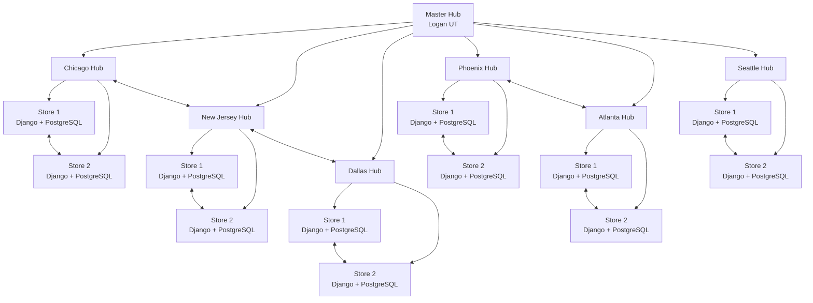
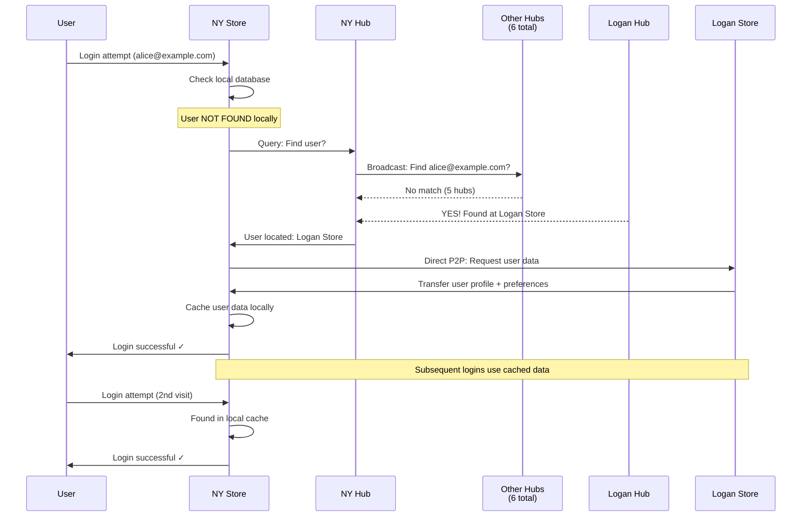
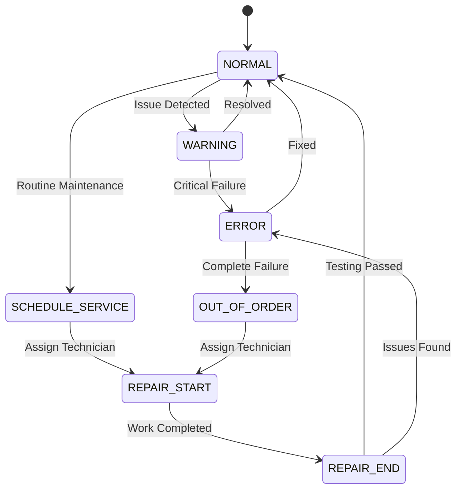
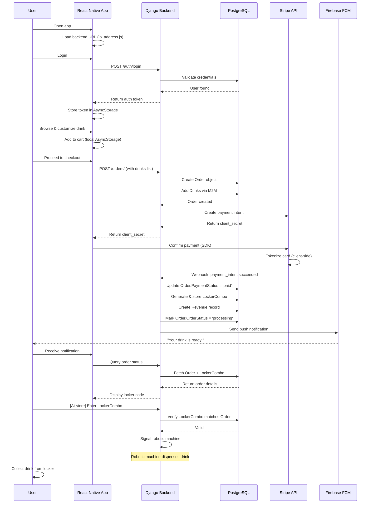
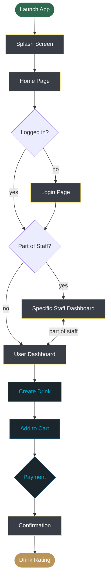
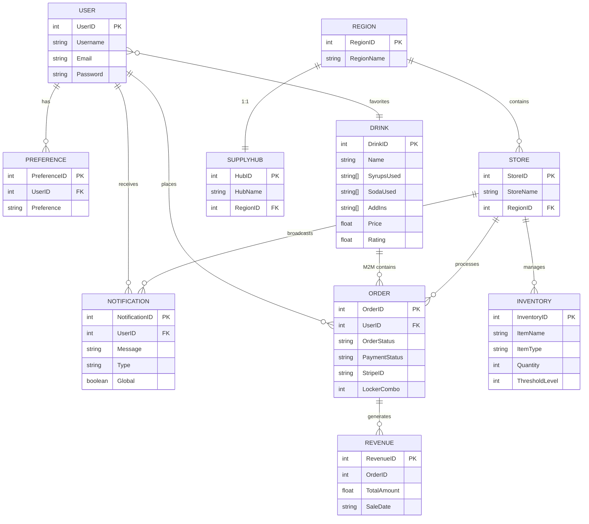

# Codepop Low Level Design Document

### Introduction
The purpose of this document is to provide a working description of the product’s system architecture, subsystems, classes, database tables, user interface prototypes, programming languages, libraries, and frameworks that will be used. This document also addresses system performance concerns and potential security risks as well as have a deployment plan for the release of the application. This document borrows heavily from the lasts teams low level desgin document as many technolgies and data structres will remain unchanged. Developers, company management and customers should reference this document to ensure they are on the same page.

### Development plan

#### Sprint Breakdown

* Sprint 1 - 2 Weeks
    * Must have basic functionality 
    * Function over form
* Sprint 2 - 2 Weeks
    * Start implementing should haves and polishing existing features 
    * Implement must haves that weren't completed from previous sprint  
* Sprint 3 - 1 Week
    * Create user manual
    * Ensure the application is release ready 

### Sprint Outline

**Sprint 1**

Front-end:

Backend: 

**Sprint 2**

Front-end:

Backend: 

**Sprint 2**

Front-end:

Backend: 

### All Tasks Outline

## System Architecture

### Federated Distributed System

The High Level Design specifies a future transformation to a **federated distributed architecture** where multiple stores operate independently with regional coordination. This section describes the target architecture.

### Network Topology

CodePop will evolve into a **hub-and-spoke model with 7 regional supply hubs**:



### Store Discovery & Registration

**Store Registration on Startup:**
1. **Node Identification**: Store reads local configuration (store_id, region, location coordinates)
2. **Hub Contact**: Store connects to regional hub via HTTPS
3. **Registration Request**: POST to `/api/hub/register/` with payload:
```json
{
  "store_id": 42,
  "store_name": "CodePop Chicago #1",
  "region": "Chicago",
  "latitude": 41.8781,
  "longitude": -87.6298,
  "public_key": "-----BEGIN PUBLIC KEY-----...",
  "api_endpoint": "https://store42.codepop.local"
}
```
4. **Hub Response**: Hub returns signed certificate valid for 90 days and list of other stores in region
5. **Cache Update**: Store stores registry in local cache for peer discovery during partition

**Hub Registry Management:**
- Hub maintains in-memory registry of all stores in region
- Registry persists to PostgreSQL for recovery after hub restart
- Heartbeat every 30 seconds from each store; timeout after 3 failures (90 seconds)
- Failed stores marked as unavailable; mobile clients redirected to healthy stores

**Peer Discovery Protocol:**
1. Store needs data from peer store
2. Queries regional hub: `GET /api/hub/store-location/?email=user@example.com`
3. Hub responds with peer store's API endpoint and public key
4. Store directly contacts peer (P2P) with TLS verification

---

### Store Startup Sequence

**Initialization Order (Critical):**
1. **Database Connection** (must succeed)
   - Connect to local PostgreSQL
   - Verify schema version matches expected
   - Fail fast if DB unavailable; store cannot operate
2. **Configuration Load**
   - Read `config.json`: store_id, region, hub_url, etc.
   - Load private key from secure storage (environment variable or key management service)
3. **Register with Hub**
   - POST to hub's `/api/hub/register/` endpoint
   - Retry with exponential backoff (1s, 2s, 4s, 8s)
   - Log warning if hub unreachable; continue with cached registry
4. **Bootstrap Local Data** (if new store or DB reset)
   - Seed catalog drinks from CSV/API
   - Initialize empty inventory (manager will replenish)
   - Create admin user account
5. **Start API Server**
   - Django server listens on configured port
   - Health check endpoint returns 200 OK
   - Accept client connections
6. **Start Background Services**
   - Celery worker for async tasks
   - Event queue processors
   - Heartbeat task to hub (every 30 seconds)
7. **Ready for Operations**
   - Log "Store startup complete"
   - Begin accepting orders

**Graceful Shutdown Sequence:**
1. Stop accepting new connections
2. Wait for in-flight requests (timeout: 10 seconds)
3. Deregister from hub
4. Shutdown Celery workers
5. Close database connection

**Data Bootstrap Sources:**
- **Drink Catalog**: Replicated from master hub on first startup
- **Inventory**: Start empty; manager creates items via UI
- **User Data**: Lazy-loaded on first login attempts
- **Machine Data**: Manager configures machines post-deployment

---

### Store Autonomy & Resilience

- **Each store runs its own complete backend stack**: Django API + PostgreSQL database
- **Operational independence**: Stores continue functioning during hub/peer outages
- **Local data ownership**: Orders, inventory, revenue, machine status never leave the local database
- **Fault isolation**: Problems at one store do not cascade to others

---

### Hub-Store Communication

**Store Registration (on startup):**
- Store registers with its regional hub
- Hub maintains a directory of operational stores

**Peer Discovery:**
- When Store A needs data from Store B, it queries the hub for Store B's address
- Hub provides Store B's IP/endpoint

**Direct P2P Communication:**
- Once Store B's address is known, Store A communicates directly with Store B
- Bypasses hub for data transfer (reduces latency and hub load)

**Logistics Coordination:**
- Supply requests, machine status updates flow through hub
- Hub aggregates regional inventory and maintenance schedules

---

### Data Replication Strategy

**Replicated Data (Lazily synchronized):**
- User accounts and authentication
- User preferences (for personalization)
- User roles (for access control)
- Drink catalog (standard catalog drinks)
- Store registry and hub information

**Local Data (Never replicated):**
- Orders (each store owns its order history)
- Inventory (each store tracks its own stock)
- Revenue (financial data stays local)
- Notifications (user-specific alerts)
- Machine status (local operational metrics)

**Lazy Replication Model:**
- User data does NOT automatically replicate to all stores
- User data syncs ON-DEMAND when user logs into a new store for the first time
- After first login, user data is cached locally for fast subsequent logins

**Rationale for Lazy Replication:**
- **Scalability**: Replicating millions of accounts to thousands of stores is prohibitively expensive
- **Data locality**: Users typically frequent the same store; local caching is efficient
- **Reduced network traffic**: Only active users generate sync traffic
- **Privacy**: User data only exists at stores they have visited

---

### Cross-Region User Discovery

When a user travels to a different region (e.g., Logan, UT user visiting New York, NY):



**Flow Details:**
1. **Discovery Phase**: NY Store checks local database → user not found → queries NY Hub
2. **Hub Broadcast**: NY Hub broadcasts to 6 other regional hubs asking for the user
3. **Peer Response**: Logan Hub responds with user location (Logan Store #001)
4. **Direct Transfer**: NY Store requests user data directly from Logan Store (P2P)
5. **Local Caching**: NY Store caches user data; user logs in successfully
6. **Subsequent Logins**: Subsequent NY Store logins use cached data (no hub/peer queries needed)

---

#### 2.1.8 Revenue Aggregation

**Local Level:**
- Each store maintains its own revenue records
- Managers can view store-level revenue via local dashboard

**Regional Level:**
- Logistics manager requests regional report
- Regional hub queries all stores in region for revenue data
- Hub aggregates results

**National Level (Master Hub Aggregation):**
- Super admin requests nationwide revenue report
- **Primary path**: Master hub (Logan Hub) queries all 7 regional hubs
- **Fallback path**: If master hub unavailable, dashboard queries all 7 hubs in parallel and aggregates client-side

---

### Machine Status Monitoring

Each robotic machine tracks operational status through a **state machine**:



**State Descriptions:**
- **NORMAL**: Machine operational, all systems nominal
- **WARNING**: Minor issue detected, monitoring increased
- **ERROR**: Critical system failure, order intake paused
- **OUT_OF_ORDER**: Machine non-functional, repair staff assigned
- **SCHEDULE_SERVICE**: Routine maintenance scheduled
- **REPAIR_START**: Technician on-site, service in progress
- **REPAIR_END**: Repair completed, testing underway

**Real-time Updates:**
- Stores push machine status changes to regional hub
- Hub dashboard provides live health monitoring for repair staff
- Repair staff can filter/prioritize machines by region and status
- Alert escalation when machines enter WARNING or ERROR states

---

### Technology Stack

#### Frontend
- **Framework**: React Native
- **Key Libraries**:
  - React Navigation: Screen routing and navigation
  - Axios: HTTP requests to backend API
  - AsyncStorage: Local persistent data (userToken, userId, userRole, checkoutList)
  - Stripe React Native SDK: Payment processing

#### Backend
- **Framework**: Django with Django REST Framework
- **Authentication**: Token-based authentication (djangorestframework.authtoken)
- **Database**: PostgreSQL 15
- **Asynchronous Processing**: Celery + Redis (planned for distributed architecture)
- **Key Libraries**:
  - psycopg2: PostgreSQL database adapter
  - stripe: Stripe payment API client
  - scikit-learn: ML-based drink recommendations
  - pandas: Data manipulation for ML models
  - transformers + torch: HuggingFace NLP chatbot

#### Infrastructure
- **Containerization**: Docker + Docker Compose (current single-store setup)
- **Database-per-Store**: Each location will have independent PostgreSQL instance
- **Cloud Deployment (Planned)**: Google Cloud Platform (GCP) chosen for:
  - Cost-effectiveness (25% cheaper than Azure)
  - Superior student credits ($300 free trial)
  - Excellent Django support

#### External Services
- **Stripe**: Payment processing (PCI-DSS compliant; no raw card data stored)
- **Mapbox**: Geolocation and proximity tracking
- **Firebase Cloud Messaging (FCM)**: Cross-platform push notifications
- **Dialogflow ES**: NLP-based customer service chatbot
- **Gemini API**: AI-generated decorative graphics for app loading screens

---

### Inter-Node Communication Protocol

**Protocol Details:**
- **Transport**: HTTPS/TLS 1.3 for all inter-node communication
- **Authentication**: Token-based (JWT or Django REST Framework tokens)
  - Each node has a shared secret or certificate
  - All requests include `Authorization: NodeToken {token}` header
  - Nodes validate token before processing requests
- **Content Type**: JSON with UTF-8 encoding
- **Timeouts**:
  - Connection timeout: 5 seconds
  - Read timeout: 10 seconds
  - Max request size: 10MB
- **Retry Logic**: Exponential backoff (1s, 2s, 4s, 8s) for transient failures

**Inter-Node REST Endpoints:**
```
POST /api/inter-node/user-lookup/          # Query peer store for user
POST /api/inter-node/user-sync/            # Transfer user data to peer
POST /api/inter-node/status-update/        # Machine/store status update to hub
GET /api/inter-node/store-registry/        # Retrieve list of stores from hub
POST /api/inter-node/supply-request/       # Submit supply request to hub
POST /api/inter-node/health-check/         # Peer availability check
```

**Request/Response Format:**
```json
// User Lookup Request
{
  "email": "user@example.com",
  "requesting_store_id": 42
}

// User Lookup Response (Success)
{
  "status": "found",
  "user": {
    "user_id": 5,
    "email": "user@example.com",
    "preferences": ["Coconut", "Fruity"],
    "favorite_drinks": [42, 87, 105]
  },
  "located_at_store_id": 101
}

// User Lookup Response (Not Found)
{
  "status": "not_found",
  "message": "User not found in any store"
}
```

---

### Data Synchronization & Conflict Resolution

**Lazy Replication Strategy:**
- User data syncs **only on-demand** when user logs into new store
- No background sync process; on-demand queries happen in real-time
- After first successful sync, data cached locally for 24 hours
- Cache invalidation: Manual refresh via API or automatic expiration

**Conflict Resolution Rules:**

| Scenario | Rule | Resolution |
| :---- | :---- | :---- |
| User updates preferences at Store A, then logs in at Store B | Preference change wins | Accept most recent timestamp; overwrite cached version |
| User's favorite drinks differ between stores | Union approach | Merge favorite lists; Store B gets all of Store A's favorites |
| User account modified at multiple stores simultaneously | Last-write-wins | Use server timestamp; later write takes precedence |
| Duplicate user records created | Merge | Consolidate into single record; redirect references |

**Consistency Model:**
- **Eventual Consistency** for replicated data (user preferences, roles)
- **Strong Consistency** for local data (orders, inventory, revenue)
- **Conflict-Free Replicated Data Type (CRDT)** consideration for future: use for favorite drinks list (append-only set)

---

### Fallback Scenarios & Error Handling

**Hub Unavailability:**
- **Impact**: Store continues operating; new users cannot be discovered from other regions
- **Fallback**: Stores maintain local user cache; queries timeout gracefully
- **Recovery**: Automatic retry after 30 seconds; manual hub reconnection after 5 minutes
- **User Experience**: Non-local users see error message with estimated wait time

**Peer Store Unreachable:**
- **Impact**: Cannot fetch user data from peer; user login fails
- **Fallback**: Suggest user use their home store; provide offline mode if available
- **Recovery**: Automatic retry with exponential backoff
- **HTTP Status**: Return 503 Service Unavailable with retry hint

**Network Partition (Store isolated):**
- **Impact**: Store operates independently; orders processed normally
- **Fallback**: All operations queued locally; sync when connectivity restored
- **Outbound**: Status updates queued in Celery; processed when hub available
- **Recovery**: Automatic reconciliation when partition heals; manual override for conflicts

**Database Failure (Local PostgreSQL down):**
- **Impact**: All API operations fail; machine maintenance halts
- **Recovery**: Failover to replica (if configured); manual intervention required
- **User Experience**: Immediate 503 error; recommend contact store management

---

### Inter-Node Authentication & Authorization

**Node Identity & Trust:**
1. **Node Registration**: Each store/hub registers with master hub on startup
   - Provides: Node ID, Region, Location, Public Key
   - Receives: Signed certificate valid for 90 days
2. **Token Issuance**: Tokens signed with node's private key
   - Token includes: Node ID, Issuing Time, Expiration (1 hour)
   - Format: JWT with RS256 signature
3. **Token Validation**: Receiving node validates signature using sender's public key
   - Check expiration time
   - Verify node ID matches certificate
   - Reject if certificate expired

**Authorization Rules:**
- **Store → Hub**: Can submit supply requests, status updates, revenue reports
- **Hub → Store**: Can query store data, trigger machine status changes
- **Store A ↔ Store B**: Can exchange user data and machine status (after hub confirmation)
- **Manager Access**: Token claims include `user_id` and `store_id`; can only access own store
- **Logistics Manager**: Token includes `region_id`; can access hub-level data

In the distributed architecture, stores and hubs communicate via:

- **REST APIs** for synchronous requests (user lookup, store discovery)
- **Event queues** (Celery + Redis) for asynchronous messaging (status updates, alerts)
- **HTTPS/TLS 1.3** for all communications (encryption in transit)
- **Token authentication** between nodes (servers must authenticate before data exchange)
- **Trusted peer registry**: Hardcoded list of valid CodePop servers prevents unauthorized access

---

### Data Flow Example: User Placing an Order



---

Subsystems and UML Class Diagrams

* App objects: 


* Main user flow:  


 

## User interfaces:

### Accessibility

The CodePop interface is carefully designed to support both usability and accessibility, adhering to the Web Content Accessibility Guidelines (WCAG). A color palette has been selected based on an analysis of common forms of color blindness, ensuring that problematic combinations like teal and purple are not placed next to each other for better readability. Each page is fully compatible with screen readers, offering audio feedback for users with visual impairments. Additionally, tab-controlled navigation is integrated, allowing keyboard users to easily move through the interface without relying on a mouse, ensuring a more inclusive user experience.

### Flow and design for page layout

**Home Page**

* Nav Bar: Links to Drink Design, Account User Home, Cart, Complaints.  
* Seasonal Drinks Menu: Displayed as a carousel.  
* Generate Random Drink Button (AI-powered).  
* Set Drink Text Box (input for AI API-generated drink).  
* Create Account Button (for non-account users).  
* **Primary Flow**: User either navigates through nav bar or signs in/creates an account.

**Sign-In Page**

* Username/Password text boxes.  
* Login Button: Authenticates user via `signIn()`, redirects to Home Page upon success.  
* Error Message displayed automatically if login fails.  
* Link to Sign-Up Page for new users.

**Sign-Up Page**

* Fields for account creation.  
* Button to create an account via `createUser()`, redirect to Sign-In after successful creation.

**Account User Home Page**

* Displays saved drinks and current user preferences.  
* Buttons to modify preferences (`updatePreferences()`) and save changes (`savePreferences()`).  
* Option to enable/disable geolocation.

**Complaints Page**

* Text entry box for complaints, integrated with AI API to manage complaints.

**Drink Design Page**

* Drink creation UI with add-ins displayed as graphics.  
* Interactive drink customization (soda, size, ice, syrups, etc.).  
* Search bar for quick ingredient lookup.  
* Drink object is created (`createDrink()`) and saved to the cart.

**Cart Page**

* Displays a list of drinks with options to remove, edit, or proceed to checkout.  
* Each drink object shows price and ingredients.  
* The Checkout button redirects to the Payment Page.  
* User can edit existing drinks using `updateDrink()`

**Payment Page**

* Stripe API for secure payment processing.  
* User can choose between geolocation-based tracking or a scheduled pickup time.  
* Confirmation message displayed after payment submission.

**Confirmation Page**

* Displays drink details with a timer countdown.  
* Option to rate each drink and file a complaint if needed.  
* Refund button if necessary.

**Manager Dashboard**

* Data visualization (charts) of store data like revenue and expenses.  
* Managers can access this dashboard to view key metrics via `getData()`.

**Admin Dashboard**

* Admin controls for managing user accounts (update, delete, create manager accounts).  
* Data visualization for user and store statistics.

## Database tables

### Overview

CodePop uses a **database-per-store architecture** where each physical store location maintains its own independent PostgreSQL instance. Data is categorized as either **replicated** (synchronized across stores on-demand) or **local** (never replicated). This section documents the core data entities currently implemented in `codepop_backend/backend/models.py`.

---

### User Table

| Field Data | Data Type | Constraints | Notes |
| :---- | :---- | :---- | :---- |
| UserID | int | Primary Key | Built-in Django `User` model |
| Username | String | Unique | User login identifier |
| Password | String | NOT NULL | Hashed using PBKDF2-SHA256 |
| Email | String | NOT NULL | Email address for verification |
| is_staff | Boolean | Default False | Distinguishes managers from regular users |
| is_superuser | Boolean | Default False | Distinguishes admins from regular users |

**Notes:**
- Uses Django's built-in `django.contrib.auth.models.User` for authentication.
- User roles are represented via `is_staff` and `is_superuser` flags rather than a separate role field.
- Role-based access control (staff, admin, customer) is implemented in views and serializers.

---

### Preference Table

| Field Data | Data Type | Constraints | Notes |
| :---- | :---- | :---- | :---- |
| PreferenceID | int | Primary Key | Auto-generated |
| UserID | int | Foreign Key References User(UserID) | Cascade on delete |
| Preference | String (varchar 100) | NOT NULL | Preference label (e.g., "Coconut", "Fruity") |

**Notes:**
- Stores user flavor preferences for the AI recommendation engine.
- One user can have multiple preferences; each preference is a separate row.
- Lazily replicated across stores (only synced when user logs into a new store).

---

### Drink Table

| Field Data | Data Type | Constraints | Notes |
| :---- | :---- | :---- | :---- |
| DrinkID | int | Primary Key | Auto-generated |
| Name | String | NOT NULL | Display name of the drink |
| SyrupsUsed | Array (String[]) | Nullable | PostgreSQL ArrayField; list of syrup names |
| SodaUsed | Array (String[]) | NOT NULL | PostgreSQL ArrayField; list of soda names |
| AddIns | Array (String[]) | Nullable | PostgreSQL ArrayField; list of add-in names |
| Rating | Float | Nullable | User rating (0–5 scale); NULL if unrated |
| Price | Float | NOT NULL | Cost of the drink in USD |
| Size | String | Default "m" | Drink size: "s" (16oz), "m" (24oz), "l" (32oz) |
| Ice | String | Default "normal" | Ice amount: "none", "light", "normal", "extra" |
| User_Created | Boolean | NOT NULL | True if user-created custom drink; False if catalog drink |
| Favorite | M2M → User | Nullable | Many-to-Many relationship; users can favorite many drinks |

**Notes:**
- Catalog drinks (User_Created=False) are replicated to all stores.
- User-created drinks (User_Created=True) are lazily replicated on-demand.
- ArrayField is PostgreSQL-specific; ensures type safety for ingredient lists.

---

### Order Table

| Field Data | Data Type | Constraints | Notes |
| :---- | :---- | :---- | :---- |
| OrderID | int | Primary Key | Auto-generated |
| UserID | int | Foreign Key References User(UserID) | Nullable; allows guest checkout |
| Drinks | M2M → Drink | NOT NULL | Many-to-Many relationship; order contains multiple drinks |
| OrderStatus | String | Choices: pending / processing / completed / cancelled | Default: pending |
| PaymentStatus | String | Choices: pending / paid / failed / remade | Default: pending |
| PickupTime | DateTime | Nullable | Scheduled pickup time (NULL for geolocation-based pickup) |
| CreationTime | DateTime | auto_now_add | Timestamp of order creation |
| LockerCombo | BigInteger | Nullable | Locker access code for drink pickup |
| StripeID | String | NOT NULL | Stripe payment intent ID (non-sensitive token) |

**Notes:**
- `Drinks` is a Many-to-Many field allowing orders to contain multiple drinks.
- `LockerCombo` is generated after successful payment and provided to customer.
- `StripeID` references the Stripe payment intent; raw credit card data never stored locally.
- **Local Data** — never replicated between stores; each store maintains its own order history.

---

### Inventory Table

| Field Data | Data Type | Constraints | Notes |
| :---- | :---- | :---- | :---- |
| InventoryID | int | Primary Key | Auto-generated |
| ItemName | String | NOT NULL | Name of ingredient or physical item |
| ItemType | String | Choices: Soda / Syrup / Add In / Physical | NOT NULL |
| Quantity | PositiveInt | NOT NULL | Current stock level |
| ThresholdLevel | PositiveInt | NOT NULL | Minimum quantity before alert triggers |
| LastUpdated | DateTime | auto_now | Automatically updates on every save |

**Notes:**
- ItemType values: "Soda", "Syrup", "Add In", "Physical" (cups, lids, straws, etc.).
- ThresholdLevel is used by managers and logistics systems to trigger supply requests.
- **Local Data** — each store maintains its own inventory; never replicated.
- `LastUpdated` auto-increments to enable tracking of recent changes.

---

### Notification Table

| Field Data | Data Type | Constraints | Notes |
| :---- | :---- | :---- | :---- |
| NotificationID | int | Primary Key | Auto-generated |
| UserID | int | Foreign Key References User(UserID) | Cascade on delete; NOT NULL if user-specific |
| Message | String | max_length=500 | Notification text content |
| Timestamp | DateTime | Default: now | Creation time of notification |
| Type | String | max_length=50 | Category (e.g., "order_ready", "stock_alert", "system") |
| Global | Boolean | Default False | False = user-specific; True = broadcast to all users |

**Notes:**
- When `Global=True`, the notification is a broadcast message to all users (e.g., store closure notice).
- When `Global=False`, the notification is user-specific (e.g., "Your drink is ready").
- **Local Data** — each store maintains its own notifications; not replicated.
- Push notifications to users triggered via Firebase Cloud Messaging (FCM).

---

### Revenue Table

| Field Data | Data Type | Constraints | Notes |
| :---- | :---- | :---- | :---- |
| RevenueID | int | Primary Key | Auto-generated |
| OrderID | int | NOT NULL | Order reference (plain field, not a FK with DB constraint) |
| TotalAmount | Float | Default 0.0 | Revenue amount in USD; auto-calculated from order drinks |
| SaleDate | DateTime | Default: now | Date/time of transaction |
| Refunded | Boolean | Default False | True if transaction was refunded |

**Notes:**
- `OrderID` is stored as an IntegerField without a foreign key constraint for flexibility.
- `TotalAmount` auto-calculates on save by summing drink prices from the associated order.
- If manually set, auto-calculation is skipped; allows for manual adjustments if needed.
- **Local Data** — each store maintains its own revenue records; never replicated.
- Aggregation happens on-demand when managers/executives request reports (see Architecture section).

---

### Removed/Consolidated Tables

#### Payment Table (Removed)
- **Previous design**: Separate Payment table for tracking transaction details.
- **Current design**: Payment information consolidated into Order table via `StripeID`.
- **Rationale**: Stripe handles all sensitive payment data; CodePop stores only the non-sensitive payment intent ID.

#### Code Table (Removed)
- **Previous design**: Separate Code table for storing locker access codes.
- **Current design**: Locker combination stored as `LockerCombo` field in Order table.
- **Rationale**: Simplifies schema; each order has exactly one locker code.

---

### Database Indexing Strategy

**Recommended Indexes:**

Create indexes on the following fields to optimize query performance:

| Table | Fields | Purpose |
| :---- | :---- | :---- |
| User | UserID | Primary key (auto-indexed) |
| Order | UserID | Lookup user's orders |
| Order | CreationTime | Range queries for date filtering |
| Order | OrderStatus | Filter orders by status |
| Preference | UserID | Lookup user preferences |
| Inventory | ItemName, ItemType | Quick ingredient lookups |
| Inventory | Quantity | Find low-stock items |
| Notification | UserID, Timestamp | User notification timeline |
| Revenue | SaleDate | Revenue reporting by date range |

**Indexing Guidelines:**
- Primary keys are auto-indexed; do not add duplicate indexes
- Foreign keys should be indexed for join performance
- Timestamp fields should be indexed for range queries
- Status/category fields should be indexed if frequently filtered
- Consider composite indexes for common multi-column filters

---

### Data Validation & Constraints

**Field Validation Rules:**

| Table | Field | Validation Rule | Error Message |
| :---- | :---- | :---- | :---- |
| User | Email | Valid email format (RFC 5322) | "Invalid email address" |
| User | Password | Min 12 chars, 1 uppercase, 1 lowercase, 1 digit, 1 special char | "Password does not meet complexity requirements" |
| Preference | Preference | Non-empty string, max 100 chars | "Invalid preference format" |
| Drink | Name | Non-empty string, max 255 chars | "Drink name required" |
| Drink | Price | Float >= 0.00, max 2 decimals | "Price must be positive currency value" |
| Drink | Size | Must be "s", "m", or "l" | "Invalid size; must be s, m, or l" |
| Drink | Ice | Must be "none", "light", "normal", or "extra" | "Invalid ice amount" |
| Order | LockerCombo | 6-digit numeric code (000000-999999) | "Invalid locker combination format" |
| Order | StripeID | Non-empty string, starts with "pi_" or "seti_" | "Invalid Stripe payment intent ID" |
| Inventory | Quantity | Integer >= 0 | "Quantity cannot be negative" |
| Inventory | ThresholdLevel | Integer >= 0 | "Threshold must be non-negative" |
| Revenue | TotalAmount | Float >= 0.00, max 2 decimals | "Invalid revenue amount" |

---

### Migration Considerations

**Key Migration Patterns:**
- **Adding new ingredients**: Insert into Inventory with appropriate ItemType and ThresholdLevel
- **Changing drink recipes**: Update ArrayFields; existing orders retain original recipe
- **Adding new user roles**: Extend is_staff/is_superuser flags or add authorization in views
- **Database replication**: User + Preference replicate on-demand; Order/Revenue stay local
- **Data cleanup**: Archive old orders/revenue after 1 year; cascade delete user records on account deletion

**Zero-Downtime Migration Strategy:**
1. Create new column with default value
2. Deploy code that reads from both old and new locations
3. Backfill data incrementally in background
4. Deploy code that writes to new location only
5. Remove old column in follow-up deployment

---

### Entity Relationship Diagram



### Backend UML:

 

### 

Manager Dashboard Module Functions:

 


User Management Module Functions: 

 

Order Management Module Functions:  

 


Soda Catalog Module Functions:  

 


AI Recommendation Module Functions: 

  

## System performance

To address system performance, potential bottlenecks such as high traffic during peak hours, concurrent payment processing, and large database queries are considered. The system is designed with scalability in mind, using load balancing techniques to distribute traffic across multiple server instances. The use of a CDN for static assets ensures faster content delivery to users across different regions. For the backend, Django’s ORM optimizes database queries, and indexing will be employed for frequently accessed data like user preferences and drink details to improve response times. PostgreSQL will handle database connections efficiently, but if demand grows, database read replicas will be deployed to reduce the load on the primary database. Additionally, autoscaling for cloud infrastructure ensures that more server instances can be automatically provisioned during traffic spikes. This architecture allows the system to handle increases in load while maintaining optimal performance.

## Security risks

The CodePop app incorporates a robust security model based on Django’s built-in authentication and authorization system. This system manages user accounts, groups, permissions, and cookie-based sessions, ensuring secure access across different user roles. This is important since many user roles have a direct impact on on day to day operations. 
* Admins have the ability manage user accounts in their area as well as create managers for stores.
* Managers can access their stores information like expense reports and sales figures.
* Logistics Managers have access to an entire regions supplies and can approve or deny requests for supplies.
* Super Admins can view the information of any store nation wide as well as create admin accounts.
If a malicious actor got access to any of these roles they could inflict serious financial harm on the company and our customers so a strong security is a must. To enhance security, features such as password strength checking can be implemented. Staff should also be told about ways the can keep their account secure. The app separates the client and server, utilizing token-based authentication for secure communication. Django’s security features include query parameterization for injection protection and Cross-Site Request Forgery (CSRF) protection to prevent unauthorized actions. Additionally, sensitive data, including user payment information, email addresses, and store revenue reports, will be encrypted using SHA-256 both at rest and in transit. CodePop complies with relevant data protection laws such as GDPR and takes measures to address the OWASP Top 10 security risks. Users will be given the option to opt into features that handle personal data, ensuring transparency and privacy. 

### Risks with AI
With the advent of AI we have seen numerous ways to "jailbreak" them and get them to say or do things they weren't intend to do. Since we have multiple interfaces for communicating with AI in the CodPop app we must take precautions to ensure that a bad actor cannot take advantage of our AI. It should be assumed that our AI *will* be exploited at some point. To minimize the damage this will cause the scope of our AI's abilities should be limited. Our resident customer support bot, Tonic, should only have access to order information to help process refunds. He should not be able to access any other data from our database. This way the worst he can do is say something obscene not leak the fiances of the company. Our Logistics Manager AI is a bit different. It will have access to sensitive documents that are uploaded by the staff. It should not be able to access anything more. To ensure that the AI stays on task we must give them initial prompts that ensure they do what they are told. These prompts should be robust enough to with stand the most common jailbreak prompts. To increase the stability of the AI's they should not be reset when they are no longer needed. Having them remember past conversations is not necessary for the functionality we require and introduces many technical and stability issues with the AI.

* **Authentication and Authorization**: Description of user roles and permission management.  
  * Explanation of admin and manager access and roles:  
    * Admins: 
        * Admins have access to user account information in their store.
        * Admins are able to add/remove general user accounts and create manager accounts for their stores.   
    * Super Admins
        * Super Admins have all the same permissions as a regional Admin but on a national scale.
        * Super Admins can create/remove store admins.
    * Managers:
        * Managers have access to store data such as revenue and expense reports.   
    * Logistics Manager:
        * Logistics Managers have access to regional supply chain information.
        * Logistics Managers determine supply routes.
    * Repair Staff:
        * Repair Staff can view any machine's status in their area.
  * User authentication:
    * Django comes with a built in user authentication system that handles user accounts, groups, permissions and cookie-based user sessions 
      * This system can be expanded and customized to add things like password strength checking to add more security.    
  * To secure the application, the client and server will be separated.   
    * The client and server will talk to each other through token authentication which is already included with Django.   
  * Django security features: [https://docs.djangoproject.com/en/5.1/topics/security/](https://docs.djangoproject.com/en/5.1/topics/security/)  
    * Includes injection protection because queries are constructed using query parameterization  
    * Includes Cross site request forgery (CSRF) protection which prevents attacks that perform actions using other people’s credentials.
  * API endpoints will be used to ensure a user can access a endpoint with their role.
* **Inter-Node Communication Security**: How to keep communications between servers secure
  * Messages should be passed using HTTPS 
  * Servers must authenticate that they are talking to a legit CodePop server before any communications take place
    * A list of know servers should be created and maintained to ensure a server can trust another server  
  * A store servers can be accessed by super admins and a store's admin, manager and repair staff
    * If a supply hub or another regional store needs information from a different store it can request the information
  * Supply hubs can only be accessed by logistic managers and super admins 
    * They can send requests to other supply hubs and store inside of their region only
  * The Master hub can only be accessed by logistic managers and super admins
  * Nodes will be ran on Google Cloud platform in Docker containers
    * Google has plenty of security features for their architecture which we will be using by default
    * The isolation of Docker containers can make programs more secure as they are harder to get into
* **Data Encryption**: Explanation of how data will be encrypted (at rest and in transit).  
  * Django user data encryption  
  * Sha 256 encryption  
* **Compliance**: Relevant data protection laws (GDPR, HIPAA).  
  * Pay attention to the OWASP top 10: [https://owasp.org/www-project-top-ten/](https://owasp.org/www-project-top-ten/)  
* **Sensitive data**  
  * User data:  
    * Payment information  
    * Email  
    * geolocation  
  * Store data:  
    * Revenue tables (regional and local) 
  * Hub data:
    * Region's supplies
* **Privacy**  
  * We will make sure that the user has the option to opt into any of the features that handle personal data (geolocation, drink preferences, emails) to ensure that they are able to make an informed choice about their data.
* **Leak Policy**: What to do when a leak occurs and sensitive information gets out.
  * Find leak and patch it ASAP
  * Assess damage, see what got out
    * Contact users about their data and account

## Programming languages, libraries, frameworks, and third party systems

#### **Front-End**

* Framework: React Native  
* Languages: JavaScript, HTML, CSS

  #### **Middle-End**

* Framework: Django  
* Languages: Python

  #### **Back-End**

* Framework: Django  
* Database: PostgreSQL  
* Languages: Python, SQL

  #### **APIs & External Services**

* Payment System: Stripe API  
  * Set up stripe account and API keys  
  * Integrate Stripe’s Mobile SDK for the frontend (checkout screen)  
  * Create payment intents on backend  
  * Handle payment confirmation on the frontend   
    * Pass the `client_secret` to frontend  
    * Use the Stripe SDK to confirm the payment by calling `confirmPayment`  
    * Set Up Webhooks for Payment Status Tracking (notifies backend if payment was successful, failed, etc.)  
* Geolocation: MapBox API  
  * Create mapBox account and obtain access token  
  * Integrate MapBox SDK into frontend  
  * Use the *Geolocation API* or Mapbox’s *GeolocateControl* to get the user’s current coordinates.  
  * Set up proximity alerts  
* Random Drink Generation: Content-Based AI Filtering Model (Scikit-Learn)  
  * Use a pandas DataFrame to prep data  
  * Convert features into numerical values  
  * Define a similarity metric for the drinks (probably `cosine_similarity`)  
  * Build recommendation function  
  * Integrate model into backend  
* Complaints Chatbot: DialoGPT (Hugging Face)  
  * Set up an environment and load DialoGPT model  
  * Create a function to generate responses  
  * Set up an API endpoint (so that the app’s frontend can call it)  
  * Integrate into frontend  
* Loading Screens: Gemini AI Images  
  * Preload 1-2 images we like  
  * Embed the preloaded images into the app

## Deployment plan

**1\. Development Environment Setup**

* **Version Control**: Use Git for managing source code. Establish a remote repository (e.g., GitHub, GitLab) for collaboration.  
* **Local Development**: Set up local environments for developers with tools like Docker for containerization to ensure consistency.  
* **Technology Stack**:  
  * Frontend: HTML, CSS, JavaScript, and Reach Native framework  
  * Backend: Django for server-side logic and database management.  
  * Database: PostgreSQL for managing user data, drinks, and store information.  
* **Dependencies**: Use `pip` for Python dependencies and `npm` for any frontend packages.

**2\. Staging Environment**

* **Staging Server Setup**: Deploy a staging environment to test all new features before going live.  
* **Testing**:  
  * **Unit Testing**: For each individual function like `createUser()`, `getDrink()`, etc.  
  * **Integration Testing**: Ensure all components (frontend, backend, database) work together.  
  * **Accessibility Testing**: Verify compliance with WCAG, ensuring color contrast, screen reader compatibility, and tab navigation.  
  * **Load Testing**: Use tools like Apache JMeter to simulate heavy traffic and ensure scalability.  
* **Pre-Deployment Validation**: Test payment flows with the Stripe API, and ensure all security measures (token authentication, CSRF protection) are in place.

**3\. User Acceptance Testing (UAT)**

* Invite key stakeholders (store owners, staff) to use the staging environment and provide feedback.  
* Ensure the interface is intuitive, accessible, and aligns with business needs.  
* Adjust any features or fix bugs found during UAT before final production deployment.

**4\. Production Environment Setup**

* **Hosting**:  
  * **Frontend Hosting**: Deploy frontend assets to a Content Delivery Network (CDN) for fast global access (e.g., AWS S3 or Netlify).  
  * **Backend Hosting**: Use cloud-based services like AWS EC2 or DigitalOcean for running the Django app.  
* **Database Setup**: Deploy the PostgreSQL database using cloud-based solutions (e.g., AWS RDS or Heroku Postgres) for scalability and backup.  
* **Security Setup**:  
  * **SSL/TLS Certificates**: Ensure HTTPS is enabled for secure communication.  
  * **Environment Variables**: Store sensitive data like API keys and database credentials securely (e.g., AWS Secrets Manager).  
  * **Firewall & Access Control**: Set up firewalls and limit access to production servers using SSH keys.  
  * **Backup Plan**: Regular backups of databases and critical assets to prevent data loss.

**5\. Production Deployment**

* **Code Freeze**: Set a code freeze date before deployment to ensure no last-minute changes.  
* **Final Deployment Steps**:  
  * Deploy the frontend and backend to their respective hosting services.  
  * Migrate any production databases and ensure all data from staging is migrated.  
  * Ensure that token-based authentication and secure data encryption (e.g., SHA-256) are fully operational.  
* **Post-Deployment Validation**:  
  * Test all critical functions (sign-in, drink creation, cart, payment).  
  * Check that the admin and manager dashboards are accessible with the correct permissions.

**6\. Post-Deployment Monitoring & Maintenance**

* **Ongoing Monitoring**: Ensure performance metrics are actively tracked, especially during high traffic periods.  
* **Bug Fixes**: Implement a process for quickly addressing user-reported issues or security vulnerabilities.  
* **Regular Updates**: Schedule periodic security patches, updates to libraries, and infrastructure improvements.

**7\. Scaling & Future Enhancements**

* **Auto-Scaling**: Set up auto-scaling for cloud-based infrastructure to handle growing user demand.  
* **Feature Rollouts**: Plan for iterative feature deployment, such as enhanced AI drink recommendations or more detailed analytics for managers and admins.  
* **Performance Optimization**: Regularly review the system’s performance and optimize database queries, asset loading times, and server response times.