This document was created with assistance from ChatGPT.

# **Code Pop High-Level Design Document**

**Introduction**

* Purpose  
* Scope  
* Audience  
  **System Overview**  
* Problem Statement  
* Proposed Solution  
* Hardware Platform  
  * Mobile  
  * Laptop and Desktop

  **Architecture Design**

* Architecture Overview: Explanation of the overall architecture (monolithic, microservices, etc.)  
* Component Diagram: Diagram showing major system components and their relationships  
* Technology Stack: Technologies and frameworks used (e.g., languages, databases, servers)  
  * React Native  
  * Django  
  * PostgreSQL  
  * AI

  **Modules and Components (Internal Interfaces)**

* Module Overview: Description of key modules or components, their responsibilities, and interactions  
* Data Flow Diagram (DFD): Illustration of how data moves between components  
* Component Interaction: Details on how system components will communicate (e.g., APIs, web services)  
  **Data Design**  
* Data Model: High-level structure of data, including key entities and relationships  
* Database Design: Type of database used (relational, NoSQL, etc.), major tables, and relationships  
* Data Access Layer: Overview of how data is accessed, stored, and retrieved (e.g., ORM, SQL)  
  **Integration Points (External Interfaces)**  
* External Systems: Description of external systems or services the app will integrate with  
* APIs: List of public/external APIs, endpoints, methods, and data contracts  
  * Payment System: Stripe  
  * Geolocator: MapBox  
  * AI Chatbot: DialoGPT  
  * Notifications: Firebase Cloud Messaging (FCM)

  **User Interface (UI) Design Overview**

* UI/UX Principles: High-level UI/UX principles (e.g., responsiveness, accessibility)  
* Mockups: High-level mockups or wireframes of key screens  
* Navigation Flow: Overview of how users will navigate the app  
  **Input and Output (I/O)**  
* Input  
* Output  
  **Security and Privacy**  
* Authentication and Authorization: Description of user roles and permission management  
* Data Encryption: Explanation of how data will be encrypted (at rest and in transit)  
* Compliance: Relevant data protection laws (GDPR, HIPAA)  
* Privacy  
  **Testing Strategy**  
* Unit Testing  
* Manual Testing  
  **Risks and Mitigations**  
* Identified Risks: List of known risks (e.g., technology choice, dependencies)  
* Mitigation Plans: Strategies for addressing these risks  
  * User Geolocation  
  * User Input (AI)  
  * Payment Information  
  * Allergies  
  * User (Account) Information  
  * Location Revenue Information  
  * Legal Issues

---

## **1\. Introduction**

**Purpose**: This document exists to provide a reference for developers while working on the CodePop app to ensure that the development team can work independent of each other and still have code that will work together to form the final project at the end. 

**Scope**: This document has a large scope that encompasses just about every part of development, but it is more focused on the “why” of each design choice than the “how”. As such it won’t delve too deeply into the specific implementation detail.

**Audience**: This document is meant for developers and stakeholders of the project to ensure development is going in the right direction and everyone is on the same page.

## **2\. System Overview**

**Problem Statement**: In the world of dirty soda shops, there are too many options and many long lines, resulting in a confusing and overwhelming customer experience.

**Proposed Solution**: CodePop will provide a simple, AI-powered ordering experience to help eliminate the confusion and pressure typically associated with dirty soda shops.

**Hardware Platform**:  
CodePop is designed to be accessible to a wide variety of users. Our goal is to create software that is easy/quick to use. This section outlines the hardware platforms CodePop could be built on, including priorities and possibilities.

* **Mobile**:  
  * **App**:  
    CodePop’s priority hardware will be a mobile application. Phones are generally very easy to use and carry around. Since users will need to travel to a CodePop location to pick up their drinks, having a device they can easily bring with them is essential. Touchscreens make it easy for users to navigate the app quickly.   
    * A mobile app is more prioritized than a website because we believe it best fits the client’s needs.  
  * **Website**:  
    The mobile app can be converted to a mobile-optimized website with the same functionality and layout as the app. To ensure accessibility, the app and website will be designed to work on both Android and iOS devices. However, due to easier testing methods, we will begin by developing the app for Android.  
  * **Touchscreen**:  
    Since touchscreen functionality is key to accessibility and usability, it will be prioritized in the app’s UI. Buttons and sections will be larger in size to make them easier to tap without zooming in. Other actions, such as swiping and holding, will also be considered.  
  * **Gestures**:  
    Gestures will not be included in the first version of the app. They are less reliable than touchscreen interactions, and our focus will remain on perfecting the core features of the app instead.  
  * **Portrait vs. Landscape**:  
    The app/website will be optimized for portrait mode to allow easy access to all points of the screen and to enable comfortable use with one hand. Landscape mode may be considered in future versions or when laptop/desktop accessibility is introduced.  
* **Laptop/Desktop**:  
  * **Website**:  
    While phones are the primary use-case for the CodePop app/website, a laptop/desktop UI will not be a high priority initially. A desktop-friendly UI may be added after the mobile functionality is complete, provided it doesn't divert resources from more critical features. Laptop/desktop access will be limited to the website only, not an app, to avoid over-scoping.  
  * **Touchscreen Laptops**:  
    Although touchscreen laptops exist, their dimensions differ significantly from mobile devices, and they will not be prioritized in the initial development phase. Their prioritization will remain with every other laptop device.

## **3. Architecture Design**

### **Architecture Overview**

This section describes a **planned future architecture** for CodePop's transformation from a single-location system to a nationwide distributed network. The current implementation is a centralized single-store system. This document serves as the architectural blueprint for the distributed system upgrade.

CodePop will employ a **federated distributed system architecture** where each physical store location operates as an independent node with regional coordination hubs. This is **not** a true peer-to-peer system but rather a **hub-and-spoke model with store autonomy**.

**Key Architectural Principles:**

* **Decentralization**: No central server controls the entire system. Each store runs its own complete backend stack (Django + PostgreSQL) and can operate independently during network partitions.

* **Regional Coordination**: Seven regional supply hubs provide logistics coordination, peer discovery, and inventory management for stores within their geographic regions. Hubs are **not** customer-facing and do not process drink orders.

* **Hybrid Communication Model**:
  - **Hub as Service Registry**: Stores register with hub on startup; hub maintains "phone book" of stores in region
  - **Hub for Discovery**: When Store B needs data from Store A, it first asks hub "where is Store A?"
  - **Direct Store-to-Store for Data**: Once Store B has Store A's address, they communicate directly (peer-to-peer) without hub mediation
  - **Hub for Logistics**: Supply requests, revenue aggregation, and machine status reporting still go through hub

* **Fault Isolation**: Failures or outages at one store or hub do not prevent other stores from continuing normal operations. The system is designed to gracefully handle network partitions and temporary connectivity loss.

* **Local-First Data**: Each store maintains its own operational data (orders, inventory, revenue, machine status) in its local database. Only specific data types (user accounts, preferences, favorites) are synchronized across the network on-demand.

---

### **Network Topology:**

```
┌─────────────────────────────────────────────────────────────────┐
│          Supply Hub Network (7 Regional Hubs)                   │
│  Chicago IL │ New Jersey NY │ Logan UT │ Dallas TX │ etc.       │
│  - Service registry (lists stores in region)                    │
│  - Logistics coordination (supply requests)                     │
│  - Regional inventory aggregation                               │
│  - User account lookup service                                  │
└────────────┬────────────────────────────────┬───────────────────┘
             │                                │
             │    Hub-Store Communication     │
             │    (REST APIs + Event Queue)   │
             │                                │
    ┌────────▼────────┐              ┌───────▼────────┐
    │  Store Node A   │              │  Store Node B  │
    │  - Django API   │◄─────────────►  - Django API  │
    │  - PostgreSQL   │ (direct P2P) │  - PostgreSQL  │
    │  - Local Data   │              │  - Local Data  │
    │  - Event Queue  │              │  - Event Queue │
    └────────┬────────┘              └───────┬────────┘
             │                                │
    ┌────────▼────────┐              ┌───────▼────────┐
    │  Mobile Client  │              │  Mobile Client │
    │  (React Native) │              │  (React Native)│
    └─────────────────┘              └────────────────┘
```

Each store node includes:
- **Django Backend**: Full REST API implementation with all business logic
- **PostgreSQL Database**: Complete local data storage for that store
- **Inter-Node Communication Layer**: REST endpoints for hub-to-store and store-to-store communication
- **Event Queue**: Celery workers with Redis broker for asynchronous message processing
- **Service Registry Client**: Maintains connection to regional supply hub for peer discovery

Each supply hub includes:
- **Same Django Codebase**: Supply hubs run the same Django backend as stores but with different configuration
- **No Customer Operations**: Supply hubs do NOT have robotic machines, do NOT accept customer orders, and are NOT customer-facing
- **Logistics Functions Only**: Manage supply requests, track regional inventory, maintain store registry

---

### **Mobile Client Interaction:**

The React Native mobile app uses geolocation to discover nearby operational stores via the store discovery API.

**Store Discovery Flow:**
1. User opens app → App requests device location (latitude, longitude)
2. Backend queries Store table for stores within radius, returns sorted list of nearby stores
3. User selects store (or app auto-selects closest operational store)
4. All subsequent orders and interactions target that specific store's API endpoint
5. If selected store becomes unavailable (health check fails), the app can switch to another nearby store

CodePop uses a **lazy replication model** for user data:

- **NOT Proactive Replication**: User accounts are NOT automatically replicated to all stores
- **NOT Eventual Replication**: There is NO background process that eventually propagates all user data everywhere
- **Lazy On-Demand**: User data is replicated to a store ONLY when that user logs in at that store for the first time

**Why Lazy Replication?**
- **Scalability**: With thousands of stores nationwide, eagerly replicating millions of user accounts to every store would be prohibitively expensive
- **Data Locality**: Most users visit the same store repeatedly, so local caching after first visit is efficient
- **Reduced Sync Traffic**: Only active users generate sync traffic, not dormant accounts
- **Privacy**: User data is only distributed to stores where the user has actually been

---

### **Cross-Region User Discovery**

When a user from one region logs in at a store in a different region, the system uses **hierarchical hub coordination** to locate the user's origin store:

1. **Discovery**: Hubs query all 6 other regional hubs in parallel to find users
2. **Transfer**: Stores talk directly to each other, bypassing hubs
3. **Caching**: After first login, subsequent logins are much quicker (no re-querying)

```
User from Logan (Region C) logs in at New York Store (Region B)
        ↓
New York Store: checks local DB → not found
        ↓
New York Store → New York Hub: "Where is user alice@example.com?"
        ↓
New York Hub: queries NY stores → not found locally
        ↓
New York Hub: broadcasts to OTHER 6 REGIONAL HUBS
    "Does anyone have user alice@example.com?"
        ↓
    ┌───────┼───────┬────────┬─────────┐
    ▼       ▼       ▼        ▼         ▼
Chicago Dallas Phoenix Atlanta Logan Boise
  Hub     Hub     Hub      Hub    Hub   Hub
    ↓       ↓       ↓        ↓      ↓     ↓
   No      No      No       No    YES!  No
                                   ↓
                    Logan Hub responds:
            "Yes! User at store-logan-001.codepop.com"
                                   ↓
        New York Hub tells New York Store:
            "User found at Logan Store (Region C)"
                                   ↓
        New York Store → Logan Store (direct P2P)
            "Please send user alice's data"
                                   ↓
            Logan Store → New York Store
            (sends user account + preferences)
                                   ↓
        New York Store replicates user locally
                                   ↓
                User logs in successfully!
```

---

### **Revenue Aggregation for Logistics Managers**

**Architecture:**
1. **Revenue stays local**: Each store's Revenue table contains only that store's transactions
2. **Supply hub does NOT store revenue**: Hub has no Revenue table
3. **On-demand polling**: When logistics manager requests regional report, hub queries all stores in region

---

### **Nationwide Revenue Aggregation for Super Admins**

CodePop uses a **master hub** (e.g., Logan Hub) as the primary aggregation point with **client-side fallback** for resilience.

The master hub queries all regional hubs in parallel, each regional hub aggregates its stores, and the master hub combines results.

**Fallback Path (Client-Side):**

If the master hub is unavailable, the dashboard queries all 7 regional hubs directly in parallel and aggregates results client-side. Slower but ensures system remains operational.

**Other Nationwide Metrics:**

The same hierarchical pattern applies to inventory status (items critically low, out-of-stock), order statistics (total orders, popular drinks), and machine health (machines by status, stores needing repair). All use master hub aggregation with client-side fallback.

---

### **Technology Stack**

**Frontend: React Native (Expo 51.0.38)**
- Cross-platform mobile app framework for iOS and Android
- Supports geolocation-based store discovery, connection resilience, and offline caching

**Backend: Django 5.1 + Django REST Framework 3.14**
- Each store and hub runs its own Django instance with complete REST API
- Supports node identity, peer registry, inter-node endpoints, and asynchronous event publishing for distributed operations

**Database: PostgreSQL 15**
- Each store runs its own independent PostgreSQL instance (database-per-store architecture)
- Provides data autonomy, fault isolation, and independent scaling
- JSONB support for semi-structured data (store hours, supply requests)
- No global transactions; uses eventual consistency for cross-store operations

**Asynchronous Task Queue: Celery 5.3+ with Redis 7.0+**
- **Celery**: Distributed task queue system that executes background jobs asynchronously using worker processes
- **Redis**: In-memory data store used as the message broker (queue) between Django and Celery workers
- **Why needed**: Without async processing, operations like "sync user account to 5 peer stores" would block the user's API request for seconds. With Celery, the API returns immediately (~50ms) while background workers handle the slow operations.
- Supports event processing (user data sync), heartbeat monitoring (peer health checks), and automated supply alerts
- Built-in retry logic handles transient network failures when communicating with peer stores

**Artificial Intelligence:**
- **Scikit-Learn 1.3+**: Content-based and collaborative filtering for personalized drink recommendations
- **Time-Series Forecasting**: Predicts inventory depletion and automates supply request triggers
- **Route Optimization**: Genetic algorithms for efficient repair staff scheduling across multiple stores
- **DialoGPT (Hugging Face)**: Natural language chatbot for customer service (transformers 4.30+, torch 2.0+)
- **Gemini API**: Decorative image generation for app graphics

## **4\. Modules and Components (Internal Interfaces)** 

* **User Management Module:** Manages customer profiles, authentication, and user interactions.  
  * Responsibilities  
    * User registration and login  
      * Email confirmation (Django)  
    * Profile management  
    * Preferences and order history  
  * Components  
    * User service: Handles user data storage and retrieval  
    * Authentication service: Manages login, sessions, and secure password management  
    * Recommendation service: Manages preferences and order history  

* **Soda Catalog Module:** Manages the inventory of soda products and custom drink options.  
  * Responsibilities  
    * Product listing and categorization  
    * Custom drink creation  
    * Inventory management  
  * Components  
    * Product service: Manages operations for soda products  
    * Customization service: Allows users to create custom sodas  
    * Inventory service: Tracks stock levels and alerts for low inventory  

* **Order Management Module:** Handles the order lifecycle from creation to delivery.  
  * Responsibilities  
    * Order placement and tracking  
    * Payment processing  
    * Order completion scheduling  
  * Components  
    * Order service: Manages order creation, updates, and status  
    * Payment service: Handles payment transactions  
    * Order completion service: Manages scheduling of orders and geolocation tracking  

* **AI Recommendation Module:** Provides personalized and randomized soda recommendations using AI.  
  * Responsibilities  
    * Analyze user preferences and behavior  
    * Generate product suggestions based on preferences  
    * Improve recommendations over time  
    * Generate random product suggestions  
  * Components  
    * Data Analysis Service: Analyzes user data and preferences for insights  
    * AI Model: Generates recommendations based on past behavior and trends

* **Supply Chain module:** Helps the admins and logistic managers keep track of supplies both in their area and the entire country

- Responsibilities
    - Supplies requests
    - Optimal routing
    - Report creation
- Components
    - Supply request: Creates and Handles requests for products
    - Routing: Ensures that products are shipped in an optimal way
    - Reporting: Creates a report for users so they can hav a at a glance view of their region
    - Order conformation: Lets admins approve or deny orders

* **Machine Maintenance module:** Tracks all machines and their status to ensure repairs go out

- Responsibilities
    - Machine status
        - Update status
    - Repair tracking
- Components
    - Status updater: Changes a machines status to reflect how operational it is
    - Machine database: Holds every machine the company need to keep track of

* **Logistics AI module:** The AI that identifies patterns in teh supply chain

- Responsibilities
    - Read CSV files
    - Analyze supply chain
- Components
    - CSV upload: A way to upload a CSV file 
    - AI analyze: Looks at the CSV file to try and find patterns

* **Inter-Node Communication Module (P2P)** Handle how servers communicate to each other to coordinate

- Responsibilities 
    - Establishes role in hierarchy (store, supply hub or master hub)
    - Manage inter-server communications 
    - Ensure messages are processed 
- Components 
    - Messenger: Handles outgoing for other stores
    - Message router: handles incoming messages and gets them to the correct module to be processed

## **5. Data Design**

The CodePop data model has been extended to support multiple store locations, regional supply hubs, machine maintenance tracking, and logistics coordination. The model follows a **database-per-store design** where some entities are local to each store (Orders, Inventory, Machines) while others are **lazily replicated** across the network on-demand (User, Preference, Drink).

---

### **User**

User accounts are global across all stores via lazy replication.

| Field | Description |
|-------|-------------|
| **id** | Globally consistent user ID (primary key) |
| **username** | Login username (unique) |
| **password** | Password (PBKDF2-SHA256, configurable to Argon2) |
| **email** | Email address (AES-256 encrypted at rest) |
| **is_staff** | Staff privileges flag |
| **is_superuser** | Superuser privileges flag |

---

### **UserProfile**

Tracks replication metadata and store preferences.

| Field | Description |
|-------|-------------|
| **user** | Links to User table (one-to-one) |
| **is_replicated** | True if replicated from another store |
| **source_node_id** | Original store where account was created |
| **preferred_store** | Links to Store table (optional) |

---

### **UserRole**

Defines user roles and their scope.

| Field | Description |
|-------|-------------|
| **user** | Links to User table |
| **role_type** | ACCOUNT_USER, GENERAL_USER, MANAGER, ADMIN, LOGISTICS_MANAGER, REPAIR_STAFF, SUPER_ADMIN |
| **store** | Links to Store table (for MANAGER, ADMIN roles) |
| **region** | Links to Region table (for LOGISTICS_MANAGER, REPAIR_STAFF) |
| **is_active** | Whether role is currently active |

---

### **Preference**

Stores flavor preferences for users (one preference per row).

| Field | Description |
|-------|-------------|
| **PreferenceID** | Primary key |
| **UserID** | Links to User table |
| **Preference** | Preference value (e.g., "Strawberry", "No Coconut") |

**Replication**: Lazy - replicated with user account.

---

### **Drink**

Drink combinations (catalog or user-created).

| Field | Description |
|-------|-------------|
| **DrinkID** | Globally unique drink ID (primary key) |
| **Name** | Drink name |
| **SyrupsUsed** | Array of syrups used in drink |
| **SodaUsed** | Array of sodas used in drink |
| **AddIns** | Array of add-ins (fruit, candy, ice) |
| **Price** | Price in USD |
| **User_Created** | True if user-created, False if catalog |

---

### **Region**

Geographic region containing multiple stores and one supply hub.

| Field | Description |
|-------|-------------|
| **region_code** | Region identifier (A-G) - primary key |
| **name** | Region name (e.g., "Logan, UT") |
| **center_latitude** | Geographic center latitude |
| **center_longitude** | Geographic center longitude |

---

### **SupplyHub**

Regional supply hub (runs same Django codebase as stores but configured for logistics only - no machines, no customer orders).

| Field | Description |
|-------|-------------|
| **hub_id** | Primary key |
| **region** | Links to Region table (one-to-one) |
| **name** | Hub name |
| **latitude** | Geographic latitude |
| **longitude** | Geographic longitude |
| **api_base_url** | API endpoint (e.g., "https://hub-logan.codepop.com") |
| **is_operational** | Operational status |

---

### **Store**

Physical CodePop location.

| Field | Description |
|-------|-------------|
| **store_id** | Primary key |
| **store_number** | Store identifier (e.g., "LOGAN-001") - unique |
| **name** | Store name |
| **region** | Links to Region table |
| **supply_hub** | Links to SupplyHub table |
| **latitude** | Geographic latitude |
| **longitude** | Geographic longitude |
| **api_base_url** | API endpoint (e.g., "https://store-logan-001.codepop.com") |
| **is_operational** | Operational status |
| **hours_of_operation** | Store hours by day (JSON format) |

---

### **Inventory**

Ingredient quantities at each store (strictly local, not replicated).

| Field | Description |
|-------|-------------|
| **store** | Links to Store table |
| **ItemName** | Item name |
| **ItemType** | Soda, Syrup, Add In, Physical |
| **Quantity** | Current quantity |
| **ThresholdLevel** | Restock alert threshold |

---

### **Order**

Customer drink order at specific store (strictly local, not replicated).

| Field | Description |
|-------|-------------|
| **store** | Links to Store table |
| **UserID** | Links to User table (nullable for guest orders) |
| **Drinks** | Links to Drink table (many-to-many) |
| **OrderStatus** | pending, processing, completed, cancelled |
| **PaymentStatus** | pending, paid, failed, remade |
| **StripeID** | Stripe payment intent ID |

---

### **Revenue**

Financial transactions by a singular store strictly local to that store.

| Field | Description |
|-------|-------------|
| **store** | Links to Store table |
| **OrderID** | Links to Order table |
| **TotalAmount** | Revenue amount in USD |
| **SaleDate** | Transaction date |
| **Refunded** | Refund status |

---

### **Notification**

Notifications sent to users or managers.

| Field | Description |
|-------|-------------|
| **store** | Links to Store table (nullable for global notifications) |
| **UserID** | Links to User table (nullable for global notifications) |
| **Message** | Notification text |
| **Type** | order_update, inventory_alert, system_message, etc. |

---

### **Machine**

Robotic beverage-making machine (strictly local; status updates pushed to hub).

| Field | Description |
|-------|-------------|
| **machine_id** | Primary key |
| **store** | Links to Store table |
| **machine_type** | Machine type |
| **status** | normal, repair-start, repair-end, warning, error, out-of-order, schedule-service |
| **status_date** | Date status was set |

---

### **MaintenanceLog**

Service history for machines (local; accessible to repair staff via hub).

| Field | Description |
|-------|-------------|
| **machine** | Links to Machine table |
| **repair_staff** | Links to User table (repair staff) |
| **service_type** | routine_maintenance, repair, emergency_fix, part_replacement, cleaning |
| **service_start** | Service start time |
| **cost** | Service cost |

---

### **RepairSchedule**

Repair staff schedules (regional; managed by hub).

| Field | Description |
|-------|-------------|
| **repair_staff** | Links to User table (assigned repair staff) |
| **machine** | Links to Machine table |
| **scheduled_date** | Service date/time |
| **status** | scheduled, in_progress, completed, cancelled |

---

### **SupplyRequest**

Inventory replenishment request from store to supply hub (hub-managed).

| Field | Description |
|-------|-------------|
| **store** | Links to Store table |
| **supply_hub** | Links to SupplyHub table |
| **requested_items** | Items and quantities |
| **priority** | low, normal, urgent |
| **status** | submitted, approved, in_transit, delivered, rejected |

---

### **Relationships Summary**

| Relationship | Type | Description |
|--------------|------|-------------|
| User → Preference | One-to-Many | User has multiple flavor preferences |
| User → Order | One-to-Many | User can place multiple orders |
| User → UserRole | One-to-Many | User can have multiple roles (e.g., manager of Store A, admin of Store B) |
| User → MaintenanceLog | One-to-Many | Repair staff logs multiple service activities |
| User → RepairSchedule | One-to-Many | Repair staff has multiple scheduled tasks |
| User ↔ Drink | Many-to-Many | Users can favorite many drinks; drinks can be favorited by many users |
| Region → Store | One-to-Many | Region contains multiple stores |
| Region → SupplyHub | One-to-One | Each region has one supply hub |
| Region → UserRole | One-to-Many | Region has multiple logistics managers and repair staff |
| SupplyHub → Store | One-to-Many | Supply hub services multiple stores |
| SupplyHub → SupplyRequest | One-to-Many | Supply hub receives multiple requests |
| Store → Inventory | One-to-Many | Store has multiple inventory items |
| Store → Order | One-to-Many | Store processes multiple orders |
| Store → Revenue | One-to-Many | Store generates multiple revenue records |
| Store → Machine | One-to-Many | Store has multiple machines |
| Store → SupplyRequest | One-to-Many | Store makes multiple supply requests |
| Store → UserRole | One-to-Many | Store has multiple managers and admins |
| Order ↔ Drink | Many-to-Many | Order contains multiple drinks; drink can be in multiple orders |
| Order → Revenue | One-to-One | Each order generates one revenue record |
| Machine → MaintenanceLog | One-to-Many | Machine has multiple service logs |
| Machine → RepairSchedule | One-to-Many | Machine has multiple scheduled service appointments |

---

### **Database Design**

**Database Type: PostgreSQL 15**

CodePop uses a **database-per-store** model where each store and hub runs its own independent PostgreSQL instance. This provides fault isolation (one store's failure doesn't affect others), data sovereignty (each store owns its data), independent scaling, and reduced latency (no network round-trip to central server). Trade-off: no global transactions (uses eventual consistency) and increased operational overhead (each database must be backed up and maintained independently).

#### **Major Tables in PostgreSQL**

| Table Name | Purpose | Local or Replicated | Key Relationships |
|------------|---------|---------------------|-------------------|
| **auth_user** | User accounts | Lazy replication | → Preference, Order, UserRole |
| **backend_userprofile** | User replication metadata | Lazy replication | → User, Store |
| **backend_userrole** | Role assignments | Lazy replication | → User, Store, Region |
| **backend_preference** | User flavor preferences | Lazy replication | → User |
| **backend_drink** | Drink combinations | Catalog: replicated, User-created: lazy | ↔ User (favorites), Order |
| **backend_region** | Geographic regions | Replicated (static, rarely changes) | → Store, SupplyHub |
| **backend_supplyhub** | Supply hubs | Replicated (static, rarely changes) | → Region, Store, SupplyRequest |
| **backend_store** | Store locations | Replicated (static, rarely changes) | → Region, SupplyHub, Inventory, Order, Machine |
| **backend_inventory** | Store inventory | Local (never replicated) | → Store |
| **backend_order** | Customer orders | Local (never replicated) | → Store, User, Drink |
| **backend_revenue** | Financial transactions | Local (never replicated) | → Store, Order |
| **backend_notification** | User notifications | Local (never replicated) | → Store, User |
| **backend_machine** | Robotic machines | Local (status pushed to hub) | → Store, MaintenanceLog |
| **backend_maintenancelog** | Machine service logs | Local (accessible to repair staff) | → Machine, User (repair staff) |
| **backend_repairschedule** | Repair schedules | Regional (managed by hub) | → Machine, User (repair staff) |
| **backend_supplyrequest** | Supply requests | Hub-managed | → Store, SupplyHub |

**Indexes:**
Django automatically creates indexes on primary keys and foreign keys. Custom indexes optimize performance-critical queries: inventory lookups and low-stock alerts, order dashboards and user history, revenue reports and refund tracking, machine status filtering, and geolocation-based store discovery.

**Data Migrations:**
Django's migration system handles schema changes across all store nodes. Migration files are committed to version control and applied independently at each store. Migrations are backward-compatible during rolling deployments (e.g., new nullable fields don't break old code).

**Data Encryption:**
- **At Rest**: Passwords hashed with PBKDF2-SHA256 (configurable to Argon2), sensitive fields encrypted with AES-256
- **In Transit**: All communication uses HTTPS/TLS 1.3 (client-to-backend and inter-node)
- **Payment Data**: No raw credit card data stored; Stripe handles payment processing (only payment intent IDs stored)

**Backup and Recovery:**
Each store runs automated backups with daily full backups and hourly incremental backups. Backups stored off-site with 30-day retention. Recovery process involves restoring from backup and re-syncing replicated data from peers. Local data (orders, inventory, revenue) must be recovered from backups as they are not replicated.

## **6\. Integration Points (External Interfaces)**

* **External Systems and APIs:**  
  * **Payment System:** Stripe  
    * Free   
    * Secure payments- offers built-in fraud prevention tools  
    * Support for variety of payment methods- like Apple Pay or Google Pay  
    * Erik is familiar with it- we can troubleshoot with him if needed  
  * **Geolocation:** Mapbox  
    * Offers Python SDKs (meaning we do not need to manually create HTTP requests. The SDK handles that for us)  
    * Free for up to 50,000 geolocation requests/month  
    * Many other tools require third-party libraries to implement features (ex. OpenStreetMap), creating a more extensive setup process. Mapbox does not have this  
  * **AI Chatbot:** DialoGPT from huggingface.co  
    * Basic AI to run the customer help/complaint center of the app  
    * This is a Natural Processing model (NPL)  
    * DialoGPT is trained on conversational datasets, making it naturally suited for a chatbot  
    * Low configuration, making it a quick setup (We aren’t too concerned with this being a super high functioning bot. Most of our concern will be with the drink suggestion AI models)  
    * Free   
    * Can be implemented with Python  
  * **Notifications**  
    * **Push:** Firebase Cloud Messaging (FCM)  
      * One of the most widely used and robust push notification services  
      * Free  
      * Integrates well with mobile platforms (Android and iOS), web push notifications, and backend server to send notifications  
        * Firebase Admin SDK includes option for Python in the backend (which is likely where we will implement the push notifications)  
        * By using the SDK instead of REST API we will not have to worry about HTTP requests  
    * **Email:** Django  
      * When the user signs up to the app or website, they will be sent a confirmation email to ensure they used the right email address and that they are the ones signing up.  
      * Django’s email functions can be used to accomplish this (send\_mail()), using a token to verify the email. While this isn’t external, it is included in this section since it is related and putting it here makes it easy to find.

## **7\. User Interface (UI) Design Overview**

* **UI/UX Principles**: High-level UI/UX principles (e.g., responsiveness, accessibility).  
  * We aim to keep the app simple and intuitive so as to provide a frustration free user experience for all our users as our app has a wide target audience.  
  * The design focus will be primarily for a phone application but we will also make sure the interface is responsive and compatible with any interface. We will utilize flex-box in the CSS design to ensure this because it is good for responsive design.   
  * Design color choices and navigation style will stay consistent for all types of users including managers and admin accounts so users remain familiar with the layout.   
  * Navigation will primarily happen through a nav bar containing descriptive graphic icons that will persist on all pages of the app. With this, a user is able to access all the app’s functionality more easily from one to two clicks.   
    * Some exceptions to this include obvious and brightly colored buttons for navigation to pages such as the account creation page or the payment page which is accessed from the cart.   
  * Accessibility  
    * Color blindness  
      * -=-=- What notes does AI have on our current palette for color blindness? -=-=- 
    * Each page will have screen-reader compatibility and tab-controlled navigation options.   
    * Web Content Accessibility Guidelines (WCAG) -=-=- what does this mean? -=-=- 
    
* **Mockups**: High-level mockups or wireframes of key screens.  
  * Color way -=-=- not sure what color way is -=-=-
    * The color way has been chosen specifically to reflect the bright colorful nature of the app while also providing good contrast for useability.
    * Hex values (L-R)  
      * Primary Color #FF2E63  
      * Secondary Color#08D9D6  
      * Background #F9FAFB  
      * Surface #FFFFFF  
      * Text Color #222831  
  * Style Guide  
    * Corners of boxes and buttons will be rounded.
    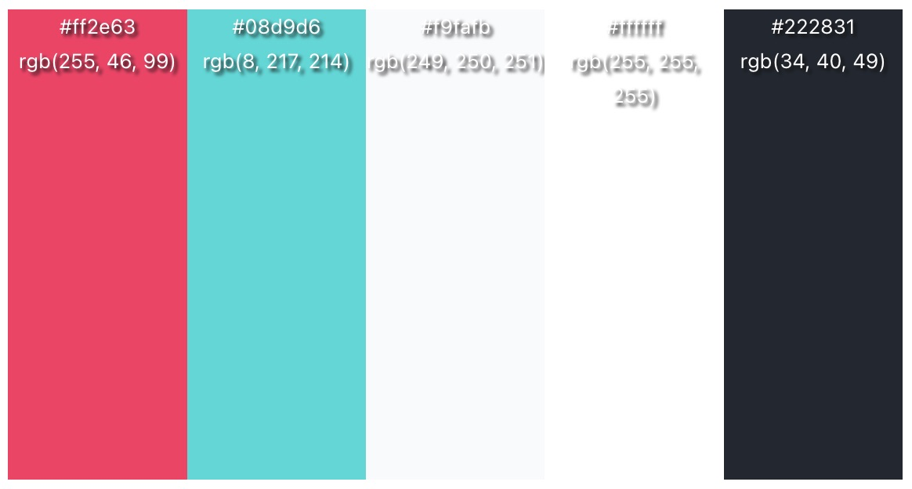
    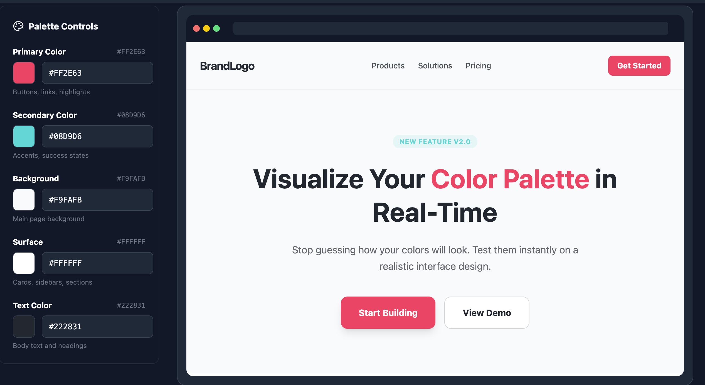

* **Navigation Flow**: Overview of how users will navigate the app.  
  * Pages will not be more than 2-3 clicks deep  
  * Pages:  
    * Home page
      * Nav bar  
        * Cart button \- link to cart page  
        * Link to drink design page  
        * Link to Account user home page  
        * Link to complaints page
      * Seasonal drinks menu carousel  
      * Generate random button (from AI)
      * If signed in: 
        * Saved drinks - with options to delete or add to cart (UI for size selection follows 'add to cart' button)
        * Update preferences  
          * Soda, syrups, ice quantity
        * Settings
          * Set location for geolocation
          * account settings
            * change email/password
            * dark mode/light mode
      * If not signed in:
        * Create account button (for non-account users)
    * Sign in page
      * Simple page with text entry boxes for username and password  
      * Login button  
      * Automatically displayed error message or taken to home page after login  
      * (C) Goes to a tutorial of how to use app after signed in - skip button optional
    * Complaints page
      * Simple page with a text entry box with a complaint prompt \- users will receive AI generated response messages after entering complaints
    * Cart page
      * Drinks graphic + drink name + edit + price + remove
      * Button to checkout + total price
    * Payment page
      * User is taken here from the “checkout” button in the cart  
      * Stripe API used to take user payment information  
      * Option for user to track with geolocation (default selected) or select a time for it to be ready  
        * If geolocation is not setup, clicking this button should give them the option to enable geolocation
    * Confirmation page
      * After a user pays for their drink, they are taken to a page with a link to the complaints page (Didn’t get their drink?” button) as well as a rate your drink section where a user can rate their drink out of 5.   
    * Drink design page  
      * generative/responsive graphic created when a user makes drinks
      * An add to cart button by the graphic - must have a soda selected (other options default to none) - size selection occurs after hitting 'add to cart'
      * A 'Save as favorite' button by the graphic (saves drink to the user's favorites)
      * Drink design options (little graphics or emojis included with option names):
        * Soda - can select/deselect multiple - search bar included at top of this section
        * Syrups - can select/deselect multiple - search bar included at top of this section
        * Juices - can select/deselect multiple - (lemon, lime, pineapple, coconut etc.) - no search bar needed
        * Ice - can select one - (light, regular, extra, no ice) - no search bar needed
    * Manager dashboard  
      * A dashboard that contains links to a store revenue report and a store inventory report.   
        * Data such as total revenue, inventory costs, total user accounts will be displayed in an easily understandable format  
      * AI will be used to estimate when supplies need to be ordered to notify the manager and also find the best places to purchase ingredients.  
    * Admin dashboard  
      * Shows all user accounts (searchable):
        * 3 sections: Active, disabled, and deleted
        * Active: delete, disable, make manager
        * Disabled: delete, enable
        * Deleted: no buttons (non-recoverable. purely a log)
      * Shows all manager accounts (searchable):
        * shows options for different kinds of permissions based on the manager -=-=-=- what are the kinds of permission for managers? -=-=-=-=-
    * Loading screens  
      * Typical loading screen:  
      
      * Loading screen for customer service:  
        * Tonic  
      
      *   
  * UI diagrams:  
  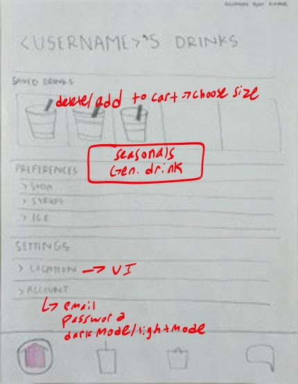
  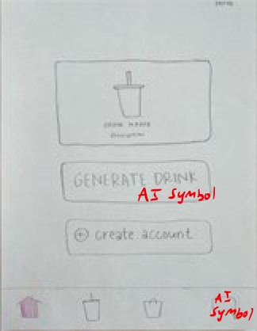
  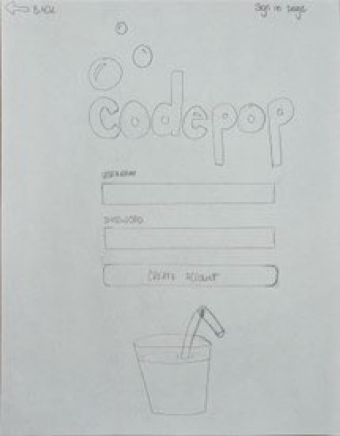
  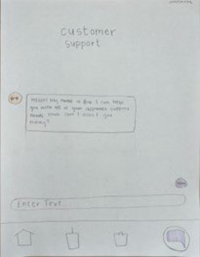
  
  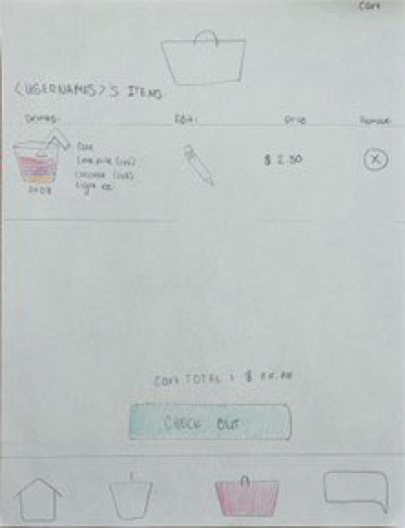
  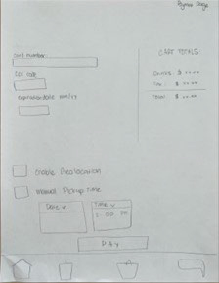
  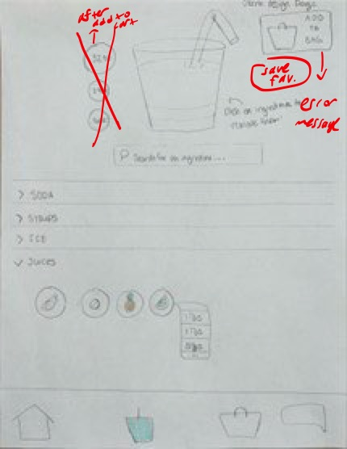
  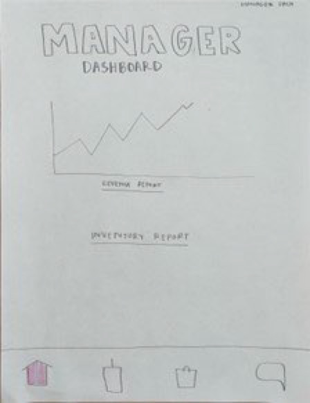
  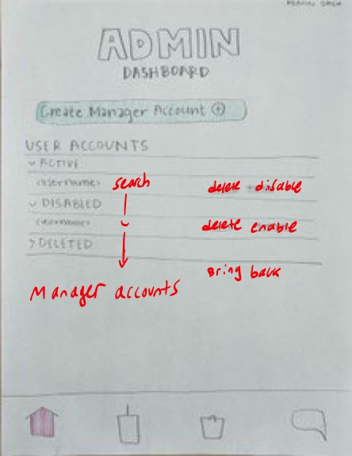
    

## **8\. Input and Output (I/O)**

Note: Much of this section may be a repeat of what has already been documented, but it is repeated here to make I/O items easier to find and relate to each other.

* Input  
  * User Information  
    * Username  
    * Email  
    * Password  
    * Preferences  
    * Payment Method  
    * Customer Complaints  
  * Geolocation (MapBox)  
    * How close the user is to a store location  
    * If user does not consent to geolocation, an “I’m ready” button or a set time will be input by the user instead  
  * Stripe  
    * Confirmation that the user’s payment went through  
  * AI  
    * AI chatbot responds to user complaints and allows for further response (from user)  
    * AI drink results are given back to the user with an option to confirm or rerandomize  
  * Navigational Input  
    * User will use buttons, drop-down menus, etc. to navigate through the app/website

* Output  
  * Notifications  
    * User will get notifications either through email (sign up confirmation) or by push notification (drink-is-ready indicator, event notifications \[ex. Birthday, holiday, change to seasonal menu\], etc.)  
  * Geolocation (MapBox)  
    * Start tracking once the user has given consent  
  * Stripe  
    * Send user payment to simulate a purchase  
  * AI  
    * Customer complaints sent to an external AI chatbot  
    * User preferences given to AI to randomize a more personalized drink (more likely to choose preferences over something completely random)  
    * User ratings used to train the AI as to what flavors/drinks are more popular  
  * UI Output  
    * User navigation input will bring them to different screens/sections of the app that will be shown visually to the user  
  * Store Information  
    * API may be used to show the manager graphs of the store’s revenue, stock, etc.

## **9\. Security and Privacy**

* **Authentication and Authorization**: Description of user roles and permission management.  
  * Explanation of admin and manager access and roles:  
    * Admins: 
        * Have access to user account information in their store.
        * They are able to add/remove general user accounts and create manager accounts for their stores.   
    * Super Admins
        * Have all the same permissions as a regional Admin but on a national scale
        * can create/remove store admins 
    * Managers:
        * have access to store data such as revenue and expense reports.   
    * Logistics Manager:
        * Has access to regional supply chain information
        * Determines supply routes
    * Repair Staff
        * Can view any machine's status in their area
  * Django comes with a built in user authentication system that handles user accounts, groups, permissions and cookie-based user sessions  
    * This system can be expanded and customized to add things like   
    * password strength checking to add more security.    
  * To secure the application, the client and server will be separated.   
    * The client and server will talk to each other through token authentication which is already included with Django.   
  * Django security features: [https://docs.djangoproject.com/en/5.1/topics/security/](https://docs.djangoproject.com/en/5.1/topics/security/)  
    * Includes injection protection because queries are constructed using query parameterization  
    * Includes Cross site request forgery (CSRF) protection which prevents attacks that perform actions using other people’s credentials.
* **Inter-Node Communication Security**: How to keep communications between servers secure
  * Messages should be passed using HTTPS 
  * Servers must authenticate that they are talking to a legit Codepop server before any communications take place
    * A list of know servers should be created and maintained to ensure a server can trust another server  
  * A store servers can be accessed by super admins and a store's admin, manager and repair staff
    * If a supply hub or another regional store needs information from a different store it can request the information
  * Supply hubs can only be accessed by logistic managers and super admins 
    * They can send requests to other supply hubs and store inside of their region only
  * The Master hub can only be accessed by logistic managers and super admins
* **Data Encryption**: Explanation of how data will be encrypted (at rest and in transit).  
  * Django user data encryption  
  * Sha 256 encryption  
* **Compliance**: Relevant data protection laws (GDPR, HIPAA).  
  * Pay attention to the OWASP top 10: [https://owasp.org/www-project-top-ten/](https://owasp.org/www-project-top-ten/)  
* **Sensitive data**  
  * User data:  
    * Payment information  
    * Email  
    * geolocation  
  * Store data:  
    * Revenue tables (regional and local) 
  * Hub data
    * 
* **Privacy**  
  * We will make sure that the user has the option to opt into any of the features that handle personal data (geolocation, drink preferences, emails) to ensure that they are able to make an informed choice about their data.

## **10. Testing Strategy**

CodePop will employ a two-pronged testing strategy: automated unit tests for systematic verification and manual testing for user experience validation. Tests are created incrementally as features are developed to catch issues early and ensure system reliability. A goal for this testing strategy should be to automate testing as much as possible without it being "overkill". Manual testing should validate cases and features that are impractical to automate. Unit tests listed here may move to manual test cases depending on automation difficulty.

### **Automated Testing (Unit Tests)**

Unit tests provide automated, repeatable verification of individual components. Tests run automatically before code merges to catch regressions early.

**Framework:** Django's built-in TestCase and APITestCase classes

**Current Implementation Coverage:**

| Test Suite | What's Tested | Key Test Cases |
|------------|---------------|----------------|
| **PreferenceTests** | User preference CRUD operations | Get/create/delete preferences, validate invalid values |
| **DrinkTests** | Drink catalog and custom drinks | CRUD operations, Ice/Size validation, user favorites |
| **InventoryTests** | Stock management | Update quantities, out-of-stock handling, low-stock warnings |
| **NotificationTests** | User notifications | Create/filter/delete notifications, time-based filtering, user isolation |
| **OrderTests** | Order processing | Create orders, add/remove drinks, invalid drink handling |
| **RevenueTests** | Financial tracking | Auto-calculate totals, update after order changes |
| **AITests** | Drink recommendation engine | Validate AI output format, preference matching, ingredient validity |

**Authentication & Authorization (All Test Suites):**
- Token-based authentication using Django REST Framework tokens
- Role-based access control verification
- Unauthorized access prevention (401/403 errors)

**Tests Needed for Planned Features:**

| Test Suite | What's Tested | Key Test Cases |
|------------|---------------|----------------|
| **UserRoleTests** | Role-based access control | Manager sees only their store, logistics manager sees region, super admin sees all |
| **StoreRegistryTests** | Store/hub communication | Registration, peer discovery, operational status updates |
| **UserReplicationTests** | Cross-store user data sync | Lazy replication on first login, preference sync, cross-region lookup |
| **SupplyRequestTests** | Inventory replenishment | Create requests, status transitions, approval workflow |
| **MachineTests** | Equipment status tracking | Status transitions, out-of-order prevents orders, notification triggers |
| **MaintenanceLogTests** | Service history | Create logs, repair staff assignment, cost tracking |
| **RevenueAggregationTests** | Financial rollup | Regional totals, nationwide aggregation, hub query fallback |
| **SettingsTests** (Frontend) | User preferences | Dark mode, geolocation toggle, account updates |

**Future Automated Testing (Existing Features):**
- **Frontend Unit Tests:** Jest + React Native Testing Library for component testing
- **Integration Tests:** End-to-end API flows (registration → login → order → payment)

---

### **Manual Testing**

Manual testing validates user experience, visual design, and edge cases that are difficult or impractical to automate. A standardized checklist ensures consistency across team members and provides a comprehensive list of requirements that the app should adhere to.

**Manual Test Checklist:**

#### **UI/UX Validation**
- [ ] Visual consistency (colors, fonts, spacing match design mockups)
- [ ] Responsive layout on different screen sizes (small, medium, large phones)
- [ ] Loading states display correctly (SodaRobot and Tonic animations)

#### **User Workflows**
- [ ] Guest user: Browse drinks → add to cart → checkout → pay → confirm
- [ ] New user: Create account → receive email → login → set preferences
- [ ] Returning user: Login → view saved drinks → reorder → rate drink
- [ ] Manager: Login → view inventory report → check low stock items
- [ ] Admin: Login → view user accounts → disable/delete user
- [ ] AI recommendations: Click "Generate" → review drink → add to cart
- [ ] Complaints: Submit complaint → receive chatbot response → verify resolution

#### **Edge Cases & Error Handling**
- [ ] Empty cart checkout attempt (should show error)
- [ ] Incorrect password (should show error, count attempts)
- [ ] Payment card declined (should display Stripe error message)

#### **New Features: Multi-Store & New Roles**

*Store Discovery & Geolocation:*
- [ ] User with geolocation enabled sees nearby stores in correct order (closest first)
- [ ] User with geolocation disabled can manually select a store
- [ ] Store list updates when user moves to different location

*New User Roles & Dashboards:*
- [ ] Manager login → dashboard shows only their store's revenue and inventory
- [ ] Manager cannot access other stores' data (verify error if trying URL manipulation)
- [ ] Logistics Manager login → sees regional supply requests and inventory status
- [ ] Logistics Manager can approve/reject supply requests
- [ ] Super Admin login → sees nationwide revenue, analytics, and user management

*Machine Maintenance:*
- [ ] Repair Staff can view machines needing service in their region
- [ ] Repair Staff can log maintenance work (start time, end time, cost)
- [ ] Manager receives notification when machine status changes
- [ ] Machine status updates (normal → repair-start → repair-end) display in real-time

*Supply Management:*
- [ ] Manager can view low-stock inventory items
- [ ] Manager can generate supply request from inventory report
- [ ] Supply hub receives and processes requests correctly

**Testing Cadence:**
- Run manual tests after each major feature completion
- Full regression testing before production releases

## **11. Risks and Mitigations**

This section identifies potential risks across technical, security, operational, and legal domains, along with mitigation strategies to minimize impact.

#### **User Geolocation Privacy**
- **Risk:** Geolocation tracking could be exploited by attackers to monitor user movements, creating privacy violations and safety concerns.
- **Likelihood:** Medium - Geolocation APIs are common attack targets
- **Mitigation:**
  - Encrypt geolocation data in transit (HTTPS/TLS 1.3)
  - Hash/encrypt geolocation data at rest in database
  - Access geolocation data only during active order tracking (not continuous background tracking)
  - Implement strict access controls (only order service can read location)
  - Users can opt out of geolocation entirely (fallback to manual time selection)
  - Display clear privacy notice explaining geolocation usage
  - Delete geolocation data after order completion (retention: 1 hour max)

#### **Payment Information Security**
- **Risk:** Payment data breach could result in financial loss for customers and legal liability for CodePop.
- **Likelihood:** Low - Using Stripe eliminates most direct risk
- **Mitigation:**
  - **Primary Defense:** Use Stripe Payment API - no raw credit card data stored in CodePop database
  - Store only Stripe payment intent IDs (non-sensitive tokens)

#### **User Account Security**
- **Risk:** User accounts could be compromised via credential stuffing, brute force attacks, or session hijacking, leading to unauthorized purchases or data theft.
- **Likelihood:** Medium - Common attack vector for online services
- **Mitigation:**
  - **Authentication:**
    - Enforce strong password requirements (min 12 chars, mix of upper/lower/digit/symbol)
    - Hash passwords with PBKDF2-SHA256 (upgrade to Argon2 in production)
  - **Authorization:**
    - Use Django REST Framework Token Authentication with expiring tokens (24-hour lifetime)
  - **Session Security:**
    - Implement HTTPS for all communication (prevent token interception)
    - Add CSRF protection for state-changing requests

#### **AI Model Security**
- **Risk:** AI models (recommendation engine, chatbot) could be manipulated via adversarial inputs, prompt injection, or data poisoning, causing incorrect recommendations or leaking sensitive information.
- **Likelihood:** Low-Medium - AI attacks are emerging but not yet widespread
- **Mitigation:**
  - **Input Sanitization:**
    - Filter user inputs for malicious content before sending to AI models
    - Blocklist risky keywords (SQL syntax, command injection patterns)
    - Limit input length (max 500 chars for chatbot, max 20 preferences)
  - **Output Validation:**
    - Ensure chatbot responses don't leak user data or internal system information
  - **Model Isolation:**
    - Run AI models in isolated environment (separate process or container)
    - Limit AI model access to database (read-only access to preferences and drinks)
  - **Monitoring:**
    - Log all AI interactions for audit trail

#### **Allergen Information Accuracy**
- **Risk:** Incorrect or missing allergen information could cause allergic reactions, resulting in bodily harm, legal liability, and reputational damage.
- **Likelihood:** Low-Medium - Human error in data entry, ingredient changes
- **Mitigation:**
  - **Data Accuracy:**
    - Maintain comprehensive allergen database for all ingredients
    - Clearly label common allergens (peanuts, tree nuts, dairy, soy, gluten, shellfish)
    - Display allergen warnings prominently in drink details
    - Allow users to filter drinks by allergen exclusions
  - **Legal Protection:**
    - Display disclaimer on AI-generated drinks: "This drink was generated by AI. Please review ingredients carefully and consult allergen information."

#### **Legal Liability for AI-Generated Drinks**
- **Risk:** Customers may attempt to hold CodePop liable for harm caused by AI-generated drinks (allergic reactions, illness, unpleasant taste).
- **Likelihood:** Low-Medium - Depends on legal precedents for AI-generated content
- **Mitigation:**
  - **Disclaimers:**
    - Display prominent warning for AI-generated drinks: "This drink was created by artificial intelligence. Please review all ingredients and allergen information before ordering. CodePop is not responsible for allergic reactions or dissatisfaction with AI-generated drinks."
  - **Human Oversight:**
    - Implement "flag for review" feature (users can report dangerous AI recommendations)


This testing and risk management strategy ensures CodePop is reliable, secure, and resilient as it scales from a single-store prototype to a nationwide distributed system.

**Interactions Diagram**

Below is a breakdown of interactions in the CodePop app. To obtain the information on the far right column, our app will utilize HTTP Requests and Django's ORM. 

For future reference, the following will be handled in app:

- Email confirmation (By Django’s built-in function, send\_mail())  
- AI drink suggestions (By Scikit-Learn. This will be built into the CodePop app.)

 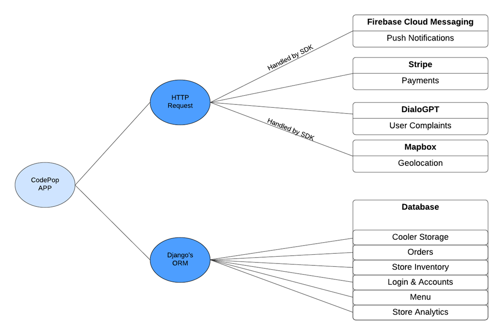

## 


