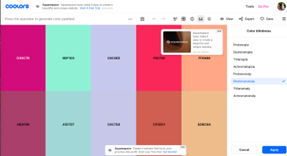
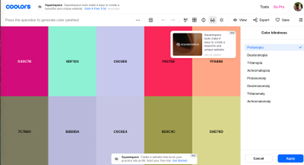
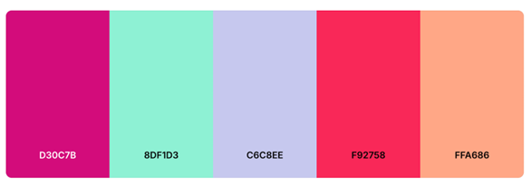

This document was created with assistance from ChatGPT.

# **Code Pop High-Level Design Document**

**Introduction**

* Purpose
* Scope
* Audience
  **System Overview**
* Problem Statement
* Proposed Solution
* Hardware Platform
  * Mobile
  * Laptop and Desktop

  **Architecture Design**

* Architecture Overview: Explanation of the overall architecture (monolithic, microservices, etc.)
* Component Diagram: Diagram showing major system components and their relationships
* Technology Stack: Technologies and frameworks used (e.g., languages, databases, servers)
  * React Native
  * Django
  * PostgreSQL
  * AI

  **Modules and Components (Internal Interfaces)**

* Module Overview: Description of key modules or components, their responsibilities, and interactions
* Data Flow Diagram (DFD): Illustration of how data moves between components
* Component Interaction: Details on how system components will communicate (e.g., APIs, web services)
  **Data Design**
* Data Model: High-level structure of data, including key entities and relationships
* Database Design: Type of database used (relational, NoSQL, etc.), major tables, and relationships
* Data Access Layer: Overview of how data is accessed, stored, and retrieved (e.g., ORM, SQL)
  **Integration Points (External Interfaces)**
* External Systems: Description of external systems or services the app will integrate with
* APIs: List of public/external APIs, endpoints, methods, and data contracts
  * Payment System: Stripe
  * Geolocator: MapBox
  * AI Chatbot: DialoGPT
  * Notifications: Firebase Cloud Messaging (FCM)

  **User Interface (UI) Design Overview**

* UI/UX Principles: High-level UI/UX principles (e.g., responsiveness, accessibility)
* Mockups: High-level mockups or wireframes of key screens
* Navigation Flow: Overview of how users will navigate the app
  **Input and Output (I/O)**
* Input
* Output
  **Security and Privacy**
* Authentication and Authorization: Description of user roles and permission management
* Data Encryption: Explanation of how data will be encrypted (at rest and in transit)
* Compliance: Relevant data protection laws (GDPR, HIPAA)
* Privacy
  **Testing Strategy**
* Unit Testing
* Manual Testing
  **Risks and Mitigations**
* Identified Risks: List of known risks (e.g., technology choice, dependencies)
* Mitigation Plans: Strategies for addressing these risks
  * User Geolocation
  * User Input (AI)
  * Payment Information
  * Allergies
  * User (Account) Information
  * Location Revenue Information
  * Legal Issues

---

## **1. Introduction**

**Purpose**: This document exists to provide a reference for developers while working on the CodePop app to ensure that the development team can work independent of each other and still have code that will work together to form the final project at the end.

**Scope**: This document has a large scope that encompasses just about every part of development, but it is more focused on the "why" of each design choice than the "how". As such it won't delve too deeply into the specific implementation detail.

**Audience**: This document is meant for developers and stakeholders of the project to ensure development is going in the right direction and everyone is on the same page.

## **2. System Overview**

**Problem Statement**: In the world of dirty soda shops, there are too many options and many long lines, resulting in a confusing and overwhelming customer experience.

**Proposed Solution**: CodePop will provide a simple, AI-powered ordering experience to help eliminate the confusion and pressure typically associated with dirty soda shops.

**Hardware Platform**:
CodePop is designed to be accessible to a wide variety of users. Our goal is to create software that is easy/quick to use. This section outlines the hardware platforms CodePop could be built on, including priorities and possibilities.

* **Mobile**:
  * **App**:
    CodePop's priority hardware will be a mobile application. Phones are generally very easy to use and carry around. Since users will need to travel to a CodePop location to pick up their drinks, having a device they can easily bring with them is essential. Touchscreens make it easy for users to navigate the app quickly.
    * A mobile app is more prioritized than a website because we believe it best fits the client's needs.
  * **Website**:
    The mobile app can be converted to a mobile-optimized website with the same functionality and layout as the app. To ensure accessibility, the app and website will be designed to work on both Android and iOS devices. However, due to easier testing methods, we will begin by developing the app for Android.
  * **Touchscreen**:
    Since touchscreen functionality is key to accessibility and usability, it will be prioritized in the app's UI. Buttons and sections will be larger in size to make them easier to tap without zooming in. Other actions, such as swiping and holding, will also be considered.
  * **Gestures**:
    Gestures will not be included in the first version of the app. They are less reliable than touchscreen interactions, and our focus will remain on perfecting the core features of the app instead.
  * **Portrait vs. Landscape**:
    The app/website will be optimized for portrait mode to allow easy access to all points of the screen and to enable comfortable use with one hand. Landscape mode may be considered in future versions or when laptop/desktop accessibility is introduced.
* **Laptop/Desktop**:
  * **Website**:
    While phones are the primary use-case for the CodePop app/website, a laptop/desktop UI will not be a high priority initially. A desktop-friendly UI may be added after the mobile functionality is complete, provided it doesn't divert resources from more critical features. Laptop/desktop access will be limited to the website only, not an app, to avoid over-scoping.
  * **Touchscreen Laptops**:
    Although touchscreen laptops exist, their dimensions differ significantly from mobile devices, and they will not be prioritized in the initial development phase. Their prioritization will remain with every other laptop device.

---

## **3. Architecture Design**

### **Architecture Overview**

CodePop employs a **true peer-to-peer distributed system architecture** where each physical store location operates as an independent node in a decentralized network. This architectural approach eliminates single points of failure and enables the system to scale nationwide while maintaining operational autonomy at each location.

**Key Architectural Principles:**

* **Decentralization**: No central server controls the entire system. Each store runs its own complete backend stack (Django + PostgreSQL) and can operate independently.

* **Regional Coordination**: Seven regional supply hubs provide logistics coordination for stores within their geographic regions, but stores remain operationally independent.

* **Peer-to-Peer Communication**: Stores communicate directly with each other and with their regional supply hub using REST APIs for synchronous operations and an asynchronous event queue (Celery/Redis) for eventual consistency.

* **Fault Isolation**: Failures or outages at one store or hub do not prevent other stores from continuing normal operations. The system is designed to gracefully handle network partitions and temporary connectivity loss.

* **Local-First Data**: Each store maintains its own operational data (orders, inventory, revenue, machine status) in its local database. Only specific data types (user accounts, preferences, favorites) are synchronized across the peer network.

**Network Topology:**

```
┌─────────────────────────────────────────────────────────────────┐
│          Supply Hub Network (7 Regional Hubs)                   │
│  Chicago IL │ New Jersey NY │ Logan UT │ Dallas TX │ etc.       │
└────────────┬────────────────────────────────┬───────────────────┘
             │                                │
             │    P2P Communication          │
             │    (REST APIs + Event Queue)   │
             │                                │
    ┌────────▼────────┐              ┌───────▼────────┐
    │  Store Node A   │◄────────────►│  Store Node B  │
    │  - Django API   │  Direct P2P  │  - Django API  │
    │  - PostgreSQL   │              │  - PostgreSQL  │
    │  - Local Data   │              │  - Local Data  │
    │  - Event Queue  │              │  - Event Queue │
    └────────┬────────┘              └───────┬────────┘
             │                                │
    ┌────────▼────────┐              ┌───────▼────────┐
    │  Mobile Client  │              │  Mobile Client │
    │  (React Native) │              │  (React Native)│
    └─────────────────┘              └────────────────┘
```

Each store node includes:
- **Django Backend**: Full REST API implementation with all business logic
- **PostgreSQL Database**: Complete local data storage for that store
- **P2P Communication Layer**: REST endpoints for inter-store communication
- **Event Queue**: Celery workers with Redis broker for asynchronous message processing
- **Service Registry**: Knowledge of nearby peer stores and the regional supply hub

**Mobile Client Interaction:**

The React Native mobile app uses geolocation to discover nearby operational stores. When a user opens the app:
1. The app requests stores within a configurable radius (default 50 miles)
2. The backend returns a list of nearby stores sorted by distance
3. The user selects a store (or the app auto-selects the closest)
4. All subsequent orders and interactions are with that specific store
5. If the selected store becomes unavailable, the app can seamlessly switch to another nearby store

**Data Distribution Strategy:**

| Data Type | Storage Model | Synchronization |
|-----------|---------------|-----------------|
| Orders | Local to each store | None (store-specific) |
| Inventory | Local to each store | None (store-specific) |
| Revenue | Local to each store | None (store-specific) |
| Machines | Local to each store | Status updates to hub |
| User Accounts | Replicated across network | Async P2P events |
| User Preferences | Replicated across network | Async P2P events |
| Favorite Drinks | Replicated across network | Async P2P events |
| Supply Requests | Store creates, Hub manages | Synchronous REST API |
| Catalog Drinks | Replicated globally | Initial seed + updates |

### **Technology Stack**

#### **Frontend: React Native (Expo 51.0.38)**

React Native continues to be the mobile application framework for CodePop, chosen for its cross-platform compatibility and developer productivity features.

**Rationale:**
* **Cross-Platform Development**: Single codebase for iOS and Android reduces development time and maintenance overhead
* **Hot Reload**: Enables rapid iteration and testing during development
* **JavaScript Ecosystem**: Wide community support and extensive library availability
* **Native Performance**: Bridge to native APIs provides near-native performance for critical operations like geolocation
* **Expo Framework**: Simplifies builds, deployments, and provides managed services for common mobile features

**Multi-Store Enhancements:**
* **Store Discovery API Integration**: New logic to find and connect to nearby store nodes based on geolocation
* **Connection Resilience**: Handles store failover by switching to another nearby store if the primary becomes unavailable
* **Offline-First Capabilities**: Can cache recently viewed data (drink catalog, user preferences) for brief offline periods

#### **Backend: Django 5.1 + Django REST Framework 3.14**

Django remains the backend framework, now enhanced to support peer-to-peer communication and distributed operations.

**Rationale:**
* **Built-in Authentication**: Django's user authentication system handles role-based access control (RBAC) with minimal configuration
* **ORM (Object-Relational Mapping)**: Django's ORM abstracts database operations and makes migrations manageable across multiple independent nodes
* **Security Features**: Built-in protection against SQL injection, CSRF attacks, XSS, and clickjacking
* **REST Framework**: Django REST Framework provides robust API development tools with serialization, permissions, and viewsets
* **Community Support**: Large ecosystem of third-party packages and extensive documentation

**P2P Architecture Additions:**
* **Node Identity System**: Each Django instance identifies itself as a unique peer with configuration for node type (STORE or SUPPLY_HUB), geographic location, and API base URL
* **Peer Registry**: Maintains knowledge of other nodes in the network (nearby stores and supply hub)
* **P2P API Endpoints**: New endpoints for node registration, service discovery, health checks, and inter-node data synchronization
* **Event Publishing**: Asynchronous event emission for user account changes, favorites updates, and machine status changes

#### **Database: PostgreSQL 15**

Each store node runs its own PostgreSQL database instance, providing true data autonomy and fault isolation.

**Rationale:**
* **Relational Integrity**: PostgreSQL's robust support for foreign keys and constraints ensures data consistency within each store
* **Complex Queries**: Advanced SQL features support complex analytics queries for dashboards and reporting
* **JSONB Support**: Native JSON data type enables flexible storage for semi-structured data (store hours, machine configurations)
* **Performance**: Excellent performance characteristics for read-heavy workloads (drink catalog) and write-heavy workloads (orders, inventory updates)
* **Scalability**: Each store's database scales independently based on that location's transaction volume

**Distributed Database Considerations:**
* **No Global Transactions**: Cross-store operations (like user registration) use eventual consistency rather than distributed transactions
* **Conflict Resolution**: Last-write-wins strategy for replicated data like user preferences
* **Data Locality**: Most operations are local to a single store's database, minimizing network latency

#### **Asynchronous Task Queue: Celery + Redis**

Celery (with Redis as the message broker) handles background tasks and inter-node communication.

**Rationale:**
* **Non-Blocking Operations**: User-facing API requests remain fast by offloading time-consuming operations (like P2P event propagation) to background workers
* **Retry Logic**: Celery's built-in retry mechanisms handle transient network failures when communicating with peer nodes
* **Scheduled Tasks**: Celery Beat scheduler runs periodic tasks like heartbeat checks (verifying peer availability) and supply level monitoring
* **Scalability**: Multiple Celery workers can run concurrently to handle high volumes of background tasks

**P2P Use Cases:**
* **Event Processing**: Asynchronously sends user account updates, favorite drink additions, and machine status changes to peer nodes
* **Heartbeat Monitoring**: Periodically pings known peers to check availability and update reachability status
* **Supply Alerts**: Monitors inventory levels and triggers notifications when items fall below threshold

#### **Artificial Intelligence (AI)**

AI plays a critical role in enhancing user experience, optimizing operations, and reducing manual intervention. The system uses multiple AI components for different purposes.

##### **AI Library: Scikit-Learn**

Scikit-Learn remains the primary machine learning library for drink recommendations and inventory forecasting.

**Rationale:**
* **Free and Open Source**: BSD license permits commercial use without licensing fees
* **Python Integration**: Native Python library integrates seamlessly with Django backend
* **Small Dataset Performance**: Works effectively with limited data during startup phase
* **Strong Documentation**: Extensive tutorials and examples for common ML tasks
* **Academic Credibility**: Widely used in research and industry, ensuring long-term support

##### **Drink Recommendation AI (Content-Based Filtering)**

**Use Case**: Personalized drink suggestions for registered users based on their flavor preferences.

**Approach**: Content-based filtering analyzes the flavor profiles of syrups, sodas, and add-ins to suggest new combinations that match a user's stated preferences or order history.

**Advantages**:
* **Cold Start Handling**: Can provide recommendations immediately for new users based on their flavor preferences (sweet, fruity, tangy, etc.)
* **No User Data Required**: Doesn't depend on popularity trends or other users' behavior
* **Highly Personal**: Each user receives unique recommendations tailored to their specific taste profile
* **Transparent**: Users can understand why a drink was recommended (e.g., "You liked strawberry syrup")

**Implementation**: The AI model:
1. Analyzes user's saved preferences (favorite flavors, avoided ingredients)
2. Computes similarity scores between user preferences and available ingredients using cosine similarity
3. Ranks drink combinations based on match to user profile
4. Suggests top-ranked drinks that the user hasn't tried yet

##### **Random Drink AI (Item-Based Collaborative Filtering)**

**Use Case**: Discover-worthy drink suggestions for users who want to explore popular or trending combinations.

**Approach**: Item-based collaborative filtering identifies relationships between drinks based on user interactions (orders, ratings, favorites) to suggest drinks that other users with similar tastes enjoyed.

**Advantages**:
* **Captures Popularity Trends**: Recommends drinks that are trending among the user base
* **Diverse Suggestions**: Exposes users to unexpected combinations they might not consider on their own
* **Implicit Learning**: Learns from user behavior (order history) without requiring explicit ratings

**Limitations**:
* **Cold Start Problem**: New drinks can't be recommended until enough users have tried them
* **Requires User Data**: Needs sufficient order history across multiple users to identify patterns

**Implementation**: Used for the "Surprise Me" feature that generates random but popular drink combinations for users who want to try something new.

##### **NEW: Inventory Forecasting AI**

**Use Case**: Predict when inventory items will run out and automate supply request triggers.

**Approach**: Time-series forecasting analyzes historical usage patterns (by store, by item, by time of day/week/season) to predict future demand and optimal restock timing.

**Features**:
* **Depletion Rate Calculation**: Tracks how quickly each ingredient is consumed at each store
* **Trend Detection**: Identifies seasonal patterns (e.g., cherry syrup more popular in summer, pumpkin spice in fall)
* **Location-Specific**: Recognizes that different stores have different consumption patterns based on local demographics
* **Proactive Alerts**: Notifies store managers and logistics managers before items run out (not after)

**Implementation**:
* Uses linear regression or ARIMA models to forecast inventory levels
* Factors in upcoming events (holidays, promotions) that may increase demand
* Suggests optimal order quantities to minimize waste while preventing stockouts

##### **NEW: Repair Schedule Optimization AI**

**Use Case**: Help repair staff build efficient maintenance schedules for robotic machines across multiple stores.

**Approach**: Constraint satisfaction and optimization algorithms create schedules that minimize travel time, prioritize critical repairs, and balance workload.

**Features**:
* **Route Optimization**: Finds the most efficient path for repair staff to visit multiple stores
* **Priority Weighting**: Schedules critical repairs (error, out-of-order status) before routine maintenance (schedule-service)
* **Time Window Constraints**: Respects store hours and repair staff availability
* **CSV Import**: Allows repair staff to upload their current schedule and get optimization suggestions

**Implementation**:
* Uses heuristic algorithms (genetic algorithm or simulated annealing) to solve the traveling salesman problem variant
* Considers machine status severity, geographic proximity of stores, and estimated repair duration
* Provides schedule recommendations that repair staff can accept, modify, or reject

##### **Chatbot AI: DialoGPT (Hugging Face)**

**Use Case**: Natural language customer service for handling complaints, answering questions, and providing app guidance.

**Approach**: DialoGPT is a pre-trained conversational AI model that can understand customer questions and generate contextually appropriate responses.

**Advantages**:
* **Conversational Training**: DialoGPT is specifically trained on dialogue data, making it naturally suited for chatbot applications
* **Low Configuration**: Requires minimal setup compared to training a custom model from scratch
* **Free and Open Source**: Available via Hugging Face transformers library at no cost
* **Python Integration**: Easy to integrate with Django backend

**Limitations**:
* **Large Model Size**: DialoGPT requires significant memory and compute resources
* **Context Understanding**: May occasionally misunderstand complex or ambiguous questions

##### **AI Image Generation: Gemini (Limited Use)**

**Use Case**: Generate loading screens, icons, and decorative graphics for the mobile app.

**Approach**: Use Gemini API to create themed images (soda-related illustrations, mascots, backgrounds) to enhance visual appeal.

**Limitations**:
* **Decorative Only**: AI images are supplementary to hand-designed UI elements
* **Learning Opportunity**: Frontend team focuses on creating custom designs, with AI images used sparingly for variety
* **Not Business-Critical**: Image generation does not affect core functionality

### **Network Infrastructure & Deployment**

CodePop's distributed architecture requires careful consideration of cloud infrastructure, network communication protocols, and security mechanisms to enable seamless peer-to-peer operations across multiple store locations.

#### **Cloud Infrastructure**

**Deployment Platform**: Cloud-based Virtual Machines (AWS EC2, Google Compute Engine, or Azure VMs)

Each store location and supply hub is deployed as an independent cloud virtual machine instance, providing:

* **Scalability**: Easy to provision new store nodes as the business expands to new locations
* **Managed Services**: Leverage cloud provider's managed databases (AWS RDS for PostgreSQL, ElastiCache for Redis) to reduce operational overhead
* **High Availability**: Cloud providers offer built-in redundancy, automated backups, and disaster recovery capabilities
* **Cost Efficiency**: Pay-as-you-go pricing model scales with business growth; dev/test environments can use smaller instances
* **Global Reach**: Deploy stores in geographically distributed regions for lower latency to customers

**Typical Store Node Infrastructure (per location)**:
* **Compute**: 1 cloud VM instance (e.g., AWS EC2 t3.medium or equivalent)
  * Django application server (Gunicorn/uWSGI)
  * Nginx reverse proxy for serving static assets and SSL termination
  * Celery background workers (2-4 worker processes)
* **Database**: Managed PostgreSQL instance (e.g., AWS RDS PostgreSQL) or self-hosted PostgreSQL on the same VM
* **Cache/Message Broker**: Managed Redis instance (e.g., AWS ElastiCache) or self-hosted Redis
* **Storage**: Cloud object storage (e.g., AWS S3) for user-uploaded images, receipts, or promotional graphics
* **Networking**: Virtual Private Cloud (VPC) with security groups restricting traffic to known peer IPs

**Supply Hub Infrastructure (7 regional hubs)**:
* **Compute**: Larger VM instance (e.g., AWS EC2 t3.large) to handle coordination for multiple stores
* **Additional Services**:
  * Service Registry Database (PostgreSQL table or dedicated service)
  * Regional analytics aggregation
  * Centralized logging (e.g., CloudWatch, Elasticsearch)

#### **Service Discovery Mechanism**

**Architecture**: Centralized Registry Service per Regional Hub

Each supply hub maintains a **Service Registry** that tracks all store nodes within its geographic region. This registry enables stores to discover peer stores and supply hub endpoints dynamically.

**How Service Discovery Works**:

1. **Node Registration**:
   - When a store node starts up, it registers itself with its regional supply hub
   - Registration includes: store ID, API base URL, geographic coordinates, operational status
   - Registration request: `POST https://hub-logan.codepop.com/api/registry/register`

2. **Health Checks**:
   - Each store node sends periodic heartbeat pings (every 60 seconds) to the supply hub
   - Supply hub marks nodes as "offline" if heartbeat is missed for 3 consecutive intervals
   - Health check endpoint: `GET https://store-logan-001.codepop.com/api/health`

3. **Peer Discovery**:
   - Mobile app queries supply hub: "Find stores within 50 miles of (lat, lon)"
   - Supply hub returns list of nearby operational stores sorted by distance
   - Stores query supply hub to find nearby peer stores for user account replication
   - Discovery request: `GET https://hub-logan.codepop.com/api/registry/stores?lat=41.7&lon=-111.8&radius=50`

4. **Registry Database Schema**:
   - Stores: `store_id`, `name`, `api_base_url`, `latitude`, `longitude`, `last_heartbeat`, `is_operational`
   - Supply hubs have read-only view of all stores across all regions (for super admin dashboard)

**Benefits of Centralized Registry**:
* **Simple Implementation**: Easier to build and maintain than fully distributed service discovery (e.g., Consul, etcd)
* **Low Latency**: Stores query local supply hub (within same region) for fast response times
* **Fault Tolerance**: If supply hub goes offline temporarily, stores continue operating with cached peer information
* **Scalability**: Each supply hub only manages stores in its region (~10-50 stores per region)

#### **Peer-to-Peer Communication Protocols**

**Hybrid Approach**: REST APIs for most operations + WebSockets for real-time events

##### **REST APIs (Primary Communication Method)**

REST over HTTPS is used for the majority of peer-to-peer interactions:

**Use Cases**:
* **User Account Synchronization**: Store A replicates user account to Store B
  - Request: `POST https://store-b.codepop.com/api/p2p/sync-user`
  - Payload: User data (username, email hash, preferences)
* **Drink Favorites Sync**: User adds favorite drink at Store A, syncs to all stores user has visited
  - Request: `POST https://store-b.codepop.com/api/p2p/sync-favorites`
* **Supply Requests**: Store submits inventory request to supply hub
  - Request: `POST https://hub-logan.codepop.com/api/supply-requests`
* **Health Checks**: Supply hub pings stores to verify availability
  - Request: `GET https://store-logan-001.codepop.com/api/health`

**REST API Authentication**:
* Each node has a unique API key (JWT token or shared secret)
* Peer requests include `Authorization: Bearer <node-api-key>` header
* API keys rotated periodically for security

**Advantages of REST**:
* **Stateless**: No persistent connections to manage; simpler to implement and scale
* **Standard HTTP**: Works with existing web infrastructure (load balancers, CDNs, firewalls)
* **Retry Logic**: Failed requests can be retried easily via Celery background tasks
* **Debugging**: Easy to test with curl, Postman, or browser dev tools

##### **WebSockets (Real-Time Event Streaming)**

WebSockets are used for **low-latency, bidirectional communication** when immediate notification is critical:

**Use Cases**:
* **Machine Status Updates**: Store sends real-time machine error status to supply hub
  - WebSocket connection: `wss://hub-logan.codepop.com/ws/machine-status`
  - Event: `{"machine_id": "abc123", "status": "error", "timestamp": "2026-02-09T14:30:00Z"}`
* **Live Order Notifications**: Supply hub broadcasts urgent messages to all stores in region (e.g., "Ingredient recall alert")
  - WebSocket broadcast from hub to all stores
* **Real-Time Dashboard**: Logistics manager dashboard displays live machine status across all stores
  - WebSocket connection from dashboard to supply hub aggregates status updates

**WebSocket Implementation**:
* Django Channels (ASGI server) handles WebSocket connections
* Redis Channels Layer for pub/sub message routing
* Automatic reconnection logic if connection drops

**When to Use WebSockets vs REST**:
* **WebSockets**: Real-time updates (machine failures, live dashboards, urgent alerts)
* **REST**: All other operations (user sync, supply requests, scheduled tasks)

##### **Asynchronous Event Queue (Celery + Redis)**

For operations that can tolerate eventual consistency (seconds to minutes delay):

**Event Flow Example - User Account Replication**:
1. User registers at Store A
2. Store A creates local user account in PostgreSQL
3. Store A publishes event to local Redis: `"user.created"` with user data
4. Celery worker picks up event from Redis queue
5. Celery worker makes REST API calls to nearby peer stores to replicate account
6. If peer store is offline, Celery retries every 60 seconds (max 10 retries)
7. After successful replication, peer stores can authenticate the user

**Advantages**:
* **Non-Blocking**: User registration completes instantly; replication happens in background
* **Fault Tolerance**: Retries handle temporary network failures
* **Load Smoothing**: Spikes in events are processed gradually by worker pool

#### **Network Security**

**Encryption in Transit**:
* All inter-node communication uses **HTTPS/TLS 1.3** with valid SSL certificates
* WebSocket connections use **WSS (WebSocket Secure)**
* Mobile app to backend communication enforces HTTPS

**Virtual Private Cloud (VPC)**:
* All store nodes and supply hubs deployed within a cloud VPC
* Security groups restrict inbound traffic:
  - Only HTTPS (port 443) from known peer node IPs
  - Mobile clients connect via public-facing API Gateway or Load Balancer
  - SSH access (port 22) restricted to admin IPs only

**API Authentication Between Nodes**:
* **Mutual TLS (mTLS)** (optional): Stores and hubs authenticate each other using client certificates
* **API Key Authentication**: Each node has a unique API key for authenticating peer requests
* **IP Whitelisting**: Supply hub only accepts requests from known store IPs

**Data Encryption at Rest**:
* PostgreSQL database encryption using Transparent Data Encryption (TDE)
* Redis encryption via cloud provider (AWS ElastiCache encryption at rest)
* Sensitive fields (email, payment tokens) encrypted at application layer

**DDoS Protection**:
* API Gateway or cloud load balancer with rate limiting (e.g., AWS WAF, Cloudflare)
* Each store API endpoint limited to reasonable request rates (e.g., 100 req/min per IP)

#### **Deployment Architecture Diagram**

```
                    ┌─────────────────────────────────────┐
                    │   Cloud Provider (AWS/GCP/Azure)    │
                    │                                     │
┌───────────────────┼─────────────────────────────────────┼──────────────────┐
│                   │     Virtual Private Cloud (VPC)     │                  │
│                   │                                     │                  │
│  ┌────────────────▼────────────────┐    ┌──────────────▼──────────────┐  │
│  │  Supply Hub VM (Logan Region)   │    │  Supply Hub VM (Dallas)     │  │
│  │  - Service Registry (PostgreSQL)│    │  - Service Registry         │  │
│  │  - Django API + Celery          │    │  - Django API               │  │
│  │  - Redis (ElastiCache)          │    │  - WebSocket Server         │  │
│  │  - WebSocket Server             │    └─────────────────────────────┘  │
│  │  - Nginx Reverse Proxy          │                                     │
│  └────────┬────────────────────────┘                                     │
│           │ HTTPS + WebSockets                                           │
│           │                                                               │
│  ┌────────▼─────────────┐        ┌─────────────────┐                    │
│  │ Store VM (Logan-001) │◄──────►│ Store (Logan-002)│ Direct P2P        │
│  │ - Django + Gunicorn  │  REST  │ - Django         │ (REST/HTTPS)      │
│  │ - PostgreSQL (RDS)   │        │ - PostgreSQL     │                   │
│  │ - Redis (ElastiCache)│        │ - Redis          │                   │
│  │ - Celery Workers     │        │ - Celery Workers │                   │
│  │ - Nginx (SSL Term.)  │        └─────────────────┘                    │
│  └─────────┬────────────┘                                                │
└────────────┼─────────────────────────────────────────────────────────────┘
             │ HTTPS (443)
             │
    ┌────────▼─────────┐
    │  API Gateway /   │  (Optional: Rate Limiting, DDoS Protection)
    │  Load Balancer   │
    └────────┬─────────┘
             │ HTTPS
             │
    ┌────────▼─────────┐
    │  Mobile Clients  │  (React Native App)
    │  - iOS & Android │
    └──────────────────┘
```

**Key Infrastructure Components**:
* **VPC**: Isolated network environment with private IP addressing
* **Security Groups**: Firewall rules controlling inbound/outbound traffic
* **RDS (Relational Database Service)**: Managed PostgreSQL with automatic backups
* **ElastiCache**: Managed Redis for Celery message broker and caching
* **API Gateway**: Public-facing entry point with SSL termination and rate limiting
* **Load Balancer**: Distributes mobile client traffic (future enhancement for high-traffic stores)

#### **Scalability & Performance Considerations**

**Horizontal Scaling**:
* Add new store nodes by spinning up new VMs and registering with supply hub
* Supply hubs scale independently (each manages one region)
* Celery workers can be scaled horizontally (add more worker processes or VMs)

**Database Scaling**:
* Each store's PostgreSQL can be upgraded to larger instance (vertical scaling)
* Read replicas can be added for analytics queries (without impacting transactional load)
* Supply hub registry database remains small (tracks ~50 stores per region)

**Caching**:
* Redis caches frequently accessed data (drink catalog, user preferences) to reduce database queries
* Mobile app caches drink catalog locally for offline viewing
* CDN (CloudFront, Cloudflare) caches static assets (images, CSS, JS)

**Monitoring & Observability**:
* Centralized logging: All nodes send logs to cloud logging service (CloudWatch, Elasticsearch)
* Metrics collection: Prometheus or cloud monitoring tracks API latency, database query times, Celery queue length
* Alerting: Automated alerts for node downtime, high error rates, or slow API responses

---

## **4. Modules and Components (Internal Interfaces)**

* **User Management Module:** Manages customer profiles, authentication, and user interactions.
  * Responsibilities
    * User registration and login
      * Email confirmation (Django)
    * Profile management
    * Preferences and order history
  * Components
    * User service: Handles user data storage and retrieval
    * Authentication service: Manages login, sessions, and secure password management
    * Recommendation service: Manages preferences and order history
* **Soda Catalog Module:** Manages the inventory of soda products and custom drink options.
  * Responsibilities
    * Product listing and categorization
    * Custom drink creation
    * Inventory management
  * Components
    * Product service: Manages operations for soda products
    * Customization service: Allows users to create custom sodas
    * Inventory service: Tracks stock levels and alerts for low inventory
* **Order Management Module:** Handles the order lifecycle from creation to delivery.
  * Responsibilities
    * Order placement and tracking
    * Payment processing
    * Order completion scheduling
  * Components
    * Order service: Manages order creation, updates, and status
    * Payment service: Handles payment transactions
    * Order completion service: Manages scheduling of orders and geolocation tracking
* **AI Recommendation Module:** Provides personalized and randomized soda recommendations using AI.
  * Responsibilities
    * Analyze user preferences and behavior
    * Generate product suggestions based on preferences
    * Improve recommendations over time
    * Generate random product suggestions
  * Components
    * Data Analysis Service: Analyzes user data and preferences for insights
    * AI Model: Generates recommendations based on past behavior and trends

---

## **5. Data Design**

### **Data Model**

The CodePop data model has been extended to support multiple store locations, regional supply hubs, machine maintenance tracking, and logistics coordination. The model follows a distributed design where some entities are local to each store (Orders, Inventory, Machines) while others are replicated across the peer network (User, Preference, Drink).

---

#### **Core Entities**

##### **User**

Represents a person who uses the application. User accounts are **global across all stores**, meaning a user can log in from any location and access their preferences and favorites.

| Field | Type | Description |
|-------|------|-------------|
| **id** | Integer (PK) | Django's built-in user ID |
| **username** | String | Unique username for login |
| **password** | String (hashed) | Securely hashed password (PBKDF2, Argon2, or bcrypt) |
| **email** | String | User's email address (encrypted at rest) |
| **first_name** | String | User's first name |
| **last_name** | String | User's last name |
| **is_staff** | Boolean | Whether user has staff privileges |
| **is_superuser** | Boolean | Whether user has superuser privileges |
| **date_joined** | DateTime | Account creation timestamp |
| **last_login** | DateTime | Last successful login timestamp |

**Encryption**: Passwords are hashed using Django's built-in password hasher. Emails are encrypted at rest.

**Relationships**:
* User → Preference (One-to-Many)
* User → Order (One-to-Many)
* User → Notification (One-to-Many)
* User → UserRole (One-to-Many, for role-based access control)
* User ↔ Drink (Many-to-Many via Favorite)

**P2P Synchronization**: User accounts are replicated across store nodes. When a user logs in at a store where their account doesn't exist locally, the store queries peer nodes, replicates the account, and allows the user to log in.

---

##### **UserProfile**

Extended profile for users containing P2P metadata and store preferences.

| Field | Type | Description |
|-------|------|-------------|
| **id** | Integer (PK) | Primary key |
| **user** | ForeignKey (User) | One-to-one link to User |
| **is_replicated** | Boolean | True if this account was replicated from another store |
| **source_node_id** | UUID | The original store where this account was created |
| **last_synced** | DateTime | Last time this profile was synchronized with peers |
| **preferred_store** | ForeignKey (Store) | User's preferred pickup location (optional) |

**Relationships**:
* UserProfile → User (One-to-One)
* UserProfile → Store (Many-to-One, optional)

---

##### **UserRole**

Defines user roles and their scope (store-specific, region-specific, or system-wide).

| Field | Type | Description |
|-------|------|-------------|
| **id** | Integer (PK) | Primary key |
| **user** | ForeignKey (User) | User this role belongs to |
| **role_type** | String (Choice) | ACCOUNT_USER, GENERAL_USER, MANAGER, ADMIN, LOGISTICS_MANAGER, REPAIR_STAFF, SUPER_ADMIN |
| **store** | ForeignKey (Store) | Specific store for this role (for MANAGER, ADMIN) |
| **region** | ForeignKey (Region) | Specific region for this role (for LOGISTICS_MANAGER, REPAIR_STAFF) |
| **supply_hub** | ForeignKey (SupplyHub) | Specific supply hub for this role (for LOGISTICS_MANAGER) |
| **is_active** | Boolean | Whether this role is currently active |
| **assigned_by** | ForeignKey (User) | Admin who assigned this role |
| **assigned_at** | DateTime | When this role was assigned |

**Relationships**:
* UserRole → User (Many-to-One)
* UserRole → Store (Many-to-One, optional)
* UserRole → Region (Many-to-One, optional)
* UserRole → SupplyHub (Many-to-One, optional)

---

##### **Preference**

Stores individual flavor preferences for each user. Uses atomic values (one preference per row) to maintain First Normal Form (1NF).

| Field | Type | Description |
|-------|------|-------------|
| **PreferenceID** | Integer (PK) | Primary key |
| **UserID** | ForeignKey (User) | User who has this preference |
| **Preference** | String | Single preference value (e.g., "Strawberry", "Vanilla") |

**Example**:
| PreferenceID | UserID | Preference |
|--------------|--------|------------|
| 1 | 123 | Strawberry |
| 2 | 123 | Vanilla |
| 3 | 123 | No Coconut |
| 4 | 456 | Cherry |

**Relationships**:
* Preference → User (Many-to-One)

**P2P Synchronization**: Preferences are replicated across store nodes when users log in from different locations.

---

##### **Drink**

Represents drink combinations that can be ordered. Includes both catalog drinks (pre-defined) and user-created custom drinks.

| Field | Type | Description |
|-------|------|-------------|
| **DrinkID** | Integer (PK) | Primary key |
| **Name** | String | Drink name (e.g., "Cherry Burst", "Custom Drink #47") |
| **SyrupsUsed** | Array[String] | List of syrup names used in this drink |
| **SodaUsed** | Array[String] | List of soda types used in this drink |
| **AddIns** | Array[String] | List of add-ins (fruit, candy, ice variations) |
| **Rating** | Float | Average user rating (0-5 scale, optional) |
| **Price** | Float | Drink price in USD |
| **Size** | String | Drink size (s, m, l) |
| **Ice** | String | Ice amount (none, light, normal, extra) |
| **User_Created** | Boolean | True if created by a user, False if catalog drink |

**Relationships**:
* Drink ↔ User (Many-to-Many via Favorite field)
* Drink ↔ Order (Many-to-Many)

**P2P Synchronization**: Catalog drinks are replicated globally. User-created drinks are personal to the user and replicate when the user's favorites sync.

---

##### **Region**

Represents a geographic region containing multiple stores and served by one supply hub.

| Field | Type | Description |
|-------|------|-------------|
| **region_code** | String (PK) | Unique region identifier (A, B, C, D, E, F, G) |
| **name** | String | Human-readable region name (e.g., "Logan, UT") |
| **center_latitude** | Float | Geographic center latitude for distance calculations |
| **center_longitude** | Float | Geographic center longitude for distance calculations |
| **service_radius_miles** | Integer | Maximum distance stores can be from center (default 200) |
| **created_at** | DateTime | Region creation timestamp |

**Pre-defined Regions**:
| Code | Name | Location | Supply Hub |
|------|------|----------|------------|
| A | Chicago Region | Chicago, IL | Chicago Supply Hub |
| B | New Jersey Region | New Jersey, NY | New Jersey Supply Hub |
| C | Logan Region | Logan, UT | Logan Supply Hub |
| D | Dallas Region | Dallas, TX | Dallas Supply Hub |
| E | Atlanta Region | Atlanta, GA | Atlanta Supply Hub |
| F | Phoenix Region | Phoenix, AZ | Phoenix Supply Hub |
| G | Boise Region | Boise, ID | Boise Supply Hub |

**Relationships**:
* Region → Store (One-to-Many)
* Region → SupplyHub (One-to-One)
* Region → UserRole (One-to-Many)

---

##### **SupplyHub**

Represents a regional supply hub that manages inventory and coordinates deliveries to stores within its region.

| Field | Type | Description |
|-------|------|-------------|
| **hub_id** | UUID (PK) | Primary key |
| **node_id** | UUID | Links to NodeConfig for P2P identification |
| **region** | ForeignKey (Region) | The region this hub serves |
| **name** | String | Hub name (e.g., "Logan UT Supply Hub") |
| **street_address** | String | Street address |
| **city** | String | City |
| **state** | String | State abbreviation (2 letters) |
| **zip_code** | String | Zip code |
| **latitude** | Float | Geographic latitude |
| **longitude** | Float | Geographic longitude |
| **phone** | String | Contact phone number |
| **email** | String | Contact email address |
| **api_base_url** | URL | API endpoint for this hub (e.g., "http://hub-logan.codepop.com:8000") |
| **is_operational** | Boolean | Whether the hub is currently operational |
| **max_delivery_distance_miles** | Integer | Maximum delivery range from this hub (default 1000) |
| **created_at** | DateTime | Hub creation timestamp |

**Relationships**:
* SupplyHub → Region (One-to-One)
* SupplyHub → Store (One-to-Many)
* SupplyHub → SupplyRequest (One-to-Many)
* SupplyHub → UserRole (One-to-Many)

---

##### **Store**

Represents a physical CodePop location where customers can pick up drinks.

| Field | Type | Description |
|-------|------|-------------|
| **store_id** | UUID (PK) | Primary key |
| **node_id** | UUID | Links to NodeConfig for P2P identification |
| **store_number** | String | Unique store identifier (e.g., "LOGAN-001") |
| **name** | String | Store name (e.g., "Logan Main Street") |
| **region** | ForeignKey (Region) | The region this store belongs to |
| **supply_hub** | ForeignKey (SupplyHub) | The supply hub that services this store |
| **street_address** | String | Street address |
| **city** | String | City |
| **state** | String | State abbreviation (2 letters) |
| **zip_code** | String | Zip code |
| **latitude** | Float | Geographic latitude |
| **longitude** | Float | Geographic longitude |
| **phone** | String | Contact phone number |
| **email** | String | Contact email address |
| **api_base_url** | URL | API endpoint for this store (e.g., "http://store-logan-001.codepop.com:8001") |
| **is_operational** | Boolean | Whether the store is currently operational |
| **is_accepting_orders** | Boolean | Whether the store is accepting new orders |
| **hours_of_operation** | JSONB | Store hours by day (e.g., {"monday": {"open": "06:00", "close": "22:00"}}) |
| **created_at** | DateTime | Store creation timestamp |
| **last_online** | DateTime | Last heartbeat from this store node |

**Relationships**:
* Store → Region (Many-to-One)
* Store → SupplyHub (Many-to-One)
* Store → Inventory (One-to-Many)
* Store → Order (One-to-Many)
* Store → Revenue (One-to-Many)
* Store → Machine (One-to-Many)
* Store → SupplyRequest (One-to-Many)
* Store → UserRole (One-to-Many)

**Methods**:
* `distance_to(latitude, longitude)`: Calculate distance from this store to given coordinates
* `is_open_now()`: Check if store is currently open based on hours_of_operation

---

##### **Inventory**

Tracks ingredient quantities at each store location.

| Field | Type | Description |
|-------|------|-------------|
| **InventoryID** | Integer (PK) | Primary key |
| **store** | ForeignKey (Store) | The store this inventory belongs to |
| **ItemName** | String | Name of the inventory item (e.g., "Cherry Syrup", "Coca-Cola") |
| **ItemType** | String (Choice) | Type: Soda, Syrup, Add In, Physical |
| **Quantity** | Integer | Current quantity in stock |
| **ThresholdLevel** | Integer | Minimum quantity before restock alert |
| **LastUpdated** | DateTime | Last inventory update timestamp (auto-updated) |

**Relationships**:
* Inventory → Store (Many-to-One)

**Unique Constraint**: (store, ItemName, ItemType) must be unique

**Methods**:
* `is_out_of_stock()`: Returns True if Quantity <= 0
* `is_low_stock()`: Returns True if Quantity <= ThresholdLevel

**P2P Synchronization**: Inventory is local to each store. Aggregate regional inventory data is managed by supply hubs.

---

##### **Order**

Represents a customer's drink order at a specific store location.

| Field | Type | Description |
|-------|------|-------------|
| **OrderID** | Integer (PK) | Primary key |
| **store** | ForeignKey (Store) | The store where this order was placed |
| **UserID** | ForeignKey (User) | User who placed the order (nullable for guest users) |
| **Drinks** | ManyToMany (Drink) | Drinks included in this order |
| **OrderStatus** | String (Choice) | pending, processing, completed, cancelled |
| **PaymentStatus** | String (Choice) | pending, paid, failed, remade |
| **PickupTime** | DateTime | Scheduled or estimated pickup time |
| **CreationTime** | DateTime | Order creation timestamp (auto-generated) |
| **LockerCombo** | Integer | Combination for pickup locker |
| **StripeID** | String | Stripe payment intent ID |

**Relationships**:
* Order → Store (Many-to-One)
* Order → User (Many-to-One, nullable)
* Order ↔ Drink (Many-to-Many)
* Order → Revenue (One-to-One)

**Methods**:
* `add_drinks(drink_ids)`: Add drinks to order
* `remove_drinks(drink_ids)`: Remove drinks from order

**P2P Synchronization**: Orders are local to each store. They do not sync across the network.

---

##### **Revenue**

Tracks financial transactions for each order at each store.

| Field | Type | Description |
|-------|------|-------------|
| **RevenueID** | Integer (PK) | Primary key |
| **store** | ForeignKey (Store) | The store where this revenue was generated |
| **OrderID** | ForeignKey (Order) | The order associated with this revenue |
| **TotalAmount** | Float | Total revenue amount in USD |
| **SaleDate** | DateTime | Transaction date (auto-generated) |
| **Refunded** | Boolean | Whether this transaction was refunded |

**Relationships**:
* Revenue → Store (Many-to-One)
* Revenue → Order (One-to-One)

**Methods**:
* `calculate_total_amount()`: Sums the price of all drinks in the order

**P2P Synchronization**: Revenue is local to each store. Aggregated regional revenue is accessible to logistics managers via their dashboard.

---

##### **Notification**

Represents notifications sent to users or managers.

| Field | Type | Description |
|-------|------|-------------|
| **NotificationID** | Integer (PK) | Primary key |
| **store** | ForeignKey (Store) | The store this notification relates to (nullable for global notifications) |
| **UserID** | ForeignKey (User) | User receiving this notification (nullable for global notifications) |
| **Message** | String | Notification text |
| **Timestamp** | DateTime | Notification creation time (auto-generated) |
| **Type** | String | Notification type (order_update, inventory_alert, system_message, etc.) |
| **Global** | Boolean | Whether this is a global notification visible to all users |

**Relationships**:
* Notification → Store (Many-to-One, optional)
* Notification → User (Many-to-One, optional)

**P2P Synchronization**: Notifications are local to each store. User-specific notifications are not replicated across stores.

---

##### **Machine**

Represents a robotic beverage-making machine at a store location.

| Field | Type | Description |
|-------|------|-------------|
| **machine_id** | UUID (PK) | Primary key |
| **store** | ForeignKey (Store) | The store where this machine is located |
| **machine_type** | String | Type of machine (e.g., "Soda Dispenser", "Syrup Injector", "Ice Machine") |
| **machine_number** | String | Machine identifier within store (e.g., "DISP-01") |
| **status** | String (Choice) | normal, repair-start, repair-end, warning, error, out-of-order, schedule-service |
| **operational_date** | DateTime | Date machine was installed or last marked operational |
| **status_date** | DateTime | Date the current status was set |
| **notes** | Text | Additional notes about machine condition |

**Status Definitions**:
* **normal**: Machine operating normally
* **repair-start**: Servicing started; machine is offline
* **repair-end**: Servicing finished; machine is back online
* **warning**: Non-critical issue; operational but needs repair soon
* **error**: Critical issue; requires repair within one week
* **out-of-order**: Not operational; requires immediate attention
* **schedule-service**: Operational but needs scheduled maintenance within one month

**Relationships**:
* Machine → Store (Many-to-One)
* Machine → MaintenanceLog (One-to-Many)
* Machine → RepairSchedule (One-to-Many)

**P2P Synchronization**: Machine status updates are sent to the regional supply hub for logistics and repair staff visibility.

---

##### **MaintenanceLog**

Tracks service history and repairs for machines.

| Field | Type | Description |
|-------|------|-------------|
| **log_id** | UUID (PK) | Primary key |
| **machine** | ForeignKey (Machine) | The machine this log entry pertains to |
| **repair_staff** | ForeignKey (User) | Repair staff member who performed the service |
| **service_type** | String (Choice) | routine_maintenance, repair, emergency_fix, part_replacement, cleaning |
| **description** | Text | Details of service performed |
| **parts_replaced** | Text | List of parts replaced (if any) |
| **service_start** | DateTime | Service start time |
| **service_end** | DateTime | Service completion time |
| **cost** | Decimal | Service cost in USD |

**Relationships**:
* MaintenanceLog → Machine (Many-to-One)
* MaintenanceLog → User (Many-to-One)

**P2P Synchronization**: Maintenance logs are local to each store but accessible to repair staff in that region.

---

##### **RepairSchedule**

Manages repair staff schedules for servicing machines across multiple stores.

| Field | Type | Description |
|-------|------|-------------|
| **schedule_id** | UUID (PK) | Primary key |
| **repair_staff** | ForeignKey (User) | Repair staff member assigned to this task |
| **machine** | ForeignKey (Machine) | Machine to be serviced |
| **scheduled_date** | DateTime | Scheduled service date and time |
| **estimated_duration_minutes** | Integer | Estimated time to complete service |
| **status** | String (Choice) | scheduled, in_progress, completed, cancelled |
| **notes** | Text | Additional scheduling notes |

**Relationships**:
* RepairSchedule → User (Many-to-One)
* RepairSchedule → Machine (Many-to-One)

**CSV Import**: Repair staff can upload their schedules in CSV format for bulk scheduling and optimization.

**AI Optimization**: The system uses route optimization algorithms to suggest efficient schedules that minimize travel time and prioritize critical repairs.

---

##### **SupplyRequest**

Represents a request from a store to a supply hub for inventory replenishment.

| Field | Type | Description |
|-------|------|-------------|
| **request_id** | UUID (PK) | Primary key |
| **store** | ForeignKey (Store) | Store making the request |
| **supply_hub** | ForeignKey (SupplyHub) | Supply hub receiving the request |
| **requested_items** | JSONB | List of items and quantities (e.g., [{"item": "Cherry Syrup", "quantity": 10}]) |
| **priority** | String (Choice) | low, normal, urgent |
| **status** | String (Choice) | submitted, approved, in_transit, delivered, rejected |
| **request_date** | DateTime | When request was submitted |
| **approval_date** | DateTime | When request was approved (nullable) |
| **delivery_date** | DateTime | Expected or actual delivery date (nullable) |
| **notes** | Text | Additional request details |

**Relationships**:
* SupplyRequest → Store (Many-to-One)
* SupplyRequest → SupplyHub (Many-to-One)

**P2P Synchronization**: Supply requests are sent synchronously from stores to supply hubs via REST API. Status updates propagate back to the store asynchronously.

---

#### **Relationships Summary**

| Relationship | Type | Description |
|--------------|------|-------------|
| User → Preference | One-to-Many | User has multiple flavor preferences |
| User → Order | One-to-Many | User can place multiple orders |
| User → UserRole | One-to-Many | User can have multiple roles (e.g., manager of Store A, admin of Store B) |
| User → MaintenanceLog | One-to-Many | Repair staff logs multiple service activities |
| User → RepairSchedule | One-to-Many | Repair staff has multiple scheduled tasks |
| User ↔ Drink | Many-to-Many | Users can favorite many drinks; drinks can be favorited by many users |
| Region → Store | One-to-Many | Region contains multiple stores |
| Region → SupplyHub | One-to-One | Each region has one supply hub |
| Region → UserRole | One-to-Many | Region has multiple logistics managers and repair staff |
| SupplyHub → Store | One-to-Many | Supply hub services multiple stores |
| SupplyHub → SupplyRequest | One-to-Many | Supply hub receives multiple requests |
| Store → Inventory | One-to-Many | Store has multiple inventory items |
| Store → Order | One-to-Many | Store processes multiple orders |
| Store → Revenue | One-to-Many | Store generates multiple revenue records |
| Store → Machine | One-to-Many | Store has multiple machines |
| Store → SupplyRequest | One-to-Many | Store makes multiple supply requests |
| Store → UserRole | One-to-Many | Store has multiple managers and admins |
| Order ↔ Drink | Many-to-Many | Order contains multiple drinks; drink can be in multiple orders |
| Order → Revenue | One-to-One | Each order generates one revenue record |
| Machine → MaintenanceLog | One-to-Many | Machine has multiple service logs |
| Machine → RepairSchedule | One-to-Many | Machine has multiple scheduled service appointments |

---

### **Database Design**

#### **Database Type: PostgreSQL 15**

CodePop uses PostgreSQL as the relational database for each store node. Each store runs its own independent PostgreSQL instance, ensuring fault isolation and data autonomy.

#### **Database-per-Store Architecture**

Unlike traditional centralized systems, CodePop employs a **database-per-store** model:

* **Store A** runs PostgreSQL instance on its local server (or cloud VM)
* **Store B** runs its own separate PostgreSQL instance
* **Supply Hub C** runs its own PostgreSQL instance

This architecture provides:
* **Fault Isolation**: Database failure at Store A doesn't affect Store B
* **Data Sovereignty**: Each store owns its operational data
* **Independent Scaling**: High-traffic stores can upgrade their database hardware without impacting other stores
* **Reduced Latency**: Local database queries are fast (no network round-trip to central server)

**Trade-offs**:
* **No Global Transactions**: Cross-store operations (like user registration) use eventual consistency rather than ACID transactions
* **Data Replication Complexity**: Some data (users, preferences, favorites) must be replicated across stores
* **Increased Operational Overhead**: Each store's database must be backed up, monitored, and maintained independently

#### **Major Tables in PostgreSQL**

| Table Name | Purpose | Local or Replicated | Key Relationships |
|------------|---------|---------------------|-------------------|
| **auth_user** | User accounts | Replicated | → Preference, Order, UserRole |
| **backend_userprofile** | User P2P metadata | Replicated | → User, Store |
| **backend_userrole** | Role assignments | Replicated | → User, Store, Region |
| **backend_preference** | User flavor preferences | Replicated | → User |
| **backend_drink** | Drink combinations | Replicated | ↔ User (favorites), Order |
| **backend_region** | Geographic regions | Replicated (static) | → Store, SupplyHub |
| **backend_supplyhub** | Supply hubs | Replicated (static) | → Region, Store, SupplyRequest |
| **backend_store** | Store locations | Replicated (static) | → Region, SupplyHub, Inventory, Order, Machine |
| **backend_inventory** | Store inventory | Local | → Store |
| **backend_order** | Customer orders | Local | → Store, User, Drink |
| **backend_revenue** | Financial transactions | Local | → Store, Order |
| **backend_notification** | User notifications | Local | → Store, User |
| **backend_machine** | Robotic machines | Local | → Store, MaintenanceLog |
| **backend_maintenancelog** | Machine service logs | Local | → Machine, User (repair staff) |
| **backend_repairschedule** | Repair schedules | Regional | → Machine, User (repair staff) |
| **backend_supplyrequest** | Supply requests | Hub-managed | → Store, SupplyHub |

#### **Indexes**

Django automatically creates indexes on primary keys and foreign keys. Additional custom indexes optimize common queries:

**Inventory Table**:
* Index on `(store, ItemType, ItemName)` for fast inventory lookups
* Index on `(store, Quantity)` for low-stock alerts

**Order Table**:
* Index on `(store, OrderStatus, PickupTime)` for dashboard queries
* Index on `(store, UserID, CreationTime)` for user order history

**Revenue Table**:
* Index on `(store, SaleDate)` for daily/weekly/monthly revenue reports
* Index on `(store, Refunded)` for refund tracking

**Machine Table**:
* Index on `(store, status)` for repair staff dashboard
* Index on `(store, status_date)` for overdue maintenance alerts

**Store Table**:
* Index on `(latitude, longitude)` for geolocation-based store discovery
* Index on `(region, is_operational)` for regional queries

#### **Data Migrations**

Django's migration system handles schema changes across all store nodes. When a new model field is added:

1. Developers create a migration using `python manage.py makemigrations`
2. Migration files are committed to version control
3. Each store node runs `python manage.py migrate` to apply the changes
4. Migrations can include data transformations (e.g., populating default values for new fields)

**Backward Compatibility**: Migrations are designed to be backward-compatible during rolling deployments. For example, adding a new nullable field allows old code to continue running while nodes are updated.

#### **Data Encryption**

**At Rest**:
* User passwords are hashed using Django's built-in hasher (PBKDF2 with SHA256, configurable to Argon2 for stronger security)
* Sensitive fields (email, payment data) can be encrypted using `django-encrypted-fields` or custom encryption
* PostgreSQL supports transparent data encryption (TDE) at the disk level

**In Transit**:
* All API communication uses HTTPS/TLS to encrypt data between mobile clients and backend
* Inter-store P2P communication also uses HTTPS/TLS

**Payment Data**:
* CodePop never stores raw credit card numbers or CVV codes
* Stripe handles all sensitive payment data
* Only Stripe payment intent IDs are stored in the database


#### **Backup and Recovery**

Each store node runs automated database backups:

**Backup Strategy**:
* **Daily full backups** using `pg_dump`
* **Hourly incremental backups** using PostgreSQL WAL archiving
* **Off-site backup storage** to cloud storage (AWS S3, Google Cloud Storage)

**Recovery Procedure**:
1. Stop Django application
2. Restore PostgreSQL database from backup: `pg_restore -d codepop_database backup.dump`
3. Restart Django application
4. Re-sync replicated data from peers if needed

**Disaster Recovery**:
* If a store node's database is completely lost, it can be re-initialized and re-sync user accounts and catalog drinks from peer nodes
* Local data (orders, inventory, revenue) must be recovered from backups; they are not replicated

---

## **6. Integration Points (External Interfaces)**

* **External Systems and APIs:**
  * **Payment System:** Stripe
    * Free
    * Secure payments- offers built-in fraud prevention tools
    * Support for variety of payment methods- like Apple Pay or Google Pay
    * Erik is familiar with it- we can troubleshoot with him if needed
  * **Geolocation:** Mapbox
    * Offers Python SDKs (meaning we do not need to manually create HTTP requests. The SDK handles that for us)
    * Free for up to 50,000 geolocation requests/month
    * Many other tools require third-party libraries to implement features (ex. OpenStreetMap), creating a more extensive setup process. Mapbox does not have this
  * **AI Chatbot:** DialoGPT from huggingface.co
    * Basic AI to run the customer help/complaint center of the app
    * This is a Natural Processing model (NPL)
    * DialoGPT is trained on conversational datasets, making it naturally suited for a chatbot
    * Low configuration, making it a quick setup (We aren't too concerned with this being a super high functioning bot. Most of our concern will be with the drink suggestion AI models)
    * Free
    * Can be implemented with Python
  * **Notifications**
    * **Push:** Firebase Cloud Messaging (FCM)
      * One of the most widely used and robust push notification services
      * Free
      * Integrates well with mobile platforms (Android and iOS), web push notifications, and backend server to send notifications
        * Firebase Admin SDK includes option for Python in the backend (which is likely where we will implement the push notifications)
        * By using the SDK instead of REST API we will not have to worry about HTTP requests
    * **Email:** Django
      * When the user signs up to the app or website, they will be sent a confirmation email to ensure they used the right email address and that they are the ones signing up.
      * Django's email functions can be used to accomplish this (send\_mail()), using a token to verify the email. While this isn't external, it is included in this section since it is related and putting it here makes it easy to find.

## **7. User Interface (UI) Design Overview**

* **UI/UX Principles**: High-level UI/UX principles (e.g., responsiveness, accessibility).
  * We aim to keep the app simple and intuitive so as to provide a frustration free user experience for all our users as our app has a wide target audience.
  * The design focus will be primarily for a phone application but we will also make sure the interface is responsive and compatible with any interface. We will utilize flex-box in the CSS design to ensure this because it is good for responsive design.
  * Design color choices and navigation style will stay consistent for all types of users including managers and admin accounts so users remain familiar with the layout.
  * Navigation will primarily happen through a nav bar containing descriptive graphic icons that will persist on all pages of the app. With this, a user is able to access all the app's functionality more easily from one to two clicks.
    * Some exceptions to this include obvious and brightly colored buttons for navigation to pages such as the account creation page or the payment page which is accessed from the cart.
  * Accessibility
    * Color blindness
      * The color palette chosen is shown in the following graphics as seen by some of the more common forms of color blindness.
      * Based on this analysis, colors like teal and purple will not be used right next to each other in the app so as to keep easy readability for all users.
      
      
    * Each page will have screen-reader compatibility and tab-controlled navigation options.
    * Web Content Accessibility Guidelines (WCAG)

* **Mockups**: High-level mockups or wireframes of key screens.
  * Color way
    * The color way has been chosen specifically to reflect the bright colorful nature of the app while also providing good contrast for useability.
    * Hex values (L-R)
      * D30C7B
      * 8DF1D3
      * C6C8EE
      * F92758
      * FFA686
  * Style Guide
    * Corners of boxes and buttons will be rounded.
    

* **Navigation Flow**: Overview of how users will navigate the app.
  * Pages will not be more than 2-3 clicks deep
  * Pages:
    * Home page
      * Nav bar
        * Cart button \- link to cart page
        * Link to drink design page
        * Link to Account user home page
        * Link to complaints page
      * Seasonal drinks menu carousel
      * Generate random button (from AI)
      * Create account button (for non-account users)
    * Sign in page
      * Simple page with text entry boxes for username and password
      * Login button
      * Automatically displayed error message or taken to home page after login
    * Complaints page
      * Simple page with a text entry box with a complaint prompt \- users will receive AI generated response messages after entering complaints
    * Account user home page
      * Saved drinks
      * Update preferences button
        * Favorite drinks and favorite ingredients for users to take into account
        * Option to enable/disable geolocation
    * Payment page
      * User is taken here from the "checkout" button in the cart
      * Stripe API used to take user payment information
      * After payment information is submitted, there is a notification for users
      * Option for user to track with geolocation (default selected) or select a time for it to be ready
        * If geolocation is disabled this button should be grayed out and there should be a message letting the user know how to enable geolocation
    * Cart page
      * Drinks
      * Options to remove things from cart
      * Button to checkout
    * Confirmation page
      * After a user pays for their drink, they are taken to a page with a link to the complaints page (Didn't get their drink?" button) as well as a rate your drink section where a user can rate their drink out of 5\.
    * Drink design page
      * generative/responsive graphic created when a user makes drinks
      * Add-in options are displayed with easily identifiable graphics instead of a list so options are easy to choose
      * There is a way to search for options
      * A van bar for different add in options
      * Also a way to remove options \- have the graphics be selected (added) or unselected (removed) with a visible difference for ingredients that are added
      * Drink graphic, nav bar (soda (can choose more than one), syrups, juices (lemon, lime, pineapple, coconut etc.), ice (light, regular), extra, no ice), search bar
      * An add to cart button
      * A size and soda selection are required to add to cart, everything else is optional and the default is "none". An error will pop up if the user tries to add a drink to the cart without selecting a drink size or soda.
    * Manager dashboard
      * A dashboard that contains links to a store revenue report and a store inventory report.
        * Data such as total revenue, inventory costs, total user accounts will be displayed in an easily understandable format
      * AI will be used to estimate when supplies need to be ordered to notify the manager and also find the best places to purchase ingredients.
    * Admin dashboard
      * A simple dashboard to view all functional user accounts with options to delete, disable, and reinstate accounts. An admin also has the permissions necessary to create manager accounts and grant managers permission to view certain data.
    * Loading screens
      * Typical loading screen:
      
      * Loading screen for customer service:
        * Bob
      
      *
  * UI diagrams:
  
  
  
  
  
  
  
  
  
  


## **8. Input and Output (I/O)**

Note: Much of this section may be a repeat of what has already been documented, but it is repeated here to make I/O items easier to find and relate to each other.

* Input
  * User Information
    * Username
    * Email
    * Password
    * Preferences
    * Payment Method
    * Customer Complaints
  * Geolocation (MapBox)
    * How close the user is to a store location
    * If user does not consent to geolocation, an "I'm ready" button or a set time will be input by the user instead
  * Stripe
    * Confirmation that the user's payment went through
  * AI
    * AI chatbot responds to user complaints and allows for further response (from user)
    * AI drink results are given back to the user with an option to confirm or rerandomize
  * Navigational Input
    * User will use buttons, drop-down menus, etc. to navigate through the app/website

* Output
  * Notifications
    * User will get notifications either through email (sign up confirmation) or by push notification (drink-is-ready indicator, event notifications \[ex. Birthday, holiday, change to seasonal menu\], etc.)
  * Geolocation (MapBox)
    * Start tracking once the user has given consent
  * Stripe
    * Send user payment to simulate a purchase
  * AI
    * Customer complaints sent to an external AI chatbot
    * User preferences given to AI to randomize a more personalized drink (more likely to choose preferences over something completely random)
    * User ratings used to train the AI as to what flavors/drinks are more popular
  * UI Output
    * User navigation input will bring them to different screens/sections of the app that will be shown visually to the user
  * Store Information
    * API may be used to show the manager graphs of the store's revenue, stock, etc.

## **9. Security and Privacy**

* **Authentication and Authorization**: Description of user roles and permission management.
  * Explanation of admin and manager access and roles:
    * Admins have access to user account information as well as permissions to add/remove general user accounts and create manager accounts.
    * Managers have access to store data such as revenue and expense reports.
  * Django comes with a built in user authentication system that handles user accounts, groups, permissions and cookie-based user sessions
    * This system can be expanded and customized to add things like
    * password strength checking to add more security.
  * To secure the application, the client and server will be separated.
    * The client and server will talk to each other through token authentication which is already included with Django.
  * Django security features: [https://docs.djangoproject.com/en/5.1/topics/security/](https://docs.djangoproject.com/en/5.1/topics/security/)
    * Includes injection protection because queries are constructed using query parameterization
    * Includes Cross site request forgery (CSRF) protection which prevents attacks that perform actions using other people's credentials.
* **Data Encryption**: Explanation of how data will be encrypted (at rest and in transit).
  * Django user data encryption
  * Sha 256 encryption
* **Compliance**: Relevant data protection laws (GDPR, HIPAA).
  * Pay attention to the OWASP top 10: [https://owasp.org/www-project-top-ten/](https://owasp.org/www-project-top-ten/)
* **Sensitive data**
  * User data:
    * Payment information
    * Email
    * geolocation
  * Store data:
    * Revenue reports
* **Privacy**
  * We will make sure that the user has the option to opt into any of the features that handle personal data (geolocation, drink preferences, emails) to ensure that they are able to make an informed choice about their data.

## **10. Testing Strategy**

* **Unit Testing**

  CodePop will implement unit tests as we go along with our software production.

* Unit tests will provide an automated way to run tests and prevent the need to manually input over and over again.
* These tests will be created as the project gets created. As an example, once all of the sign-in page functionality is up-and-running, unit tests will be created to ensure the user can only input valid emails, and that everything gets properly stored in the database. Creating the tests in this fashion will:
  * Prevent rushing them later on in the project's development.
  * Ensure a section works before moving on
  * Make testing easier as developers merge code together. Did someone's merge break someone else's unit test?
    Unit testing may add more complication to the project, especially if developers are not that familiar with it. However, unit testing will ensure that the project has less bugs and also provide a visual as to what has and hasn't been tested.
* **Manual Testing**

  In the case that unit tests do not work, manual testing will be used.

* In order to make the testing as smooth and consistent as possible, a document will be created describing each test case, that way everyone on the team has access to every test (and could copy/paste).
* Without this document, test cases may get left out during testing or forgotten, which will cause problems later on in development.

## **11. Risks and Mitigations**

* **Identified Risks**: List of known risks (e.g., technology choice, dependencies).
* **Mitigation Plans**: Strategies for addressing these risks.

* **User Geolocation**
  * **Risk:** Geolocation will be used to track how close the user is to the CodePop location. However, there is a chance this gets hacked and the user's location will be revealed and tracked by unknown parties
  * **Mitigation:** User location will be encrypted/hashed so it is more secure, and location will be accessed sparingly throughout the program. The user also has the option to opt out of geolocation and set a time for their drink to be ready instead.
* **User Input (AI)**
  * **Risk:** AI could get fed bad input from the user preventing it from working properly or causing it to reveal secure information.
  * **Mitigation:** Users will either not be able to directly input into the AI, or in cases where they do input (i.g. Preferences, complaints) user input will be searched for any risky words or symbols, which will then get parsed out before being sent to the AI.
* **Payment Information**
  * **Risk:** Anytime we deal with people's money there is a big risk that relevant data will be hacked resulting in financial harm to our customers
  * **Mitigation:** We will be using Stripe's payment API so that we avoid directly handling our customers' sensitive information. This will allow our customer's data to be kept safe by Stripe who has much more time and money to create robust security than we do.
* **Allergies**
  * **Risk:** Some of our customers may have food allergies that could result in bodily harm if they get contaminated drinks.
  * **Mitigation:** We will need to clearly label what allergens a drink contains so that a user can make an informed decision when they purchase a drink and ensure that it won't cause harm to them.
* **User Information**
  * **Risk:** User accounts may be hacked and information may be stolen or used to buy items through the app.
  * **Mitigation:** We will encrypt sensitive user information in the database (i.e. email, password). We will also allow users to contact administrators if they fear their data has been compromised to allow them to either freeze their account or change passwords.
* **Location Revenue Information**
  * **Risk:** Manager accounts may be hacked and information may be stolen.
  * **Mitigation:** We will encrypt sensitive user information in the database (i.e. email, password). We will have a stricter password policy for managers and admins that will require them to have longer, more complicated passwords.
* **Legal Issues**
  * **Risk:** Customers may try to hold the company liable if something were to happen such as the AI generating them a drink that has something they are allergic to in it.
  * **Mitigation:** We will have a warning statement for non account users when they order a drink created though AI. Account users will sign an agreement upon account creation to agree to not hold the company liable for personal harm.

**Interactions Diagram**

Below is a breakdown of interactions in the CodePop app. To obtain the information on the far right column, our app will utilize HTTP Requests and Django's ORM.

For future reference, the following will be handled in app:

- Email confirmation (By Django's built-in function, send\_mail())
- AI drink suggestions (By Scikit-Learn. This will be built into the CodePop app.)

 

##
