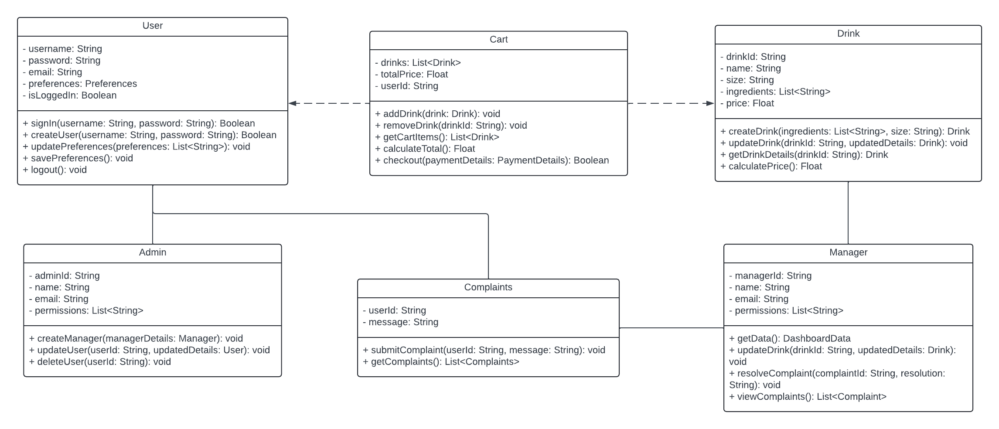
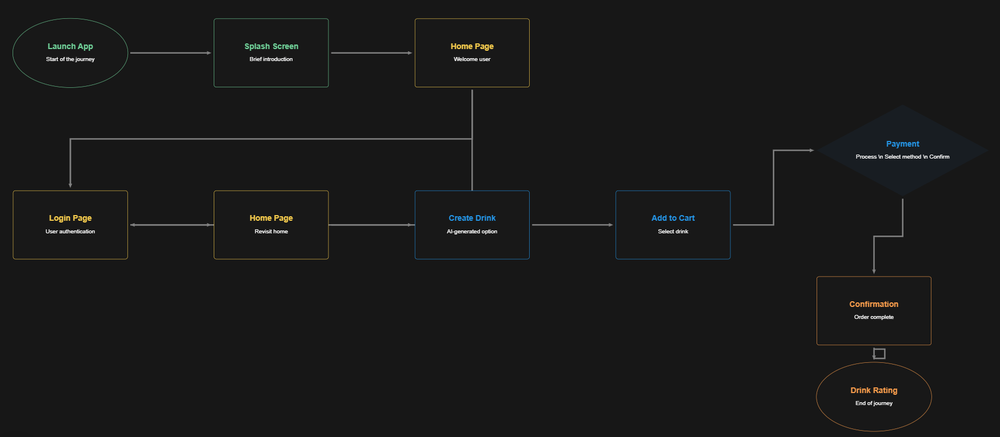

# Codepop Low Level Design Document

### Introduction
The purpose of this document is to provide a working description of the product’s system architecture, subsystems, classes, database tables, user interface prototypes, programming languages, libraries, and frameworks that will be used. This document also addresses system performance concerns and potential security risks as well as have a deployment plan for the release of the application. This document borrows heavily from the lasts teams low level desgin document as many technolgies and data structres will remain unchanged. Developers, company management and customers should reference this document to ensure they are on the same page.

### Development plan

#### Sprint Breakdown

* Sprint 1 - 2 Weeks
    * Must have basic functionality 
    * Function over form
* Sprint 2 - 2 Weeks
    * Start implementing should haves and polishing existing features 
    * Implement must haves that weren't completed from previous sprint  
* Sprint 3 - 1 Week
    * Create user manual
    * Ensure the application is release ready 

### Sprint Outline

**Sprint 1**

Front-end:

Backend: 

**Sprint 2**

Front-end:

Backend: 

**Sprint 2**

Front-end:

Backend: 

### All Tasks Outline

## System architecture

Client-server architecture

The CodePop system architecture follows a three-tier model, consisting of the front-end, middle-end, and back-end layers. The front-end, built with React Native, handles user interaction and interfaces, communicating with the middle-end via API requests. The middle-end is powered by Django, acting as the central framework that manages business logic, authentication, and data flow. It interacts with the PostgreSQL database on the back-end, which stores user data, drink configurations, and order information. APIs like Stripe (for payments), MapBox (for geolocation), and AI-based models (for drink generation and complaints chatbot) are integrated to enhance functionality and user experience, ensuring seamless interaction between the client and server.

## 

## 

Subsystems and UML Class Diagrams

* App objects: 

 

* Main user flow:  

 
 

## User interfaces:

### Accessibility

The CodePop interface is carefully designed to support both usability and accessibility, adhering to the Web Content Accessibility Guidelines (WCAG). A color palette has been selected based on an analysis of common forms of color blindness, ensuring that problematic combinations like teal and purple are not placed next to each other for better readability. Each page is fully compatible with screen readers, offering audio feedback for users with visual impairments. Additionally, tab-controlled navigation is integrated, allowing keyboard users to easily move through the interface without relying on a mouse, ensuring a more inclusive user experience.

### Flow and design for page layout

**Home Page**

* Nav Bar: Links to Drink Design, Account User Home, Cart, Complaints.  
* Seasonal Drinks Menu: Displayed as a carousel.  
* Generate Random Drink Button (AI-powered).  
* Set Drink Text Box (input for AI API-generated drink).  
* Create Account Button (for non-account users).  
* **Primary Flow**: User either navigates through nav bar or signs in/creates an account.

**Sign-In Page**

* Username/Password text boxes.  
* Login Button: Authenticates user via `signIn()`, redirects to Home Page upon success.  
* Error Message displayed automatically if login fails.  
* Link to Sign-Up Page for new users.

**Sign-Up Page**

* Fields for account creation.  
* Button to create an account via `createUser()`, redirect to Sign-In after successful creation.

**Account User Home Page**

* Displays saved drinks and current user preferences.  
* Buttons to modify preferences (`updatePreferences()`) and save changes (`savePreferences()`).  
* Option to enable/disable geolocation.

**Complaints Page**

* Text entry box for complaints, integrated with AI API to manage complaints.

**Drink Design Page**

* Drink creation UI with add-ins displayed as graphics.  
* Interactive drink customization (soda, size, ice, syrups, etc.).  
* Search bar for quick ingredient lookup.  
* Drink object is created (`createDrink()`) and saved to the cart.

**Cart Page**

* Displays a list of drinks with options to remove, edit, or proceed to checkout.  
* Each drink object shows price and ingredients.  
* The Checkout button redirects to the Payment Page.  
* User can edit existing drinks using `updateDrink()`

**Payment Page**

* Stripe API for secure payment processing.  
* User can choose between geolocation-based tracking or a scheduled pickup time.  
* Confirmation message displayed after payment submission.

**Confirmation Page**

* Displays drink details with a timer countdown.  
* Option to rate each drink and file a complaint if needed.  
* Refund button if necessary.

**Manager Dashboard**

* Data visualization (charts) of store data like revenue and expenses.  
* Managers can access this dashboard to view key metrics via `getData()`.

**Admin Dashboard**

* Admin controls for managing user accounts (update, delete, create manager accounts).  
* Data visualization for user and store statistics.

## Database tables

### User Table (Done with the built in django authentication)

| Field Data | Data Type | Constraints |
| :---- | :---- | :---- |
| UserID | int | Primary Key |
| Username | String |  |
| Password | String |  |
| Email | String (Email) |  |
| UserRole | String | Default “Customer” |

### Preference Table

| Field Data | Data Type | Constraints |
| :---- | :---- | :---- |
| PreferenceID | int | Primary Key |
| UserID | int | Foreign Key References User(UserID) |
| Preference | bool | Default “no preferences checked” |

### Order Table

| Field Data | Data Type | Constraints |
| :---- | :---- | :---- |
| OrderID | int | Primary Key |
| UserID | int | Foreign Key References User(UserID) |
| DrinkDetails | List drink objects |  |
| OrderStatus | String |  |
| PaymentStatus | String |  |
| PickupTime | Timestamp |  |
| CreationTime | Timestamp |  |

### Drink Table

| Field Data | Data Type | Constraints |
| :---- | :---- | :---- |
| DrinkID | int | Primary Key |
| Name | String | NONE |
| SyrupsUsed | List\[Strings\] | None |
| SodaUsed | List\[Strings\] | Required |
| AddIns | List\[Strings\] |None |
| Rating | double | Default NULL |
| Price | double | Required |
| Size  | String | Required, Must be [16, 24, 32] |
| Ice   | String | Required, Must be [none, light, regular, extra]|
| User_Created | Boolean | Required|
| Favorite | UserID | |

### Inventory Table

| Field Data | Data Type | Constraints |
| :---- | :---- | :---- |
| InventoryID | int | Primary Key |
| ItemName | String |  |
| ItemType | String | Must be “Soda”, “Syrup”, “Add In” or “Physical”(for cups lids straws etc…) |
| Quantity | int |  |
| ThresholdLevel | int |  |
| LastUpdated | Timestamp |  |

### Payment Table

| Field Data | Data Type | Constraints |
| :---- | :---- | :---- |
| PaymentID | int | Primary Key |
| OrderID | int | Foreign Key References Order(OrderID) |
| UserID | Int  | Foreign Key References User(UserID) |
| Amount | double |  |
| PaymentMethod | String |  |
| PaymentStatus | String |  |
| RefundStatus | String |  |

### Notification Table

| Field Data | Data Type | Constraints |
| :---- | :---- | :---- |
| NotificationID | int | Primary Key |
| UserID | int | Foreign Key References User(UserID) |
| Message | String |  |
| Timestamp | timestamp |  |
| Type | String |  |

### Code Table

| Field Data | Data Type | Constraints |
| :---- | :---- | :---- |
| OrderID | int | Foreign Key References User(UserID) |
| ExpirationTime | Timestamp |  |

### Revenue Table

| Field Data | Data Type | Constraints |
| :---- | :---- | :---- |
| RevenueID | int | Primary Key |
| TotalAmount | double |  |
| Date | date |  |
| UserID | int | Foreign Key References User(UserID) |

### Inventory(Items that must be in the database)

| Sodas | Syrups | Add ins |
| :---- | :---- | :---- |
| Mtn. Dew Diet Mtn. Dew Dr. Pepper Diet Dr. Pepper Dr. Pepper Zero Dr Pepper Cream Soda Sprite Sprite Zero Coke Diet Coke Coke Zero Pepsi Diet Pepsi Rootbeer Fanta Big Red Powerade Lemonade Light Lemonade | Coconut Pineapple Strawberry Raspberry Blackberry Blue Curacao Passion Fruit Vanilla Pomegranate Peach Grapefruit Green Apple Pear Cherry Cupcake Orange Blood Orange Mango Cranberry Blue Raspberry Grape Sour Kiwi Chocolate Milano Huckleberry Sweetened Lime Mojito Lemon Lime Cinnamon Watermelon Guava Banana Lavender Cucumber Salted Caramel Choc Chip Cookie Dough Brown Sugar Cinnamon Hazelnut Pumpkin Spice Peppermint Irish Cream Gingerbread White Chocolate Butterscotch Bubble Gum Cotton Candy Butterbrew Mix | Cream Coconut Cream Whip Lemon Wedge Lime Wedge French Vanilla Creamer Candy Sprinkles Strawberry Puree Peach Puree Mango Puree Raspberry Puree Ice?????? |

### Backend UML:

 

### 

Manager Dashboard Module Functions:

 

User Management Module Functions: 

 

Order Management Module Functions:  

 

Soda Catalog Module Functions:  

 

AI Recommendation Module Functions: 

  

## System performance

To address system performance, potential bottlenecks such as high traffic during peak hours, concurrent payment processing, and large database queries are considered. The system is designed with scalability in mind, using load balancing techniques to distribute traffic across multiple server instances. The use of a CDN for static assets ensures faster content delivery to users across different regions. For the backend, Django’s ORM optimizes database queries, and indexing will be employed for frequently accessed data like user preferences and drink details to improve response times. PostgreSQL will handle database connections efficiently, but if demand grows, database read replicas will be deployed to reduce the load on the primary database. Additionally, autoscaling for cloud infrastructure ensures that more server instances can be automatically provisioned during traffic spikes. This architecture allows the system to handle increases in load while maintaining optimal performance.

## Security risks

The CodePop app incorporates a robust security model based on Django’s built-in authentication and authorization system. This system manages user accounts, groups, permissions, and cookie-based sessions, ensuring secure access across different user roles. Admins have the authority to manage user accounts, add or remove users, and create manager accounts, while managers have access to store-specific data like revenue and expense reports. To enhance security, features such as password strength checking can be implemented. The app separates the client and server, utilizing token-based authentication for secure communication. Django’s security features include query parameterization for injection protection and Cross-Site Request Forgery (CSRF) protection to prevent unauthorized actions. Additionally, sensitive data, including user payment information, email addresses, and store revenue reports, will be encrypted using SHA-256 both at rest and in transit. CodePop complies with relevant data protection laws such as GDPR and takes measures to address the OWASP Top 10 security risks. Users will be given the option to opt into features that handle personal data, ensuring transparency and privacy.

* **Authentication and Authorization**: Description of user roles and permission management.  
  * Explanation of admin and manager access and roles:  
    * Admins have access to user account information as well as permissions to add/remove general user accounts and create manager accounts.   
    * Managers have access to store data such as revenue and expense reports.   
  * Django comes with a built in user authentication system that handles user accounts, groups, permissions and cookie-based user sessions  
    * This system can be expanded and customized to add things like   
    * password strength checking to add more security.    
  * To secure the application, the client and server will be separated.   
    * The client and server will talk to each other through token authentication which is already included with Django.   
  * Django security features: [https://docs.djangoproject.com/en/5.1/topics/security/](https://docs.djangoproject.com/en/5.1/topics/security/)  
    * Includes injection protection because queries are constructed using query parameterization  
    * Includes Cross site request forgery (CSRF) protection which prevents attacks that perform actions using other people’s credentials.  
* **Data Encryption**: Explanation of how data will be encrypted (at rest and in transit).  
  * Django user data encryption  
  * Sha 256 encryption  
* **Compliance**: Relevant data protection laws (GDPR, HIPAA).  
  * Pay attention to the OWASP top 10: [https://owasp.org/www-project-top-ten/](https://owasp.org/www-project-top-ten/)  
* **Sensitive data**  
  * User data:  
    * Payment information  
    * Email  
    * geolocation  
  * Store data:  
    * Revenue reports  
* **Privacy**  
  * We will make sure that the user has the option to opt into any of the features that handle personal data (geolocation, drink preferences, emails) to ensure that they are able to make an informed choice about their data.

## Programming languages, libraries, frameworks, and third party systems

#### **Front-End**

* Framework: React Native  
* Languages: JavaScript, HTML, CSS

  #### **Middle-End**

* Framework: Django  
* Languages: Python

  #### **Back-End**

* Framework: Django  
* Database: PostgreSQL  
* Languages: Python, SQL

  #### **APIs & External Services**

* Payment System: Stripe API  
  * Set up stripe account and API keys  
  * Integrate Stripe’s Mobile SDK for the frontend (checkout screen)  
  * Create payment intents on backend  
  * Handle payment confirmation on the frontend   
    * Pass the `client_secret` to frontend  
    * Use the Stripe SDK to confirm the payment by calling `confirmPayment`  
    * Set Up Webhooks for Payment Status Tracking (notifies backend if payment was successful, failed, etc.)  
* Geolocation: MapBox API  
  * Create mapBox account and obtain access token  
  * Integrate MapBox SDK into frontend  
  * Use the *Geolocation API* or Mapbox’s *GeolocateControl* to get the user’s current coordinates.  
  * Set up proximity alerts  
* Random Drink Generation: Content-Based AI Filtering Model (Scikit-Learn)  
  * Use a pandas DataFrame to prep data  
  * Convert features into numerical values  
  * Define a similarity metric for the drinks (probably `cosine_similarity`)  
  * Build recommendation function  
  * Integrate model into backend  
* Complaints Chatbot: DialoGPT (Hugging Face)  
  * Set up an environment and load DialoGPT model  
  * Create a function to generate responses  
  * Set up an API endpoint (so that the app’s frontend can call it)  
  * Integrate into frontend  
* Loading Screens: Gemini AI Images  
  * Preload 1-2 images we like  
  * Embed the preloaded images into the app

## Deployment plan

**1\. Development Environment Setup**

* **Version Control**: Use Git for managing source code. Establish a remote repository (e.g., GitHub, GitLab) for collaboration.  
* **Local Development**: Set up local environments for developers with tools like Docker for containerization to ensure consistency.  
* **Technology Stack**:  
  * Frontend: HTML, CSS, JavaScript, and Reach Native framework  
  * Backend: Django for server-side logic and database management.  
  * Database: PostgreSQL for managing user data, drinks, and store information.  
* **Dependencies**: Use `pip` for Python dependencies and `npm` for any frontend packages.

**2\. Staging Environment**

* **Staging Server Setup**: Deploy a staging environment to test all new features before going live.  
* **Testing**:  
  * **Unit Testing**: For each individual function like `createUser()`, `getDrink()`, etc.  
  * **Integration Testing**: Ensure all components (frontend, backend, database) work together.  
  * **Accessibility Testing**: Verify compliance with WCAG, ensuring color contrast, screen reader compatibility, and tab navigation.  
  * **Load Testing**: Use tools like Apache JMeter to simulate heavy traffic and ensure scalability.  
* **Pre-Deployment Validation**: Test payment flows with the Stripe API, and ensure all security measures (token authentication, CSRF protection) are in place.

**3\. User Acceptance Testing (UAT)**

* Invite key stakeholders (store owners, staff) to use the staging environment and provide feedback.  
* Ensure the interface is intuitive, accessible, and aligns with business needs.  
* Adjust any features or fix bugs found during UAT before final production deployment.

**4\. Production Environment Setup**

* **Hosting**:  
  * **Frontend Hosting**: Deploy frontend assets to a Content Delivery Network (CDN) for fast global access (e.g., AWS S3 or Netlify).  
  * **Backend Hosting**: Use cloud-based services like AWS EC2 or DigitalOcean for running the Django app.  
* **Database Setup**: Deploy the PostgreSQL database using cloud-based solutions (e.g., AWS RDS or Heroku Postgres) for scalability and backup.  
* **Security Setup**:  
  * **SSL/TLS Certificates**: Ensure HTTPS is enabled for secure communication.  
  * **Environment Variables**: Store sensitive data like API keys and database credentials securely (e.g., AWS Secrets Manager).  
  * **Firewall & Access Control**: Set up firewalls and limit access to production servers using SSH keys.  
  * **Backup Plan**: Regular backups of databases and critical assets to prevent data loss.

**5\. Production Deployment**

* **Code Freeze**: Set a code freeze date before deployment to ensure no last-minute changes.  
* **Final Deployment Steps**:  
  * Deploy the frontend and backend to their respective hosting services.  
  * Migrate any production databases and ensure all data from staging is migrated.  
  * Ensure that token-based authentication and secure data encryption (e.g., SHA-256) are fully operational.  
* **Post-Deployment Validation**:  
  * Test all critical functions (sign-in, drink creation, cart, payment).  
  * Check that the admin and manager dashboards are accessible with the correct permissions.

**6\. Post-Deployment Monitoring & Maintenance**

* **Ongoing Monitoring**: Ensure performance metrics are actively tracked, especially during high traffic periods.  
* **Bug Fixes**: Implement a process for quickly addressing user-reported issues or security vulnerabilities.  
* **Regular Updates**: Schedule periodic security patches, updates to libraries, and infrastructure improvements.

**7\. Scaling & Future Enhancements**

* **Auto-Scaling**: Set up auto-scaling for cloud-based infrastructure to handle growing user demand.  
* **Feature Rollouts**: Plan for iterative feature deployment, such as enhanced AI drink recommendations or more detailed analytics for managers and admins.  
* **Performance Optimization**: Regularly review the system’s performance and optimize database queries, asset loading times, and server response times.
