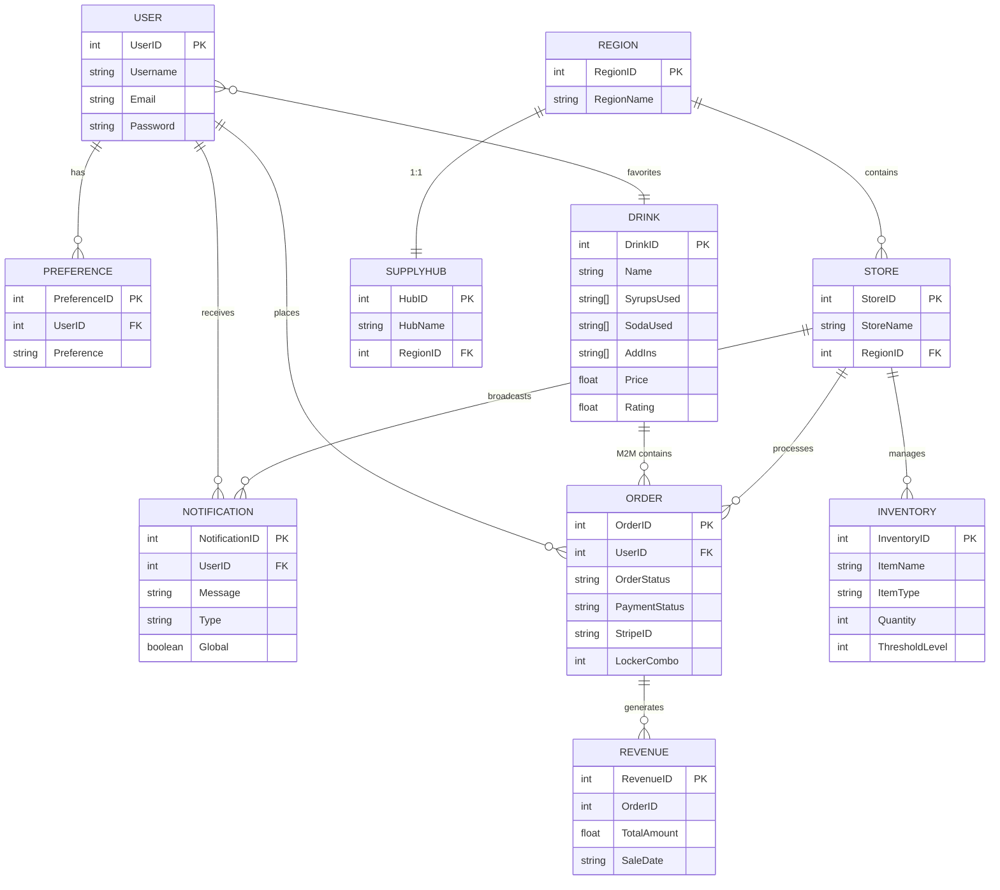
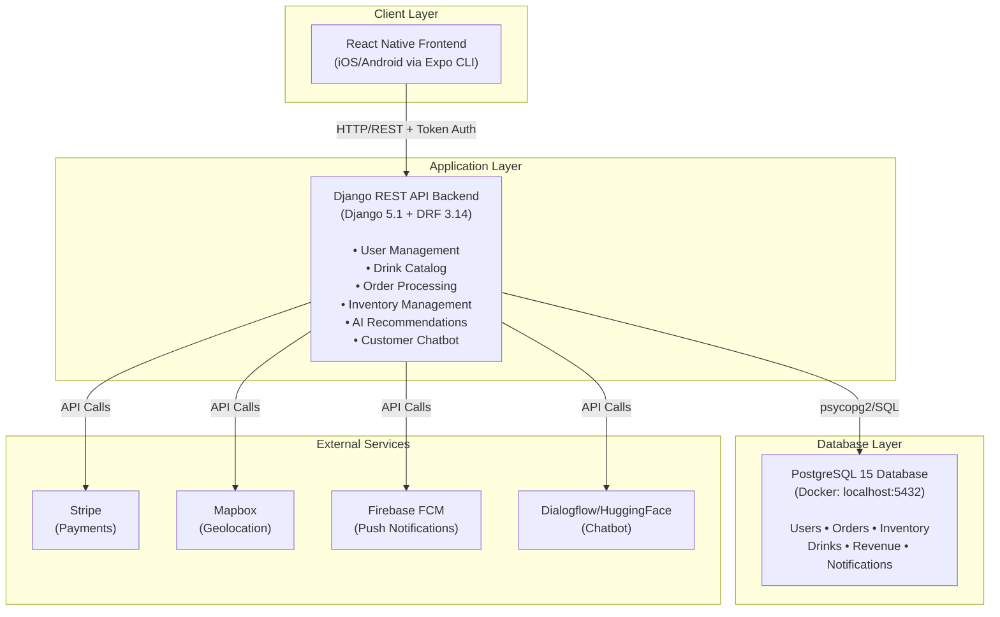
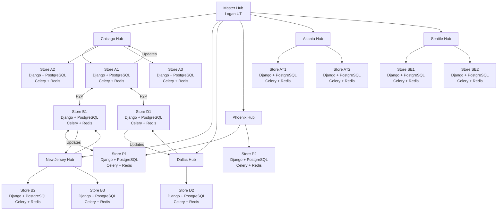
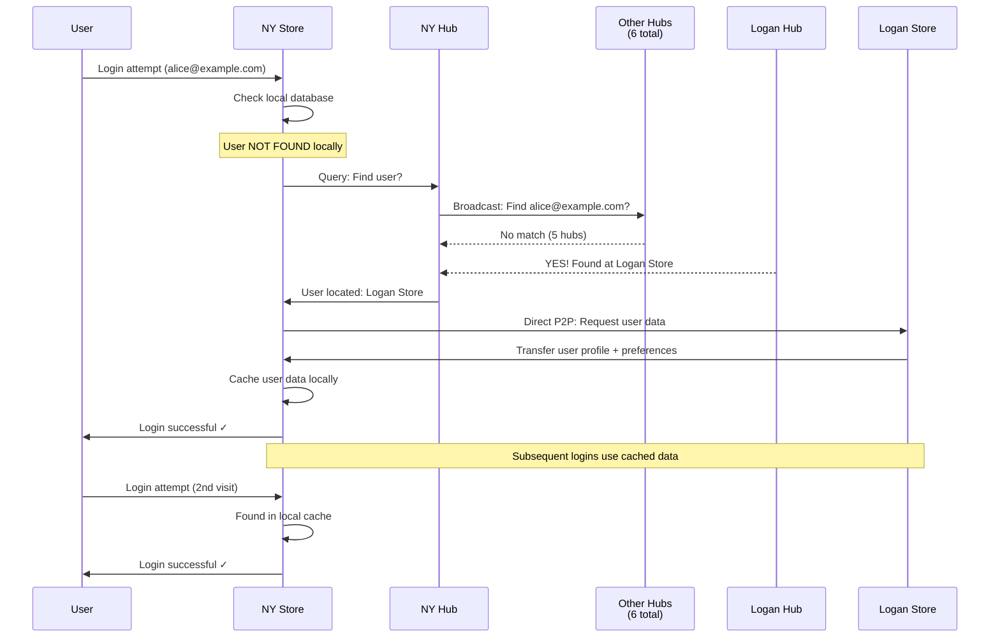
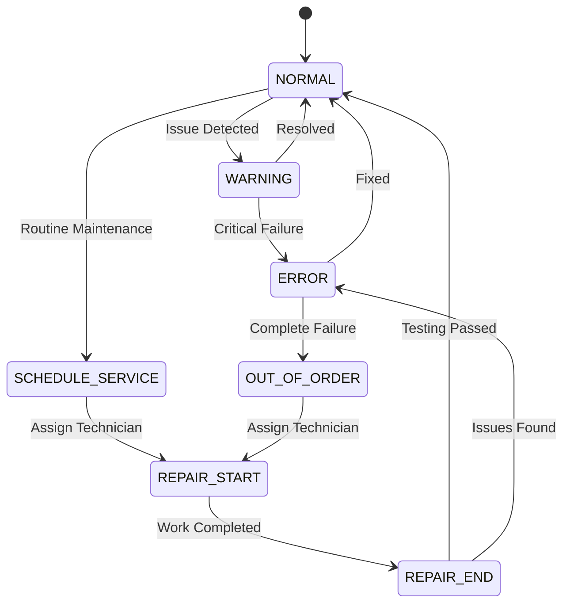
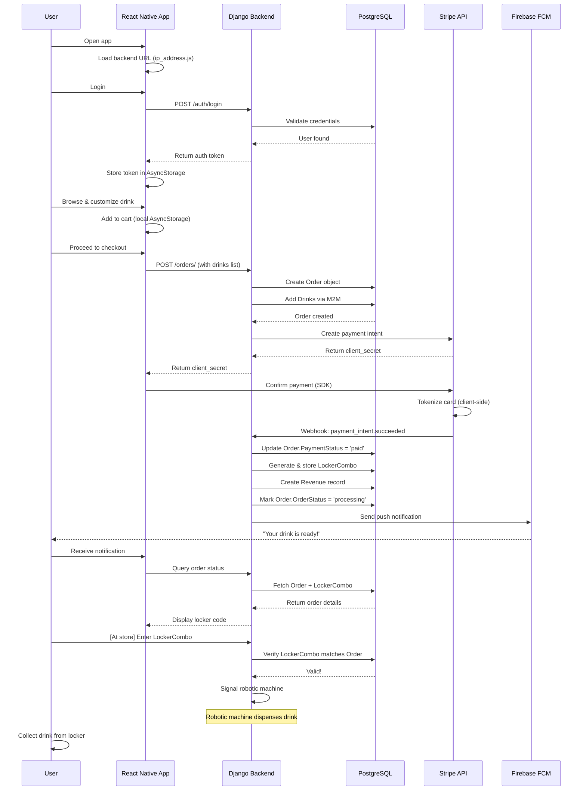

# Codepop Low Level Design Document

## Introduction

The purpose of this document is to provide a working description of the product's system architecture, subsystems, database schema, user interface, programming languages, libraries, and frameworks. This document bridges the gap between the High Level Design (which defines the "what" and "why") and implementation details (which define the "how").

---

## 1. Database Tables

### Overview

CodePop uses a **database-per-store architecture** where each physical store location maintains its own independent PostgreSQL instance. Data is categorized as either **replicated** (synchronized across stores on-demand) or **local** (never replicated). This section documents the core data entities currently implemented in `codepop_backend/backend/models.py`.

---

### 1.1 User Table

| Field Data | Data Type | Constraints | Notes |
| :---- | :---- | :---- | :---- |
| UserID | int | Primary Key | Built-in Django `User` model |
| Username | String | Unique | User login identifier |
| Password | String | NOT NULL | Hashed using PBKDF2-SHA256 |
| Email | String | NOT NULL | Email address for verification |
| is_staff | Boolean | Default False | Distinguishes managers from regular users |
| is_superuser | Boolean | Default False | Distinguishes admins from regular users |

**Notes:**
- Uses Django's built-in `django.contrib.auth.models.User` for authentication.
- User roles are represented via `is_staff` and `is_superuser` flags rather than a separate role field.
- Role-based access control (staff, admin, customer) is implemented in views and serializers.

---

### 1.2 Preference Table

| Field Data | Data Type | Constraints | Notes |
| :---- | :---- | :---- | :---- |
| PreferenceID | int | Primary Key | Auto-generated |
| UserID | int | Foreign Key References User(UserID) | Cascade on delete |
| Preference | String (varchar 100) | NOT NULL | Preference label (e.g., "Coconut", "Fruity") |

**Notes:**
- Stores user flavor preferences for the AI recommendation engine.
- One user can have multiple preferences; each preference is a separate row.
- Lazily replicated across stores (only synced when user logs into a new store).

---

### 1.3 Drink Table

| Field Data | Data Type | Constraints | Notes |
| :---- | :---- | :---- | :---- |
| DrinkID | int | Primary Key | Auto-generated |
| Name | String | NOT NULL | Display name of the drink |
| SyrupsUsed | Array (String[]) | Nullable | PostgreSQL ArrayField; list of syrup names |
| SodaUsed | Array (String[]) | NOT NULL | PostgreSQL ArrayField; list of soda names |
| AddIns | Array (String[]) | Nullable | PostgreSQL ArrayField; list of add-in names |
| Rating | Float | Nullable | User rating (0–5 scale); NULL if unrated |
| Price | Float | NOT NULL | Cost of the drink in USD |
| Size | String | Default "m" | Drink size: "s" (16oz), "m" (24oz), "l" (32oz) |
| Ice | String | Default "normal" | Ice amount: "none", "light", "normal", "extra" |
| User_Created | Boolean | NOT NULL | True if user-created custom drink; False if catalog drink |
| Favorite | M2M → User | Nullable | Many-to-Many relationship; users can favorite many drinks |

**Notes:**
- Catalog drinks (User_Created=False) are replicated to all stores.
- User-created drinks (User_Created=True) are lazily replicated on-demand.
- ArrayField is PostgreSQL-specific; ensures type safety for ingredient lists.

---

### 1.4 Order Table

| Field Data | Data Type | Constraints | Notes |
| :---- | :---- | :---- | :---- |
| OrderID | int | Primary Key | Auto-generated |
| UserID | int | Foreign Key References User(UserID) | Nullable; allows guest checkout |
| Drinks | M2M → Drink | NOT NULL | Many-to-Many relationship; order contains multiple drinks |
| OrderStatus | String | Choices: pending / processing / completed / cancelled | Default: pending |
| PaymentStatus | String | Choices: pending / paid / failed / remade | Default: pending |
| PickupTime | DateTime | Nullable | Scheduled pickup time (NULL for geolocation-based pickup) |
| CreationTime | DateTime | auto_now_add | Timestamp of order creation |
| LockerCombo | BigInteger | Nullable | Locker access code for drink pickup |
| StripeID | String | NOT NULL | Stripe payment intent ID (non-sensitive token) |

**Notes:**
- `Drinks` is a Many-to-Many field allowing orders to contain multiple drinks.
- `LockerCombo` is generated after successful payment and provided to customer.
- `StripeID` references the Stripe payment intent; raw credit card data never stored locally.
- **Local Data** — never replicated between stores; each store maintains its own order history.

---

### 1.5 Inventory Table

| Field Data | Data Type | Constraints | Notes |
| :---- | :---- | :---- | :---- |
| InventoryID | int | Primary Key | Auto-generated |
| ItemName | String | NOT NULL | Name of ingredient or physical item |
| ItemType | String | Choices: Soda / Syrup / Add In / Physical | NOT NULL |
| Quantity | PositiveInt | NOT NULL | Current stock level |
| ThresholdLevel | PositiveInt | NOT NULL | Minimum quantity before alert triggers |
| LastUpdated | DateTime | auto_now | Automatically updates on every save |

**Notes:**
- ItemType values: "Soda", "Syrup", "Add In", "Physical" (cups, lids, straws, etc.).
- ThresholdLevel is used by managers and logistics systems to trigger supply requests.
- **Local Data** — each store maintains its own inventory; never replicated.
- `LastUpdated` auto-increments to enable tracking of recent changes.

---

### 1.6 Notification Table

| Field Data | Data Type | Constraints | Notes |
| :---- | :---- | :---- | :---- |
| NotificationID | int | Primary Key | Auto-generated |
| UserID | int | Foreign Key References User(UserID) | Cascade on delete; NOT NULL if user-specific |
| Message | String | max_length=500 | Notification text content |
| Timestamp | DateTime | Default: now | Creation time of notification |
| Type | String | max_length=50 | Category (e.g., "order_ready", "stock_alert", "system") |
| Global | Boolean | Default False | False = user-specific; True = broadcast to all users |

**Notes:**
- When `Global=True`, the notification is a broadcast message to all users (e.g., store closure notice).
- When `Global=False`, the notification is user-specific (e.g., "Your drink is ready").
- **Local Data** — each store maintains its own notifications; not replicated.
- Push notifications to users triggered via Firebase Cloud Messaging (FCM).

---

### 1.7 Revenue Table

| Field Data | Data Type | Constraints | Notes |
| :---- | :---- | :---- | :---- |
| RevenueID | int | Primary Key | Auto-generated |
| OrderID | int | NOT NULL | Order reference (plain field, not a FK with DB constraint) |
| TotalAmount | Float | Default 0.0 | Revenue amount in USD; auto-calculated from order drinks |
| SaleDate | DateTime | Default: now | Date/time of transaction |
| Refunded | Boolean | Default False | True if transaction was refunded |

**Notes:**
- `OrderID` is stored as an IntegerField without a foreign key constraint for flexibility.
- `TotalAmount` auto-calculates on save by summing drink prices from the associated order.
- If manually set, auto-calculation is skipped; allows for manual adjustments if needed.
- **Local Data** — each store maintains its own revenue records; never replicated.
- Aggregation happens on-demand when managers/executives request reports (see Architecture section).

---

### 1.8 Removed/Consolidated Tables

#### Payment Table (Removed)
- **Previous design**: Separate Payment table for tracking transaction details.
- **Current design**: Payment information consolidated into Order table via `StripeID`.
- **Rationale**: Stripe handles all sensitive payment data; CodePop stores only the non-sensitive payment intent ID.

#### Code Table (Removed)
- **Previous design**: Separate Code table for storing locker access codes.
- **Current design**: Locker combination stored as `LockerCombo` field in Order table.
- **Rationale**: Simplifies schema; each order has exactly one locker code.

---

### 1.9 Entity Relationship Diagram

---

## 2. System Architecture

### 2.1 Current Implementation: Single-Store Architecture

The current CodePop backend is a **3-tier client-server model** running locally via Docker Compose:

**External Integrations:**
- **Stripe API**: Payment processing (credit cards, Apple Pay, Google Pay)
- **Mapbox API**: Geolocation and proximity calculations
- **Firebase Cloud Messaging (FCM)**: Push notifications
- **Dialogflow ES**: Customer service chatbot (Google Cloud AI)

**Backend URL Configuration:**
- Configured in `codepop/ip_address.js` (default: `http://localhost:8000`)
- All protected endpoints require `Authorization: Token {userToken}` header

---

### 2.2 Planned Architecture: Federated Distributed System

The High Level Design specifies a future transformation to a **federated distributed architecture** where multiple stores operate independently with regional coordination. This section describes the target architecture.

#### 2.2.1 Network Topology

CodePop will evolve into a **hub-and-spoke model with 7 regional supply hubs**:

#### 2.2.2 Store Autonomy & Resilience

- **Each store runs its own complete backend stack**: Django API + PostgreSQL database
- **Operational independence**: Stores continue functioning during hub/peer outages
- **Local data ownership**: Orders, inventory, revenue, machine status never leave the local database
- **Fault isolation**: Problems at one store do not cascade to others

#### 2.2.3 Hub-Store Communication

**Store Registration (on startup):**
- Store registers with its regional hub
- Hub maintains a directory of operational stores

**Peer Discovery:**
- When Store A needs data from Store B, it queries the hub for Store B's address
- Hub provides Store B's IP/endpoint

**Direct P2P Communication:**
- Once Store B's address is known, Store A communicates directly with Store B
- Bypasses hub for data transfer (reduces latency and hub load)

**Logistics Coordination:**
- Supply requests, machine status updates flow through hub
- Hub aggregates regional inventory and maintenance schedules

#### 2.2.4 Data Replication Strategy

**Replicated Data (Lazily synchronized):**
- User accounts and authentication
- User preferences (for personalization)
- User roles (for access control)
- Drink catalog (standard catalog drinks)
- Store registry and hub information

**Local Data (Never replicated):**
- Orders (each store owns its order history)
- Inventory (each store tracks its own stock)
- Revenue (financial data stays local)
- Notifications (user-specific alerts)
- Machine status (local operational metrics)

**Lazy Replication Model:**
- User data does NOT automatically replicate to all stores
- User data syncs ON-DEMAND when user logs into a new store for the first time
- After first login, user data is cached locally for fast subsequent logins

**Rationale for Lazy Replication:**
- **Scalability**: Replicating millions of accounts to thousands of stores is prohibitively expensive
- **Data locality**: Users typically frequent the same store; local caching is efficient
- **Reduced network traffic**: Only active users generate sync traffic
- **Privacy**: User data only exists at stores they have visited

#### 2.2.5 Cross-Region User Discovery

When a user travels to a different region (e.g., Logan, UT user visiting New York, NY):

**Flow Details:**
1. **Discovery Phase**: NY Store checks local database → user not found → queries NY Hub
2. **Hub Broadcast**: NY Hub broadcasts to 6 other regional hubs asking for the user
3. **Peer Response**: Logan Hub responds with user location (Logan Store #001)
4. **Direct Transfer**: NY Store requests user data directly from Logan Store (P2P)
5. **Local Caching**: NY Store caches user data; user logs in successfully
6. **Subsequent Logins**: Subsequent NY Store logins use cached data (no hub/peer queries needed)

#### 2.2.6 Revenue Aggregation

**Local Level:**
- Each store maintains its own revenue records
- Managers can view store-level revenue via local dashboard

**Regional Level:**
- Logistics manager requests regional report
- Regional hub queries all stores in region for revenue data
- Hub aggregates results

**National Level (Master Hub Aggregation):**
- Super admin requests nationwide revenue report
- **Primary path**: Master hub (Logan Hub) queries all 7 regional hubs
- **Fallback path**: If master hub unavailable, dashboard queries all 7 hubs in parallel and aggregates client-side

#### 2.2.7 Machine Status Monitoring

Each robotic machine tracks operational status through a **state machine**:

**State Descriptions:**
- **NORMAL**: Machine operational, all systems nominal
- **WARNING**: Minor issue detected, monitoring increased
- **ERROR**: Critical system failure, order intake paused
- **OUT_OF_ORDER**: Machine non-functional, repair staff assigned
- **SCHEDULE_SERVICE**: Routine maintenance scheduled
- **REPAIR_START**: Technician on-site, service in progress
- **REPAIR_END**: Repair completed, testing underway

**Real-time Updates:**
- Stores push machine status changes to regional hub
- Hub dashboard provides live health monitoring for repair staff
- Repair staff can filter/prioritize machines by region and status
- Alert escalation when machines enter WARNING or ERROR states

---

### 2.3 Technology Stack

#### Frontend
- **Framework**: React Native 0.74.5 with Expo 51.0.38
- **Key Libraries**:
  - React Navigation: Screen routing and navigation
  - Axios: HTTP requests to backend API
  - AsyncStorage: Local persistent data (userToken, userId, userRole, checkoutList)
  - Stripe React Native SDK: Payment processing
  - Expo Location: Geolocation services
- **Supported Platforms**: iOS and Android (via Expo CLI)

#### Backend
- **Framework**: Django 5.1 with Django REST Framework 3.14
- **Authentication**: Token-based authentication (djangorestframework.authtoken)
- **Database**: PostgreSQL 15
- **Asynchronous Processing**: Celery + Redis (planned for distributed architecture)
- **Key Libraries**:
  - psycopg2: PostgreSQL database adapter
  - stripe: Stripe payment API client
  - scikit-learn: ML-based drink recommendations
  - pandas: Data manipulation for ML models
  - transformers + torch: HuggingFace NLP chatbot

#### Infrastructure
- **Containerization**: Docker + Docker Compose (current single-store setup)
- **Database-per-Store**: Each location will have independent PostgreSQL instance
- **Cloud Deployment (Planned)**: Google Cloud Platform (GCP) chosen for:
  - Cost-effectiveness (25% cheaper than Azure)
  - Superior student credits ($300 free trial)
  - Excellent Django support

#### External Services
- **Stripe**: Payment processing (PCI-DSS compliant; no raw card data stored)
- **Mapbox**: Geolocation and proximity tracking
- **Firebase Cloud Messaging (FCM)**: Cross-platform push notifications
- **Dialogflow ES**: NLP-based customer service chatbot
- **Gemini API**: AI-generated decorative graphics for app loading screens

---

### 2.4 Inter-Node Communication Protocol

In the distributed architecture, stores and hubs communicate via:

- **REST APIs** for synchronous requests (user lookup, store discovery)
- **Event queues** (Celery + Redis) for asynchronous messaging (status updates, alerts)
- **HTTPS/TLS 1.3** for all communications (encryption in transit)
- **Token authentication** between nodes (servers must authenticate before data exchange)
- **Trusted peer registry**: Hardcoded list of valid CodePop servers prevents unauthorized access

---

### 2.5 Security Model

#### Authentication & Authorization

**User Roles:**
- **Customer**: Browse drinks, place orders, manage preferences
- **Manager (Staff)**: View store inventory, manage stock, view local revenue reports
- **Admin (Superuser)**: User management, store-level notifications, store configuration
- **Logistics Manager**: Regional supply chain, hub-level logistics
- **Repair Staff**: Machine status in assigned region, maintenance logging
- **Super Admin**: National system administration, nationwide revenue, emergency overrides

**Role-Based Access Control:**
- Each API endpoint checks user role before granting access
- Manager can only view their store's data; cannot access other stores
- Logistics manager sees regional data; super admin sees national data

#### Data Protection

- **Passwords**: Hashed with PBKDF2-SHA256 (upgrade to Argon2 in production)
- **In Transit**: HTTPS/TLS 1.3 for all client-server and inter-node communication
- **Sensitive Fields**: User email, geolocation, payment intent ID encrypted at rest
- **Payment Security**: Stripe handles all card data; CodePop stores only payment intent tokens

#### Compliance

- **GDPR**: User consent required for geolocation, email, and preference tracking
- **OWASP Top 10**: Query parameterization for SQL injection prevention; CSRF tokens for state-changing requests
- **PCI-DSS**: Stripe compliance means CodePop never handles raw credit card data

---

### 2.6 Data Flow Example: User Placing an Order

**Key Integration Points:**
1. **Token Authentication**: All protected endpoints require `Authorization: Token {userToken}`
2. **Local Storage**: Token and user ID cached in AsyncStorage for offline access
3. **Stripe Integration**: Card tokenization happens on client; backend never sees raw card data
4. **Push Notifications**: Firebase FCM delivers order status updates in real-time
5. **Database Transactions**: Order, Drinks (M2M), and Revenue created atomically
6. **Locker Access**: LockerCombo generated server-side after payment confirmation

---

## Summary

The CodePop backend is currently a centralized single-store system running in Docker Compose. The planned distributed architecture transforms it into a **federated multi-store network** with 7 regional supply hubs coordinating independent store operations. Data strategy balances scalability (lazy replication for user data) with operational locality (orders, inventory, revenue never replicated). This design ensures resilience, fault isolation, and efficient resource utilization as the system scales nationwide.
