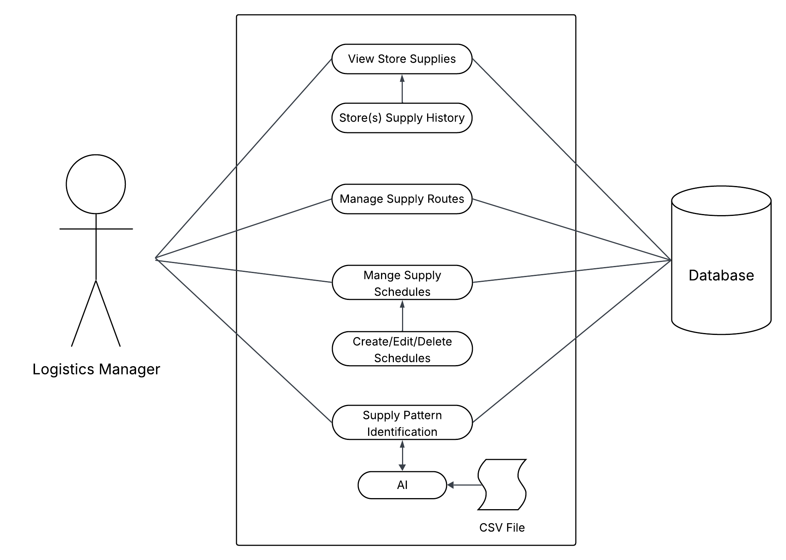

# CodePop Requirements Document

## Introduction

### Overview of CodePop

CodePop is an innovative beverage application that leverages advanced technology, including AI and automation, to redefine the customer experience in soda customization and ordering. Designed to function seamlessly across multiple platforms, including handheld devices and desktops, CodePop aims to provide users with a unique and efficient way to create, customize, and order their favorite drinks. The application is geared towards minimal human intervention, utilizing AI and automated systems to manage inventory, process orders, and provide customer support.

### Purpose of Requirements Document

The purpose of this requirements document is to provide a comprehensive outline for the functionality of the CodePop software. This document serves to keep developers and stakeholders on the same page in regards to basic requirements of CodePop going forward. 

### Introduction to MoSCoW Analysis

To effectively prioritize the requirements for this application, we will use MoSCoW analysis. This method categorizes requirements into four groups:

- **Must Have *(M)*:** Essential features needed for the application to function correctly.
- **Should Have *(S)*:** Important but not critical features that enhance user experience.
- **Could Have *(C)*:** Desirable features that are not essential but could add value to the application.
- **Won’t Have *(W)*:** Features that are not relevant or feasible at this stage.

In this document, these categories will be indicated with the following abbreviations added to each requirement for clarity:
- **M** for Must Have
- **S** for Should Have
- **C** for Could Have
- **W** for Won’t Have

These abbreviations will facilitate a clear and efficient understanding of the priority and scope of each requirement.

## Functional Requirements

### Summary of Existing Functional Requirements

**Device Accessibility:** (M) CodePop prioritizes handheld device usage. The system should support iOS and Android devices, as well as all modern browsers.

**User Authentication:** (M) Users can sign in as general users, managers, or administrators with role-specific access.

**Guest Ordering:** (M) Users may order without an account, but preferences and favorites will not be saved.

**Account Personalization:** (M) Registered users can save favorite drinks.

**Administrative Account Control:** (M) Admins can manage user accounts and assign manager permissions.

**User Onboarding:** (S) New users should receive a tutorial during sign-up.

**Drink Customization:** (M) AI can generate randomized drink combinations. Users can also fully customize drinks by selecting soda, ice, syrups, and add-ins. 

**AI Suggestions:** (M) AI tailors recommendations for registered users. Non-account users receive popularity-based suggestions.

**Cart Management:** (M) Users can add, edit, review, or remove drinks before checkout.

**Order Cancellation:** (M) Orders can be canceled before payment.

**Payment Processing:** (M) Payment occurs immediately upon order submission.

**Refund Handling:** (M) Orders canceled before pickup are refunded.

**Order Verification:** (M) An order code is used to prevent theft.

**Saved Payment Methods:** (C) Users may save payment methods.

### Geolocation and User Proximity Logic (M)
The core value proposition of CodePop is the "just-in-time" preparation of beverages using robotic automation. To achieve this, the application must handle location data with high precision to ensure products are fresh at the moment of pickup.

* **User Location Prompt (M):** After a successful payment transaction, the application must trigger a permissions request for the user's GPS data
* **Proximity Calculation (M):** If the user grants permission ("Yes"), the AI engine will begin a real-time analysis of the user’s rate of approach (velocity) combined with the current estimated time of assembly for the specific order.
* **Automated Trigger (M):** The system must determine the **"Golden Window"**—the exact distance at which the robots should begin the pour to ensure the drink is fresh the moment the user arrives at the CodePop location. This minimizes wait times and ensures optimal beverage temperature.
* **Manual Override ("Start" Button) (M):**  In scenarios where the user denies location access ("No"), or if the GPS signal is unavailable, the UI must provide a "Start" button. This puts the power in the user's hands to signal when they are heading to the store.
* **Time Estimates (M):** Regardless of whether GPS is used, the user will get to know how long their order will take. This enables them to press the “start” option at the right time, ensuring the drink is ready exactly when they arrive.
* **Scheduled Orders (M):** Beyond immediate proximity, the system provides an option for scheduling drinks to be ready at a certain time. This is essential for users who want to plan their day in advance or pick up a drink on a specific commute schedule.

### Inventory Tracking and AI Forecasting (M)
Inventory management is critical for a robotic storefront to prevent service interruptions and logistical bottlenecks.

* **Real-Time Monitoring (M):** To prevent a CodePop location from running out of ingredients, an AI will keep track of how popular certain ingredients are and the rate at which they are being used within the specific store showing a depletion rate.
* **Usage Trend Analysis (M):** The AI will analyze popularity trends—for example, identifying if a specific cherry syrup is trending at a certain time, like the weekends or at a certain location, like Utah or a specific store, to adjust replenishment alerts.
* **Manager Notifications (M):**  When stock levels cross a predictive threshold (indicating they will run out before the next scheduled delivery), the system must automatically notify the local manager to initiate a restock order.

### Integrated AI Functionalities (M)
AI is an integral part of the app/website’s functionality and is used in a variety of places to streamline the user experience.

* **Randomly Generated Drinks (M):** To encourage exploration, the AI will create a randomized drink for the user upon request. 
    * Analyze user preferences (based on order history) to suggest a new flavor profile.
    * Alternatively, it can create a completely random combination for adventurous users.
    * If the user does not like what the AI creates, they can have the AI re-randomize a new drink instantly.
* **Geolocation and EST (M):** The AI will calculate the perfect preparation time based on current robot load, drink complexity, and travel speed to give the customer the best and most refreshing product. No one likes it when their ice is all melted, and this will stop that problem from happening.

### New Functional Requirements

**Multi-Store Support:** (M) The system must support multiple store locations operating under the CodePop platform across the United States, where each store can accept orders, manage inventory, and operate independently without impacting other stores.

**Independent Store Operation:** (M) Each store must maintain independent inventory, order processing, machine status, and operational data, and changes to one store must not automatically alter data at another store.

**Decentralized Architecture:** (M) The system must operate without a centralized server controlling all stores, such that individual stores can continue operating even if other stores or regions become unavailable. 

**Store-to-Store Communication:** (S) Stores should be able to exchange limited operational data (such as supply availability or transfer requests) with nearby stores within the same geographic region. 

**Supply Hub Infrastructure:** (M) The system must support seven designated supply hubs, each with defined inventory, service regions, and assigned management responsibility. 

**Supply Hub Scope:** (M) Supply hubs must support deliveries to stores within their assigned region, and must also support inter-region deliveries to other regions within 1000 miles.

**Shared Supply Coordination:** (M) Store managers must be able to request supplies from supply hubs, including item types, quantities, and urgency, and view the status of those requests.

**Local Supplier Integration:** (C) Stores could submit supply requests to approved local suppliers when hub supplies are unavailable, with those requests tracked separately from hub deliveries.

**Logistics Manager Role:** (M) A logistics manager role must exist with permissions to manage supply hub inventory, approve or deny supply requests, and coordinate inter-store and inter-region deliveries.

**Supply Tracking:** (S) The system should record the lifecycle of each supply request, including submission, approval, shipment, delivery, and completion.

**Historical Supply Records:** (C) The system could retain historical records of supply movements and requests to support reporting and analysis.

**Test Data Generation:** (M) The system must include test files or configurations that populate stores, hubs, users, and supplies so that system behavior can be validated without real-world data. 

* **Maintenance Logs (M):** The software must maintain a digital ledger/history for every machine, tracking its service history, part replacements, and cleaning cycles.
* **Role: repair_staff (M):** A new role is required: `repair_staff`. These users are responsible for managing repair schedules for machines at the specific locations they are in charge of. They must have a dashboard to see which machines need attention.
    * Viewing a dashboard of machines requiring service.
    * Updating the status of a machine (e.g., "In Service," "Operational," "Offline").
    * Logging specific repair actions taken.
* **System Population (M):** Development must include scripts or CSV seeds to populate the database with initial machine data for testing the maintenance workflows.

### Non-Functional Requirements (NFRs)
These requirements define the quality attributes of the system, ensuring stability, security, and accessibility.

* **Responsiveness (M):** The application must be responsive, providing an optimal user experience across a variety of devices, including desktops, tablets, and mobile devices, with seamless adaptation to different screen sizes and orientations.

* **Error Messages (M):** The application must provide clear, informative error messages for user interactions, invalid inputs, and system errors. Messages should be concise and include suggestions for resolution.

* **Cross-Browser Capability (S):** The application must be compatible with the latest versions of major browsers, including Chrome, Firefox, Safari, and Edge, ensuring consistent functionality across platforms.

* **Security (M):** All sensitive data, including user credentials, payment information, and location data, must be encrypted using industry-standard encryption protocols, such as TLS (Transport Layer Security). The application must adhere to best practices for secure coding. and data storage

* **Scalability (S):** The application should be designed to scale efficiently, handling an increasing number of transactions and data volume without performance degradation.

* **Availability (C):** Orders can only be placed when the store is open, but scheduled ordering is supported. The application should maintain an uptime of at least 99.9%. While the store is closed, users can schedule orders to be processed once the store reopens.

**Maintainability:**
*(M)* The codebase must be modular, well-documented, and adhere to established coding standards to facilitate ease of maintenance, updates, and troubleshooting. This includes clear comments, structured code, and comprehensive documentation. Additionally, all dependencies, libraries, and frameworks used in the application should be kept up-to-date to ensure security, compatibility, and optimal performance.

**Accessible:**
*(S)* The application must comply with Web Content Accessibility Guidelines (WCAG) 2.1 to ensure that users with disabilities can navigate and use the application effectively. This includes avoiding problematic color combinations, such as red and green, and providing alternative text labels for color-based indicators.

**Reporting:**
*(S)* The system should include features for inventory management. It must automatically notify the manager when items are out of stock and generate detailed reports that can be sent to the developer for further analysis. Additionally, the system should provide the manager with financial reports, offering insights into revenue. This will ensure timely restocking, help in identifying inventory trends or potential issues, and provide a clear understanding of the store's financial performance

### New Non-Functional Requirements

**Scalability:** (M) The system must support expansion from a small number of stores to a nationwide network without requiring fundamental redesign.

**Fault Isolation:** (M) Failures or outages at one store or supply hub must not prevent other stores or hubs from continuing normal operations.

**Performance Expectations:** (S) Store-to-store and store-to-hub communication should complete within reasonable operational timeframes that do not disrupt normal store operations.

**Network Resilience:** (S) Stores should continue core operations, such as accepting orders and tracking inventory, during partial or temporary network disruptions.

**Offline Operation:** (C) Limited offline functionality, such as viewing recent inventory data, could be available when a store is temporarily offline.

**Global Synchronization:** (W) The system will not require real-time global synchronization of all stores and hubs at all times. 

## Business Requirements

### Summary of Existing Business Requirements

**As Little Human Input as Possible:**
- The stores and the app should be mostly machine run.
- We want one manager to effectively be able to run many stores.
- Ideally there won’t be a human at most locations, just the robots that make the drinks.

**Payment System:** *(M)*
- The app needs to be able to process payments when an order is placed. 
- Refunds must be able to be processed if the order is canceled before it’s made.
- There should be a system to track revenue for each location.

**Flavor Syrup Tracking System:** *(M)*
- There should be a system to remotely check the levels of the flavor syrups at the location.
- There should be warnings when the syrups get low.
- The manager of the store should get warnings of when to order new syrups.
- There should be analytics where the app learns the use of syrups per location and can give you an estimated amount of syrup you should order for a given month.

**Order pickup tracking system:** *(S)*
- In order to ensure that pickup coolers don’t get full with orders sitting for a long time there needs to be some way to track how long an order has been sitting waiting for pickup.
- After a certain amount of time the old order should be thrown out to make room for new orders.

**Manager Dashboard:** *(M)*
- There should be a simple easy way for the store managers to access information about the store.
- The managers should be able to look at syrup levels at a store.
- The managers should be able to check on the status of the store and ensure that everything is still working from the app.
- The dashboard should display a grid of all the available flavors and their levels with the ability to sort by how much is left in a flavor.
- The dashboard should display a grid of the coolers and their status(full/empty). If the cooler is full it should display a time of how long the order has been sitting in the cooler.
- The dashboard should display a list of orders processed at the store with the focus being on the in progress and future orders but the manager should be able to view past orders as well.
- The dashboard should display overall revenue information for the location.
- The dashboard should display stats of average time between the order being made and picked up and also display stats of how long people are waiting to receive their order.

**AI Help Bot:** *(C)*
- There shall be an AI chatbot to help with customer concerns/questions 24/7
- The bot shall be capable of resolving the following issues:
  - Questions on how to use the app
  - Refunds
  - How the customer can file a complaint or request to speak with a manager
- When the bot cannot resolve an issue, it must categorize the issue by one of the following (by prompting - the user chatting with the bot):
  - Software bug: send a report (prompt user for description of error) to IT (us)
  - Customer service: the bot provides the contact information of the nearest store manager

**Member Loyalty Program:** *(C)*
- Users earn 1 point for every dollar spent on drinks
- Points are only available to account users
- Points are added after the order is picked up (canceled orders do not earn points)
- Points expire 1 year after being earned, with prior user notification
- Users can view their point balance on their dashboard
- Users can redeem points during checkout

**Social Media:** *(C)*
- Users can share their favorite drinks to Instagram, X, or Facebook
- A pre-populated post template includes the hashtag #socialdrinker
- Sharing is available to generate organic marketing and community engagement

### New Business Requirements

**Nationwide Expansion:** (M) The system must support business operations across multiple regions to enable expansion beyond a single store.

**Supply Efficiency:** (M) Coordinated supply management and logistics must reduce the likelihood of inventory shortages and overstocking at individual stores.

**Operational Cost Reduction:** (S) Shared supply hubs should reduce redundant purchasing and storage costs at the store level.

**Data-Informed Decisions:** (S) Aggregated supply and usage data should support management in identifying trends and making operational decisions.

**Strategic Insights:** (C) Regional summaries could be used to evaluate performance and guide future store placement or hub expansion.

**Automated Business Decisions:** (W) The system will not autonomously make final business or financial decisions without human approval.

## User requirements

### Summary of Existing User Requirements

**Account creation:** *(M)* 
Users must be able to create an account or log in to the application using a combination of a username, password, and email address. This process includes setting up security measures such as email verification (upon sign-up) and password strength checks to protect user accounts from unauthorized access. The email verification will be done prior to password creation and the password must be at least 8 characters and contain a lowercase letter, an uppercase letter, a number, and a special character.

**Profile management:** *(M)* 
Users should be able to view and edit their profile information after initial sign-up. The profile management system should ensure that updates are reflected immediately after modification across all parts of the application.

**Favorite drinks:** *(M)* 
Users should be able to mark and view their favorite drinks. There should be an interface where users can manage their favorites. That interface should include easy one-click reordering. If there are any ingredients unavailable, any drinks in this interface should be marked as ‘unavailable’.

**Edit preferences:** *(S)* 
Users shall be able to edit drink preferences, including preferred ingredients, excluded ingredients, sweetness level, ice amount, and other customization defaults. These preferences shall be used to personalize drink recommendations and AI-generated drinks and may be overridden on a per-order basis.

**First-time user tutorial:** *(S)* 
New users should be guided through a tutorial (upon account creation) when they first use the application. The tutorial should have an option to be skipped and will not be replayable. The tutorial should not only introduce the basic functionalities but also highlight unique features of the app, ensuring a smooth onboarding experience and helping users get the most out of the application from the start.

**Choose time for drink to be ready:** *(S)* 
Users should be able to select a specific time for their drink to be ready. The time window for scheduling will be only show store hours. This feature aims to provide convenience for those users who do not want to use geolocation functionality by allowing them to plan ahead and ensure their drink is prepared and available precisely when they want it, reducing wait times and improving overall satisfaction.

**Rate drinks:** *(S)* 
Users shall be able to rate purchased drinks after pickup using a 5-point numeric scale, with an optional text comment. Ratings shall be stored per user and used to improve drink recommendations and AI-generated suggestions.

**Chat functionality with AI support staff:** *(C)* 
Users should be able to chat with an AI-powered support staff for assistance. The AI support staff should be capable of handling a wide range of queries and issues, providing instant help and guidance while learning from reactions to improve its responses over time.

**Loyalty program:** *(C)* 
A loyalty program should be available to reward repeat customers.This program should offer various incentives such as points, discounts, or exclusive offers, fostering customer retention and encouraging continued patronage by recognizing and rewarding frequent visits.

**Social media functionality:** *(C)* 
The application should integrate with social media platforms to enhance user engagement and sharing. Users should be able to seamlessly share their experiences and favorite drinks, as well as interact with the soda shop’s social media presence, creating a sense of community and boosting brand visibility.

## User requirements
**Manager:**
- Has access to data such as stock inventory
- Has access to user payments
- Has access to revenue reports

**Account User:**
- This user has an account they can sign into
- Account keeps track of user data and suggests new drinks based on preferences as well as remembers previous orders
- Essentially has all app functionality

**General User:**
- User can use the app to order drinks on a single time basis without creating an account 
- This user’s data and preferences aren’t saved

**Admin (us):**
- Has access to manage user account data
- Has ability to update account
  - remove/unlock user accounts
- Has the ability to add manager accounts/grant permissions

### New User Requirements

#### Store Manager

* **Supply Requests:** (M) A store manager must be able to submit, view, and track supply requests for their store.
* **Supply Coordination:** (S) A store manager should be able to view nearby store availability and request shared supplies when appropriate.
* **Inventory Awareness:** (C) A store manager could view summarized inventory information for nearby stores or regional hubs.

#### New Role: logistics_manager (M)
The `logistics_manager` is a specialized role focused on the "behind-the-scenes" movement of goods.
* **Regional Supply Oversight (M):** They must be able to view and manage the inventory levels of all local stores within their assigned geographical region.
* **Supply Routing (M):** They are responsible for determining the most efficient paths for supply delivery trucks to reach stores needing restock.
* **AI Pattern Recognition (M):** The manager will upload CSV files containing historical supply data. An AI module will then parse this data to identify patterns (e.g., "Store A always runs out of lemons on Tuesdays").
* **Automated Scheduling (M):** Based on the patterns identified by the AI, the logistics manager can create or update recurring supply delivery schedules to preemptively solve stock shortages.

#### New Role: super_admin (M)
The `super_admin` is the highest tier of access, providing a bird's-eye view of the entire operation.
* **Universal Data Access (M):** The super_admin can access data for any store location across the entire network, bypassing regional restrictions.
* **System-Wide Configuration (C):** They have the authority to create new roles, adjust global AI parameters, and override system settings in case of emergencies or hardware failures.

### Extended Logistics and AI Integration (S)
Building upon the inventory tracking from Part 1, the new requirements demand a deeper integration between data and action to work effectively together.

* **CSV Data Ingestion (M):** The system must provide a robust interface for logistics managers to upload raw data files. The system must validate these files for correct formatting before processing.
* **Predictive Supply Updates (C):** Once the AI identifies a pattern from the CSV data, it should suggest specific schedule modifications to the logistics manager. Ideally, the manager should be able to approve these suggestions with a single click.

---

## MosCow analysis
**Must haves:**
- App that works on a phone
- Geolocation or similar
- Ordering
- Payments (when they order. If they cancel reimburse)
- System orders when ingredients are low
- AI integration for generating drinks
- Log in/signup screen
- Database that keeps track of inventory and updated when inventory is used up – Can see this from the managers side
- Ability to cancel orders (reimbursement)
- Option to favorite drinks

**Should haves:**
- User can add preferences (likes and dislikes)
  - Ai can also add these depending on user drinks – uses them for random generated drinks
- Accessibility
- Login tutorial for first timers
- Seasonal menu
- Ability to choose what time the drink is ready as opposed to making it automatically based on geolocation
- System to throw out old orders if they have sat in a cooler for too long

**Could haves:**
- AI that talks to the customer
- Ai that receives complaints
- Customer could rate a drink and the rating gets stored, AI can use this
- Ability to enable push notifications to notify customers when drinks are ready
  - Also maybe the ability to subscribe to a text list to promote the shop and keep user informed about deals
- Loyalty program
- Social media posts
- SSO - google, etc

**Will not haves:**
- Use of global trends to determine when the manager should restock: AI may not be able to get good/reliable data, and world trends may not affect CodePop stores. Tracking what is happening in-store should provide similar data anyway.
- The ability for multiple users to use the same account to keep better track of individual preferences. 
- Multiple store locations: will keep our focus on 1 location for version 1.
- The ability to get a refund after a drink is made. 
- The ability to upload money into the account: payments only made through an outer source. 
- A gift card system. 
- A cash processing system. 

## Use case stories 
**Account user stories:**
- *(M)* As an account user I want to be able to easily and securely sign in to my account to access my drink history and order drinks 
- *(M)* As an account user, I want to know that my private data such as payment information and geolocation is being protected if I choose to share it. 
- *(S)* As an account user, I want to have drinks recommended to me based on my preferences.
- *(M)* As an account user, I want the app to be visually pleasing.
- *(M)* As an account user I want to be able to see all possible combinations of syrups, sodas, and add-ins so I can craft my drink. 
- *(M)* As an account user, I want to be able to save my favorite drinks so I can order them easily in the future
- *(M)* As an account user, I want to be able to have my drink fresh and ready for me right as I arrive to pick it up. 
- *(S)* As an account user, I want the option to deny access to my geolocation and instead choose a time for my drink to be ready. 
- *(M)* As an account user, I want to receive a notification when my soda is ready to pick up. 
- *(M)* As an account user, I want to be able to add payment options to my account so I can pay through the app when I order my drinks.
- *(M)* As an account user, I want to be refunded if I cancel my drink order. 
- *(C)* As an account user, I want to be able to rate the sodas I have tried out of 5.
- *(C)* As an account user, I want AI to use my drink ratings to recommend  future soda combinations.
- *(M)* As an account user, I want to be able to pay for my drink on the application when I order it.
- *(C)* As an account user, I want to be able to lodge complaints. 
- *(M)* As an account user, I want to be able to add and remove preferences
- *(M)* As an account user, I want to be able to dislike ingredients so they aren’t recommended to me. 
- *(C)* As an account user, I want to be able to share my drinks on social media. 
- *(S)* As an account user, I want access to a seasonal drink menu for inspiration when making my own drinks. 

**General user stories:**
- *(M)* As a general user, I want to be able to order drinks from the soda shop without having an account
- *(M)* As a general user I want to be able to create personalized drinks to order
- *(S)* As a general user, I want to be able to see drink suggestions based on popular drinks so I have ideas to order
- *(M)* As a general user I want to be able to see all possible combinations of syrups, sodas, and add-ins so I can craft my drink.
- *(S)* As a general user, I want to receive a notification when my soda is ready to pick up.
- *(M)* As a general user, I want to be able to receive a refund if I cancel my order. 
- *(S)* As an account user, I want access to a seasonal drink menu for inspiration when making my own drinks. 

**Admin User stories**
- *(M)* As an admin, I want to be able to keep track of inventory.
- *(M)* As an admin, I want to be able to access certain user data such as the number of user accounts.
- *(M)* As an admin, I want to be able to see and keep track of the cost of inventory and maintenance of the shop.
- *(M)* As an admin, I want to be able to see how much money the shop is bringing in.
- *(M)* As an admin, I want to be able to see general and account user complaints.
- *(S)* As an admin, I want to receive all available data in the form of easily understandable and regular reports.
- *(M)* As an admin, I want the ability to manage user accounts. This includes overriding locked accounts, disabling accounts, and deleting user accounts.
- *(M)* As an admin, I want to be able to add permissions to manager accounts.
- *(M)* As an admin, I want to assign logistics manager roles so that each supply hub has proper oversight.
- *(S)* As an admin, I want to review nationwide supply trends so that I can support strategic decisions for the business.
- *(M)* As an admin, I want to ensure each store and hub has proper data access so that security and permissions are maintained. 

**Manager User stories**
- *(S)* As a manager, I want to be able to see store revenue reports from the database.
- *(M)* As a manager, I want to be notified when inventory is low. 
- *(S)* As a manager, I want to be able to order more inventory when it is low.
- *(M)* As a manager, I want to be able to see inventory and usage data pertinent to running the store in the form of regular reports.
- *(M)* As a manager, I want to request inventory from a supply hub so that my store remains stocked.
- *(S)* As a manager, I want to coordinate shared supplies with nearby stores so that inventory shortages can be mitigated.
- *(M)* As a manager, I want to generate test data files to simulate orders and supplies so that I can validate system functionality before real operations.

**Logistics Manager Stories**
- *(S)* As a logistics manager, I want to approve or deny supply transfers so that supplies are delivered efficiently and appropriately.
- *(M)* As a logistics manager, I want to track supply requests and deliveries so that I can monitor hub performance.
- *(M)* As a logistics manager, I want to approve inter-region deliveries so that distant stores can receive necessary supplies on time. 

**General User stories**
- *(M)* As a user, I want all my options to be easily accessible and useful. 
- *(M)* As a user, I want simple and user-friendly options for making soda combinations, rating my sodas, and ordering sodas.
- *(M)* As a user, I want a safe and secure platform that ensures my data, especially my geolocation and email, is protected. 
- *(S)* As a user, I want the platform to be accessible according to WCAG standards of at least an “A”. 
- *(S)* As a user, I want a place I can lodge complaints and get helpful feedback.
- *(M)* As a user, I want to choose a store location for pickup so that I can get my drinks from the most convenient location.
- *(M)* As a user, I want to see drink suggestions based on my past orders so that I can quickly reorder favorites or discover new drinks I like.
- *(M)* As a user, I want to place a one-time order without having to create an account so that I can try the service without committing to an account.

### General System Stories
- *(M)* As a system, I want to automatically track supply inventory changes so that managers and logistics managers always have up-to-date data.
- *(S)* As a system, I want to notify store managers when supplies are approved or delivered so that store operations remain efficient.
- *(M)* As a system, I want to simulate supply routes during testing so that system performance can be validated under realistic conditions. 

**Use Case Diagrams**

